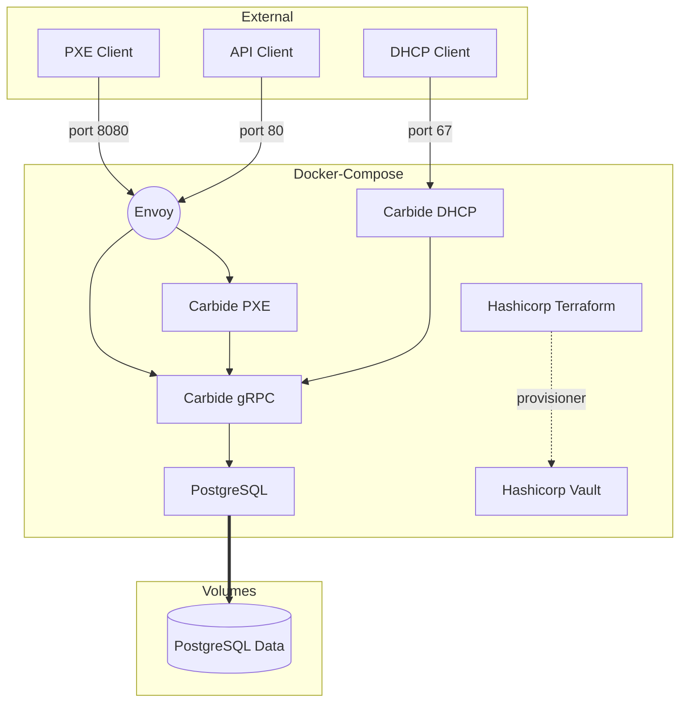

# Carbide - Bare Metal Provisioning


## Introduction

Carbide is a bare metal provisioning system used to manage the lifecycle of bare metal machines.

Please see [The Book](https://nvmetal.gitlab-master-pages.nvidia.com/carbide/index.html) for more detail about roadmap & architecture.

Discussion happens on #ngc-metal slack channel.

## Setting up development environments

We aim to keep the development environment as self-contained and automated as
possible.  Each time we on-board new staff we want to enshrine more of each
developmenet cluster bring up into tooling instead of institutional knowledge.
To that end, we are using docker compose to instanciate a development
environment.

[The docker compose configuration file](docker-compose.yml) contains all of the
software in the control plane in order to make requests to a working Carbide
installation.

The docker-compose configuration starts an environment that looks generally like this:



The container used to run components is specified by [the default
Dockerfile](Dockerfile).  This contains the prereqs to run the components and
where the build actually happens.  The containers run ```cargo watch``` in order to
recompile on changes.

(NOTE: this messes with ```rust-analyzer``` and needs someone to fix it)


## Running Manually

### Building in Docker

```
   docker run  --volume (pwd):/code -e "RUST_BACKTRACE=1" --workdir /code -it carbide-build cargo make workspace-ci-flow
```

### Pre-reqs
  * Kea
  * Rust
  * Postgresql
  * boost-libs
  * gnu-c++

### PostgreSQL

You can run PostgreSQL locally if you wish.  We expect your unix username to be
able to create/delete databases for tests, or have a single database to run the
code in.

1. ```sudo -iu postgres```
2. ```initdb --locale=en_US.UTF-8 -E UTF8 -D /var/lib/postgres/data```
3. ```createuser --interactive carbide_development (answer yes to super user)```
4. ```createdb carbide_development```
5. ```cargo run --bin carbide-api migrate```

### Kea

1. Install Kea from package manager or compile from source
2.```cp dev/kea-dhcp4.conf.example dev/kea-dhcp4.conf```
  *Make sure to change the listen interface to reflect your system.*

### Clients

1. Install ```edk2-omvf``` on host. This provides the UEFI files needed

```
   sudo qemu-system-x86_64 -boot n -nographic -serial mon:stdio -cpu host \
   -accel kvm -device virtio-serial-pci -display none \
   -netdev bridge,id=carbidevm,br=carbide0 \
   -device virtio-net-pci,netdev=carbidevm \
   -bios /usr/share/ovmf/OVMF.fd
```

You might need to modify or create /etc/qemu/bridge.conf and add ```allow <bridgename>```

```
grpcurl -d '{"name":"test", "subdomain": "test.com", "prefix_ipv4": "172.20.0.0/24", "prefix_ipv6": "::1/128", "mtu": 1490, "reserve_first_ipv4": 0, "reserve_first_ipv6": 0, "gateway_ipv4": "172.20.0.1" }' -plaintext 127.0.0.1:1079 metal.v0.Metal/CreateNetworkSegment
```

## Still needs documentation

If you're new or bored, feel free to do one of these:

- How to configure libvirt for qemu based PXE booting on EFI
- How to configure DHCP relay to the docker-compose constellation
- Document how to run the Ci/CD tests that gitlab does, locally

## If you see something, say something

If you see possible improvements or doing things that are sub-optimial, but don't have time to fix it, just file a jira and move on.
