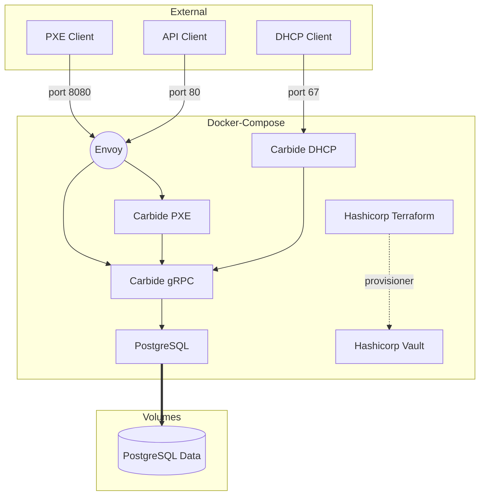

# Carbide - Bare Metal Provisioning


## Introduction

Carbide is a bare metal provisioning system used to manage the lifecycle of
bare metal machines.

Please see [The Book](https://nvmetal.gitlab-master-pages.nvidia.com/carbide/index.html) for more detail about roadmap & architecture.

Discussion happens on #ngc-metal slack channel.

## Setting up development environments

We aim to keep the development environment as self-contained and automated as
possible.  Each time we on-board new staff we want to enshrine more of each
development cluster bring up into tooling instead of institutional knowledge.
To that end, we are using docker compose to instantiate a development
environment.

[The docker compose configuration file](docker-compose.yml) contains all of the
software in the control plane in order to make requests to a working Carbide
installation.

The docker-compose configuration starts an environment that looks generally 
like this:



The container used to run components is specified by [the default
Dockerfile](Dockerfile).  This contains the prereqs to run the components and
where the build actually happens.  The containers run ```cargo watch``` in
order to recompile on changes.

(NOTE: this messes with ```rust-analyzer``` and needs someone to fix it)


### QEMU
QEMU and UEFI firmware are required to PXE boot a VM using Carbide

Arch - `pacman -S qemu edk2-ovmf`
Ubuntu - `apt-get install qemu edk2-ovmf`

You might need to modify or create `/etc/qemu/bridge.conf` and add `allow carbide0`

`cargo install cargo-make`

Build a container for running local development

```
cargo make runtime-container
```

### docker

We use docker-compose to spin up a local carbide development environment

Arch - `pacman -S docker-compose`
Ubuntu - `apt-get install docker-compose`

Before you can start the carbide development environment you must `init` terraform
to create a terraform state file which we do not checked into VCS.

In `dev/terraform` directory, run:

```
   docker run -v ${PWD}:/junk --rm hashicorp/terraform -chdir=/junk init
```

### Bootstrapping Carbide
1. Create a domain -

```
grpcurl -d '{"name":"forge.local"}' -plaintext 127.0.0.1:80 metal.v0.Metal/CreateDomain
```

2. Create a new `networkSegment` using the id returned from domain step 1

```
grpcurl -d '{"name":"test", "prefix_ipv4": "172.20.0.0/24", "prefix_ipv6": "::1/128", "mtu": 1490, "reserve_first_ipv4": 0, "reserve_first_ipv6": 0, "gateway_ipv4": "172.20.0.1", "subdomain_id": { "value":"<UUID From domain>"}}' -plaintext 127.0.0.1:80 metal.v0.Metal/CreateNetworkSegment
```


### PXE Client

```
sudo qemu-system-x86_64 -boot n -nographic -serial mon:stdio -cpu host \
  -accel kvm -device virtio-serial-pci -display none \
  -netdev bridge,id=carbidevm,br=carbide0 \
  -device virtio-net-pci,netdev=carbidevm \
  -bios /usr/share/ovmf/OVMF.fd
```

While not needed for PXE, it is sometimes helpful to seed DB entries 
for debugging SQL queries: 

```
INSERT INTO machines DEFAULT VALUES;

INSERT INTO machine_interfaces (machine_id, segment_id, mac_address, address_ipv4, address_ipv6, domain_id, hostname,
primary_interface) VALUES ('<machine uuid>', '<segment uuid>', 'de:af:de:ad:be:ed', '172.20.0.5', '::2', '<domain uuid>', 'myhost', true);
```

## SJC4 Lab Environments
### Required access groups
In order to reach the any of IP's listed you will need to be a member of 
the `ngc-automation` and `sagan` ssh groups. Without this ssh access you cannot
access the jump hosts.

You must first install [nvinit](https://confluence.nvidia.com/display/COS/Security+Engineering+Home#SecurityEngineeringHome-CertificateBasedSSHAccessforNGCHosts) and Hashicorp vault

SSH group membership:

First is `sagan`.  Make a [dlrequest](https://dlrequest/GroupID/Groups/Properties?identity=M2UwMzM1NGI0M2Q2NDFkZWIyZTUwZjA1Zjk4YmQxMmV8Z3JvdXA=) Click Join -> Join perpetually

Second group is `ngc-automation`, open a Jira using [this](https://jirasw.nvidia.com/browse/NGCSEC-1183) as a template

When you have been added to one of the groups, you will need to sign-in to vault

```
vault login -method=ldap username=<your AD username> -passcode=<passcode from duo>  
```

You will know when you are a member a group based on the policies 
returned from `vault login` (example below where you are a member of `sagan` and `ngc-automation`)

```
Success! You are now authenticated. The token information displayed below
is already stored in the token helper. You do NOT need to run "vault login"
again. Future Vault requests will automatically use this token.

Key                    Value
---                    -----
token                  XXXXXXXXXXX
token_accessor         XXXXXXXXXXX
token_duration         1h
token_renewable        true
token_policies         ["default" "jwt-nvidia-policy" "ngc-devops-service-accounts-policy" "ngc-user-policy" "sagan-policy"]
identity_policies      ["jwt-nvidia-policy"]
policies               ["default" "jwt-nvidia-policy" "ngc-devops-service-accounts-policy" "ngc-user-policy" "sagan-policy"]
token_meta_username    <your AD login>
```

Once authenticated to vault, you use nvinit to request additional principals
Before running the commands below make sure to have `ssh-agent` running.  
```
eval $(ssh-agent)
ssh-add -D
```

```
nvinit ssh -user <AD username> -principals "<AD username>,bouncer" -passcode <DUO passcode>
nvinit ssh -user <AD username> -vault-role sshca-usercert/issue/sagan
nvinit ssh -user <AD username> -vault-role sshca-devopscert/issue/ngc-automation
```

Add the following to your `.ssh/config`. The user depends on which ssh group you use are a member of,
but bouncer should be sufficient for most.

```
Host sjc4jump
  Hostname 24.51.7.3
  Compression yes
  User ngc-devops
  PubkeyAcceptedKeyTypes=+ssh-rsa-cert-v01@openssh.com  // This is only required if you are running the latest SSH.  OpenSSH deprecated RSA a while ago
```
### Host info
Related Info about Lab hosts:

https://jirasw.nvidia.com/browse/NSVIS-3666
https://docs.google.com/spreadsheets/d/1wbRW8zcw_rx05fgP6ThK288d0W_WRIVe6uErUpqT0Eg/edit?userstoinvite=rdancel@nvidia.com&actionButton=1#gid=2074715696
https://netbox.nvidia.com/dcim/racks/6496/


| hostname   | DPU BMC IP    | DPU OOB IP    | HOST OOB IP   | HOST IP                          | DPU BMC Credentials | DPU OOB Credentials | ILO Creds             | Host OS Creds   |
| ---------- | ------------- | ------------- | ------------- | -------------------------------- | ------------------- | ------------------- | --------------------- | --------------  |
| forge001   | 10.146.38.232 | 10.146.38.229 | 10.146.38.242 | 10.150.51.235 / 10.150.51.236    | `root/0penBmc123`   | `ubuntu:ubuntu`     | `sjc4dcops:sjc4dcops` | `ubuntu:ubuntu` |
| forge002   | 10.146.38.233 | 10.146.38.228 | 10.146.38.243 | 10.150.115.234 / 10.150.115.245  | `root/0penBmc123`   | `ubuntu:ubuntu`     | `sjc4dcops:sjc4dcops` | `ubuntu:ubuntu` |
| forge003   | 10.146.38.234 | 10.146.38.227 | 10.146.38.244 | 10.150.51.230 / 10.150.51.229    | `root/0penBmc123`   | `ubuntu:ubuntu`     | `sjc4dcops:sjc4dcops` | `ubuntu:ubuntu` |
| forge004   | 10.146.38.235 | 10.146.38.226 | 10.146.38.245 | 10.150.115.236 / 10.150.115.237  | `root/0penBmc123`   | `ubuntu:ubuntu`     | `sjc4dcops:sjc4dcops` | `ubuntu:ubuntu` |
| forge005   | 10.146.38.236 | 10.146.38.225 | 10.146.38.246 | 10.150.51.228 / 10.150.51.227    | `root/0penBmc123`   | `ubuntu:ubuntu`     | `sjc4dcops:sjc4dcops` | `ubuntu:ubuntu` |

### Connecting to DPU
The DPU shares a physical 1GB ethernet connection for both BMC and OOB access.  
This one interface has two different MAC addresses. So, while the physical 
connection is shared the OOB and BMC have unique IP addresses.

The BMC OS is a basic `busybox` shell,  so the available commands are limited.
To connect the BMC, ssh to the IP address listed under `DPU BMC IP` address 
using credentials in the `DPU BMC Credentials` table above.

To then connect to the 'console' of the DPU you use `microcom` on the
console device

```
microcom /dev/rshim0/console

Press enter to bring up login prompt.

use the login credentials in the DPU OOB column to connect

ctrl-x will break out of the connection
```

Another way (and preferred if the OOB interfaces are provisioned) is to ssh
directly to the IP listed in `DPU OOB IP` and use the credentials in the
`DPU OOB Credentials` column. This bypasses the BMC and connects you directly to
the DPU OS.

#### Updating to the latest BFB on a DPU


Download the latest BFB from artifactory - https://urm.nvidia.com/artifactory/list/sw-mlnx-bluefield-generic/Ubuntu20.04/

In order to upgrade the OS you will need to `scp` the BFB file to a specific directory on the DPU.
`scp DOCA_1.3.0_BSP_3.9.0_Ubuntu_20.04-3.20220315.bfb root@bmc_ip:/dev/rshim0/boot` once the file is copied the DPU reboots and completes the install of the new BFB.

Note you will need to request access to the `ngc-automation` or `sagan` ssh group
in order to login to a jump host.


Recent versions of BFB can also contain firmware updates which can need to be applied using `/opt/mellanox/mlnx-fw-updater/mlnx_fw_updater.pl` after that completes
you must power cycle (not reboot) the server.  For HP the "Cold restart" option in iLO works.   

`mlxfwmanager` will tell you the current version of firmware as well as the new version that will become active on power cycle

Open Vswitch is loaded on the DPUs 
`ovs-vsctl` show will show which interfaces are the bridge interfaces

From the ArmOS BMC you can instruct the DPU to restart using 

`echo "SW_RESET 1" > /dev/rshim0/misc`

The DPU Might require the following udev rules to enable auto-negotiation.  You can look if that is already enable

```
echo 'SUBSYSTEM=="net", ACTION=="add", NAME=="p0", RUN+="/sbin/ethtool -s p0 autoneg on"' >> /etc/udev/rules.d/83-net-speed.rules
echo 'SUBSYSTEM=="net", ACTION=="add", NAME=="p1", RUN+="/sbin/ethtool -s p1 autoneg on"' >> /etc/udev/rules.d/83-net-speed.rules
```

```
ethtool p0 | grep -P 'Speed|Auto'
ethtool p1 | grep -P 'Speed|Auto'

Output should look like this assuming it is connecting to a 25G port

	Speed: 25000Mb/s
	Auto-negotiation: on
```


## Production containers on Quay.io

You must first be a member of the nvidia organization at Quay.io hop
 #swngc-devops

TODO


---

# New or bored
## Still needs documentation

If you're new or bored, feel free to do one of these:

- How to configure libvirt for qemu based PXE booting on EFI
- How to configure DHCP relay to the docker-compose constellation
- Document how to run the Ci/CD tests that gitlab does, locally

## If you see something, say something

If you see possible improvements or doing things that are sub-optimial, but don't have time to fix it, just file a jira and move on.


---

# Legacy / Archival

### Pre-reqs
  * Kea
  * Rust
  * Postgresql
  * boost-libs
  * gnu-c++

### PostgreSQL

You can run PostgreSQL locally if you wish.  We expect your unix username to be
able to create/delete databases for tests, or have a single database to run the
code in.

1. ```sudo -iu postgres```
2. ```initdb --locale=en_US.UTF-8 -E UTF8 -D /var/lib/postgres/data```
3. ```createuser --interactive carbide_development (answer yes to super user)```
4. ```createdb carbide_development```
5. ```cargo run --bin carbide-api migrate```

### Kea

1. Install Kea from package manager or compile from source
2.```cp dev/kea-dhcp4.conf.example dev/kea-dhcp4.conf```
  *Make sure to change the listen interface to reflect your system.*
