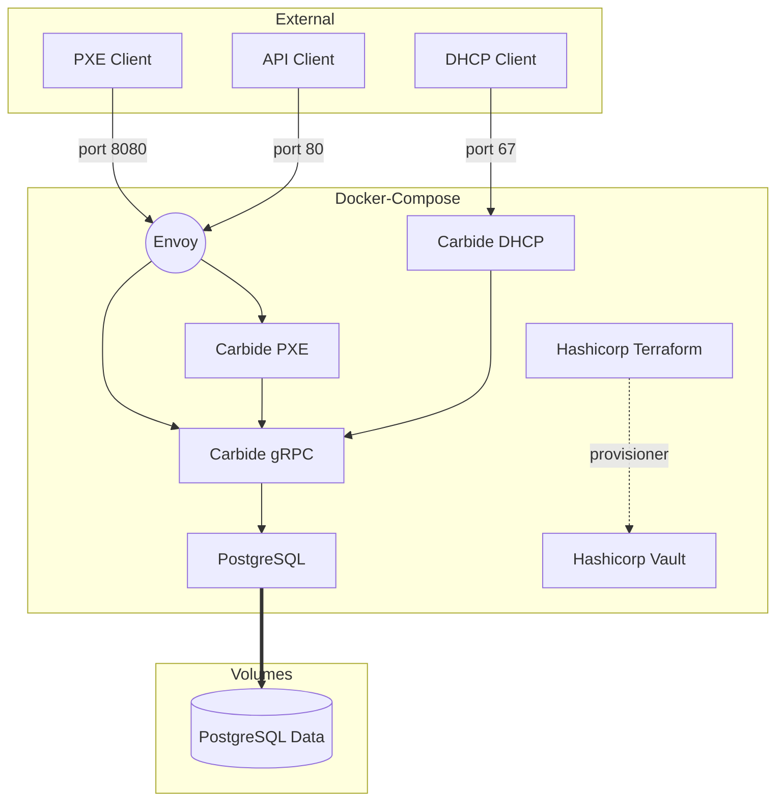

# Carbide - Bare Metal Provisioning


## Introduction

Carbide is a bare metal provisioning system used to manage the lifecycle of
bare metal machines.

Please see [The Book](https://nvmetal.gitlab-master-pages.nvidia.com/carbide/index.html) for more detail about roadmap & architecture.

Discussion happens on #ngc-metal slack channel.

## Setting up development environments

We aim to keep the development environment as self-contained and automated as
possible.  Each time we on-board new staff we want to enshrine more of each
development cluster bring up into tooling instead of institutional knowledge.
To that end, we are using docker compose to instantiate a development
environment.

[The docker compose configuration file](docker-compose.yml) contains all of the
software in the control plane in order to make requests to a working Carbide
installation.

The docker-compose configuration starts an environment that looks generally 
like this:



The container used to run components is specified by [the default
Dockerfile](Dockerfile).  This contains the prereqs to run the components and
where the build actually happens.  The containers run ```cargo watch``` in
order to recompile on changes.

(NOTE: this messes with ```rust-analyzer``` and needs someone to fix it)


### QEMU
QEMU and UEFI firmware are required to  PXE boot a VM using Carbide

Arch - `pacman -S qemu edk2-ovmf`
Ubuntu - `apt-get install qemu edk2-ovmf`

You might need to modify or create `/etc/qemu/bridge.conf` and add `allow carbide0`

`cargo install cargo-make`

Build a container for running local development

```
cargo make runtime-container
```

### docker

We use docker-compose to spin up a local carbide development environment

Arch - `pacman -S docker-compose`
Ubuntu - `apt-get install docker-compose`

Before you can start the carbide development environment you must `init` terraform
to create a terraform state file which we do not checked into VCS.

In `dev/terraform` directory, run:

```
   docker run -v ${PWD}:/junk --rm hashicorp/terraform -chdir=/junk init
```

### Bootstrapping Carbide
1. Create a domain -

```
grpcurl -d '{"name":"forge.local"}' -plaintext 127.0.0.1:80 metal.v0.Metal/CreateDomain
```

2. Create a new `networkSegment` using the id returned from domain step 1

```
grpcurl -d '{"name":"test", "prefix_ipv4": "172.20.0.0/24", "prefix_ipv6": "::1/128", "mtu": 1490, "reserve_first_ipv4": 0, "reserve_first_ipv6": 0, "gateway_ipv4": "172.20.0.1", "subdomain_id": { "value":"<UUID From domain>"}}' -plaintext 127.0.0.1:80 metal.v0.Metal/CreateNetworkSegment
```


### PXE Client

```
sudo qemu-system-x86_64 -boot n -nographic -serial mon:stdio -cpu host \
  -accel kvm -device virtio-serial-pci -display none \
  -netdev bridge,id=carbidevm,br=carbide0 \
  -device virtio-net-pci,netdev=carbidevm \
  -bios /usr/share/ovmf/OVMF.fd
```

While not needed for PXE, it is sometimes helpful to seed DB entries 
for debugging SQL queries: 

```
INSERT INTO machines DEFAULT VALUES;

INSERT INTO machine_interfaces (machine_id, segment_id, mac_address, address_ipv4, address_ipv6, domain_id, hostname,
primary_interface) VALUES ('<machine uuid>', '<segment uuid>', 'de:af:de:ad:be:ed', '172.20.0.5', '::2', '<domain uuid>', 'myhost', true);
```

## SJC4 Lab Environments

| hostname   | DPU BMC       | DPU OOB       | HOST OOB      | HOST IP                         |
| ---------- | ------------- | ------------- | ------------- | ------------------------------- |
| forge001   | 10.146.38.232 | 10.146.38.229 | 10.146.38.242 | 10.150.51.235 / 10.150.51.236   |
| forge002   | 10.146.38.233 | 10.146.38.228 | 10.146.38.243 | 10.150.115.234 / 10.150.115.245 |
| forge003   | 10.146.38.234 | 10.146.38.227 | 10.146.38.244 | 10.150.51.230 / 10.150.51.229   |
| forge004   | 10.146.38.235 | 10.146.38.226 | 10.146.38.245 | 10.150.115.236 / 10.150.115.237 |
| forge005   | 10.146.38.236 | 10.146.38.225 | 10.146.38.246 | 10.150.51.228 / 10.150.51.227   |

## Production containers on Quay.io

You must first be a member of the nvidia organization at Quay.io hop
 #swngc-devops

TODO


---

# New or bored
## Still needs documentation

If you're new or bored, feel free to do one of these:

- How to configure libvirt for qemu based PXE booting on EFI
- How to configure DHCP relay to the docker-compose constellation
- Document how to run the Ci/CD tests that gitlab does, locally

## If you see something, say something

If you see possible improvements or doing things that are sub-optimial, but don't have time to fix it, just file a jira and move on.


---

# Legacy / Archival

### Pre-reqs
  * Kea
  * Rust
  * Postgresql
  * boost-libs
  * gnu-c++

### PostgreSQL

You can run PostgreSQL locally if you wish.  We expect your unix username to be
able to create/delete databases for tests, or have a single database to run the
code in.

1. ```sudo -iu postgres```
2. ```initdb --locale=en_US.UTF-8 -E UTF8 -D /var/lib/postgres/data```
3. ```createuser --interactive carbide_development (answer yes to super user)```
4. ```createdb carbide_development```
5. ```cargo run --bin carbide-api migrate```

### Kea

1. Install Kea from package manager or compile from source
2.```cp dev/kea-dhcp4.conf.example dev/kea-dhcp4.conf```
  *Make sure to change the listen interface to reflect your system.*
