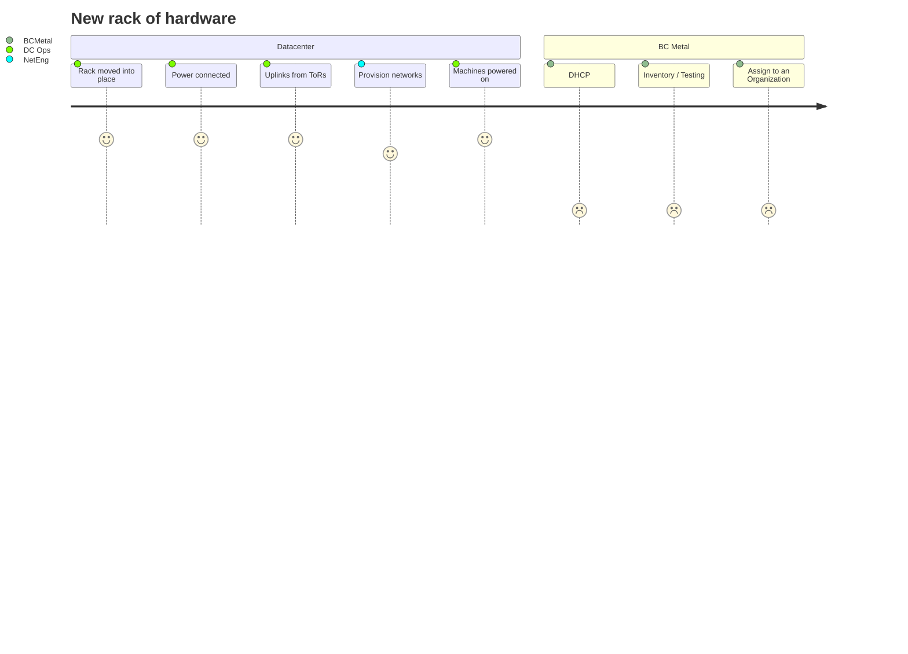

# Carbide

Marketing Name: **Base Command Metal**

* [Carbide GitLab project](https://gitlab-master.nvidia.com/aforgue/carbide)
* [Base Command Metal - JIRA](https://jirasw.nvidia.com/projects/NSVIS/summary) (BC Metal Component)

Carbide is a bare metal provisioning system written in Rust that uses gRPC and PostgreSQL to maintain machine lifecycle.

Carbide manages a machine with no prior knowledge of the machine and moves it through a state machine to perform tasks on the machine such as:

* Hardware Inventory
* IPMI setup
* Hardware Testing & Burn-in
* Firmware validation & updating
* Tenant management
* IP address allocation (IPv4 & IPv6)
* Power-on/off, set boot order, get IPMI SEL logs
* Provide DNS responses for managed machines

#### Project Goals

* Minimal footprint for deployment (single, low-power machine)
* Minimal configuration of the managed environment (no pre-configuring hosts, IP addresses, or other inventory)
* Confidence the machine is ready to be used when it's provisionable
* Knowledge of broken/unavailable machines and integration with existing DC workflows
* Wide variety of Hardware platforms including DGX, EGX, amd64 compute and ARM platforms
* Expose NVIDIA specific infrastructure technologies with an API for other NVIDIA platforms
* Deploy ESXi and Ubuntu hosts

#### Non-goals

* Configuration of services & software running on managed machines
* A standalone product outside of NVIDIA clusters and datacenters
* Higher level machine workflows (e.g. time-based machine allocation)
* General DNS service
* Network device management (excluding DPUs)
* OS image build pipeline
* Network / Subnet / Fabric management
* General purpose IP address management

Components
----------

Carbide provides several services to provide management interfaces for machines, but the vast majority of interaction happens through the API `services/src/daemons/api.rs`.

API
: This API is responsible for interacting with the High-Level resources (Machines, Networks, Interfaces, etc) via gRPC

DHCP
: Serves DHCP to machines on known networks

DNS
: Services DNS responses for forward and reverse DNS for machines under it's management

IPMI
: Proxy for accessing IPMI interfaces for performing power-on/power-off and changing boot order of machines

PXE
: A template generator for generating machine instructions when the machine network boots

Events
: A gRPC event stream that logs events happening to machines to consume for application specific purposes


```mermaid
journey
	title Create a new project
	section
```

