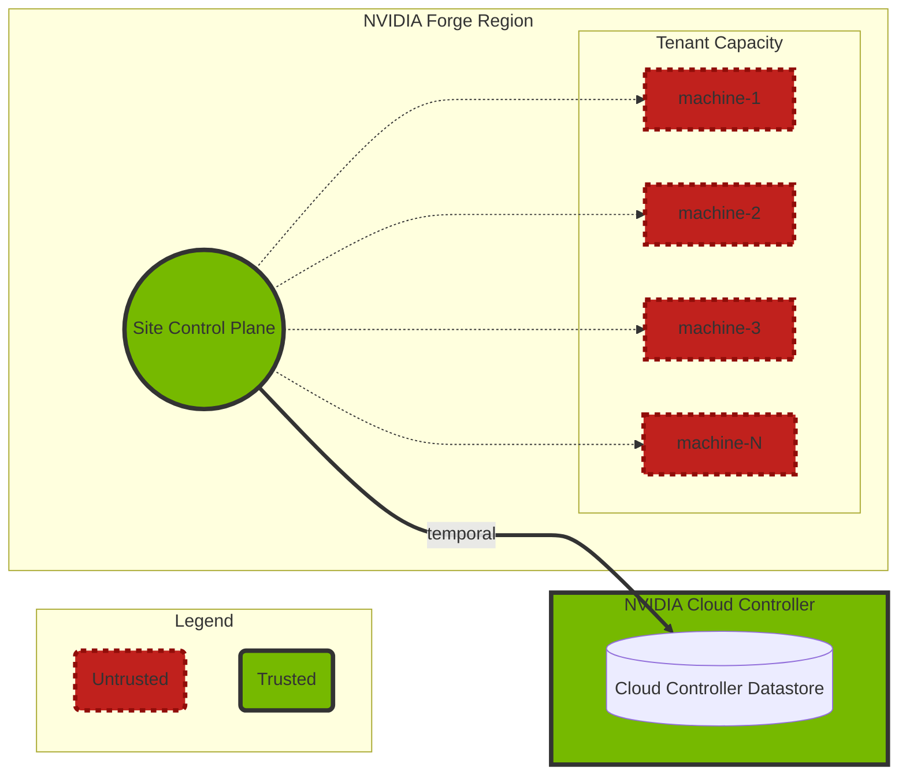

# NVIDIA Forge

NVIDIA Forge exists to manage the end-to-end lifecycle of bare-metal machines consisting of NVIDIA certified hardware and software, as well as managing allocation of this bare metal to external organizations and customers.  It is designed to support network virtualization, and enable fungible capacity in a purely automatic way.   NVIDIA Forge is intended to be multi-datacenter, multi-tenant, with a single cloud-control plane for management of sites and hardware within those sites.  NVIDIA Forge is a "Bare Metal as-a-service" offering built on NVIDIA Hardware and Software.

NVIDIA Forge has two major components.  First, a cloud control plane that can manage multiple sites, handles account management, billing and scheduling of hardware and instances to various tenants.  Next is the on-prem control plane that manages the end-to-end lifecycle of individual machines and networks between those machines.

This set of documentation covers only the technical documentation for the on-premises NVIDIA Forge control plane.  It does not cover the NVIDIA Forge cloud control plane.

NVIDIA Forge's responsibility ends at booting the machine into a user-defined Host OS, all further responsibility is outside the scope of NVIDIA Forge.

## NVIDIA Forge principles

* The machine is untrustworthy
* We cannot impose any requirements on operating system running on the machine
* After being racked, machines must become ready for tenant use with no human intervention
* The machine must be able to assert trustworthiness at any time or be removed from the pool
* All monitoring of the machine must be done via out-of-band methods
* End-to-end SLO is inclusive of planned and unplanned maintenance
* Keep the underlay and fabric configuration as static and simple as possible

## NVIDIA Forge responsibilities

* Maintain Hardware Inventory
* Perform initial IPMI setup of usernames/password
* Hardware Testing & Burn-in
* Firmware validation & updating
* IP address allocation (IPv4 & IPv6)
* Power control (power on/off/reset)
* Provide DNS services for managed machines
* Orchestrating provisioning, wiping, & releasing nodes
* Ensuring trust of the machine when switching tenants

## NVIDIA Forge Non-goals

* Configuration of services & software running on managed machines
* Cluster assembly (i.e. it does not build SLURM or Kubernetes clusters)
* Underlay network management
