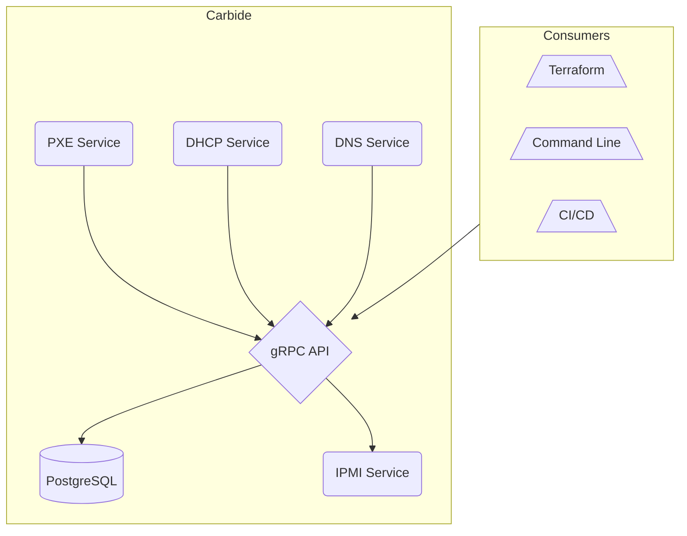

# Architecture

Carbide is a gRPC service with multiple components that drive actions based on the API calls performed by the consumer, or by events triggered by machines (i.e. DHCP boot or PXE request).

Each service will communicate with the API over [gRPC](https://grpc.io) using [protocol buffers](https://developers.google.com/protocol-buffers).  The API uses [gRPC reflection](https://github.com/grpc/grpc/blob/master/doc/server-reflection.md) to provide a machine readable API description so clients can auto-generate code and RPC functions in the client.

Each service runs as a separate daemon on any machine with IP connectivity to the API, and must be configured with the URL to the API server, the API, DHCP, PXE, and DNS services are indented to be horizontally scaled, behind a reverse proxy (load-balancer) to provide High-Availability and fault-tolerance for the components.  The IPMI service as of now, must be single instance.  This is due to requiring a single actor to handle IPMI requests to a machine (i.e. it's not desireable to have multiple IPMI services powering on and off the same machine.  This limitation will eventually be removed.

When services start up, they are expected to be given a TLS certificate.  This certificate is used for client-side authentication (i.e. "mutual TLS") to the API server.  The API server will authenticate the client, the API call it's trying to perform, and whether or not this service has access to perform the operation.  This schema (encoding roles in TLS certificates is not yet defined).

Users of the service (i.e. not other internal components) will authenticate to the API with a JWT token which will contain roles and capabilities of that service.  It's expected that users and automated processes will retrieve JWT tokens from a system like [Vault](https://vaultproject.io) and presented to the API.
