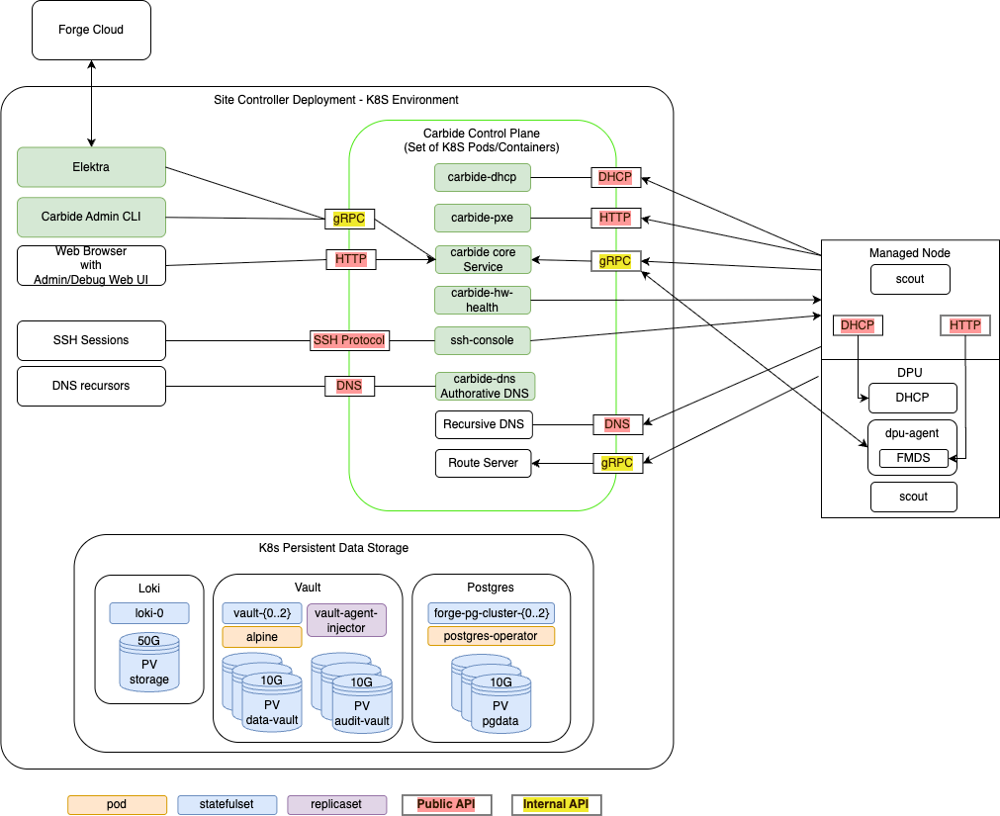

# Architecture

This page discusses the high level architecture of a Forge managed site.

Each site managed by the [Forge Cloud](https://gitlab-master.nvidia.com/nvmetal/cloud-api) must have an established
control plane through which command and control traffic can flow in order to deploy and opperate tenant resources. The
control plane is deployed via [Fleet Command](https://docs.nvidia.com/fleet-command/user-guide/0.1.0/overview.html)
and consists of a three node Kubernetes cluster on which we run all the required services.

<-- Source drawio file at static/site-controller.drawio -->

## Carbide Components and Services

Carbide is a gRPC service with multiple components that drive actions based on the API calls performed by the consumer,
or by events triggered by machines (i.e. DHCP boot or PXE request).

Each service will communicate with the API over [gRPC](https://grpc.io) using
[protocol buffers](https://developers.google.com/protocol-buffers). The API uses
[gRPC reflection](https://github.com/grpc/grpc/blob/master/doc/server-reflection.md) to provide a machine readable API
description so clients can auto-generate code and RPC functions in the client.

The Carbide API server includes a number of services:

- [Carbide API service](https://gitlab-master.nvidia.com/nvmetal/carbide/-/tree/trunk/api): The Carbide API service
  is responsible for managing and providing configuration state to Forge managed components including
  networking (VPCs, subnets and Infiniband partitions) and managed hosts. The API service provides APIs for users
  (site providers/tenants/site administrators) to query the state of all objects and to request the creation,
  configuration and deletion of entities.
- [DHCP](https://gitlab-master.nvidia.com/nvmetal/carbide/-/tree/trunk/dhcp): The DHCP server provides IPs to all
  devices on underlay networks. This includes Host BMCs, DPU BMCs and DPU OOB addresses. It also at the moment
  provides IPs to Hosts on overlay network - both when the host machine is on the admin network for maintenance
  use-cases as well as when the host is assigned to a tenant as an instance. There is currently (as of March 2024)
  an effort to migrate DHCP handling for host machines on overlay networks directly onto the DPU.  Please see
  [dpu-based-host-dhcp](https://gitlab-master.nvidia.com/nvmetal/designs/-/blob/main/designs/026-DPU-Local-Host-DHCP.md)
  for more information.
- [PXE](https://gitlab-master.nvidia.com/nvmetal/carbide/-/tree/trunk/pxe): The PXE server delivers images to
  managed hosts at boot time. Currently, managed hosts are configured to always boot from PXE. If a local
  bootable device is found, the host will boot it. Hosts can also be configured to always boot from a
  particular image for stateless configurations.
- [Hardware health](https://gitlab-master.nvidia.com/nvmetal/carbide/-/blob/trunk/health): This service pulls
  hardware health and configuration information emitted from a Prometheus /metrics endpoint on port 9009 and
  reports that state information back to Carbide.
- [SSH console](https://gitlab-master.nvidia.com/nvmetal/ssh-console): The SSH console provides a virtual serial
  console logging and access over ssh. The virtual serial console allows viewing the console of remote
  machines deployed in customer sites. The ssh-console also logs the output of each hosts serial console into
  the logging system (Loki), from where it can be queried using Grafana and logcli.
- [DNS](https://gitlab-master.nvidia.com/nvmetal/carbide/-/blob/trunk/dns): Domain name service (DNS) fuctionality
  is handled by two services. The `carbide-dns` service handels DNS queries from the site controller and managed nodes
  and is authoritative for all `<name>.<site>.frg.nvidia.com` records while the
  `unbound` service hands out authoritative DNS records to the outside world.
- Route Server: The route server (K8s service `frrouting`) is responsible for configuring networking, especially
  border gateway protocol (BGP) and networking for the DPUs installed in managed nodes.

## Site Controller Components and Services

In addition to the Carbide API server components there are other supporting services run within the K8s site
controller nodes.

### Forge Management

- The entry point for the Forge Cloud components into a Forge managed site is through the
  [Elektra site agent](https://gitlab-master.nvidia.com/nvmetal/elektra-site-agent). The site agent maintains a
  northbound [Temporal](https://gitlab-master.nvidia.com/nvmetal/cloud-temporal) connection to the cloud control plane
  for command and control.
- The [Forge admin CLI](https://gitlab-master.nvidia.com/nvmetal/carbide/-/tree/trunk/admin) provides a command
  line interface into Carbide.

### K8s Persistent Storage Objects

Some site controller node services require persistent, durable storage to maintain state for their attendant
pods. There are three different K8s statefulsets that run in the controller nodes:

- [Loki](https://grafana.com/oss/loki/) - The loki/loki-0 pod instatites a single 50GB persistent volume and is used to
  store logs for the site controller components.
- [Hashicorp Vault](https://www.vaultproject.io/) - Used by Kubernetes for certificate signing requests (CSRs). Vault
  uses three each (one per K8s control node) of the `data-vault` and `audit-vault` 10GB PVs to protect and distribute
  the data in the absense of a shared storage solution.
- [Postgres](https://www.postgresql.org/) - Used to store state for any Carbide or site controller components that
  require it including the main "forgedb". There are three 10GB `pgdata` PVs deployed to protect and distribute
  the data in the absense of a shared storage solution. The `forgedb` database is stored here.

## Managed Hosts

The point of having a site controller is to administer a site that has been populated with tenant managed hosts.
Each managed host is a pairing of a one (and only one as of March 2024) Bluefield (BF) 2/3 DPU and a host server.
During initial deployment [scout](https://gitlab-master.nvidia.com/nvmetal/carbide/-/tree/trunk/scout) runs and
informs carbide-api of any discovered DPUs. Carbide completes the installation of services on the DPU and boots
into regular operation mode. Thereafter the forge-dpu-agent starts as a daemon.

Each DPU runs the forge-dpu-agent which connects via gRPC to the API service in Carbide to get configuration
instructions.

<!-- Commenting out the following until FMDS is merged in.

The forge-dpu-agent also runs the Forge metadata service (FMDS) which parses the Infiniband
networking setup and configures the virtualized network interface for the tenant host operating system. FMDS
is always available at 169.254.169.254 and is a source for the tenant's software to know the hosts IP address,
Infiniband ids and any user-data configured, among other things.
-->
