# Architecture

Carbide is a gRPC service with multiple components that drive actions based on the API calls performed by the consumer, or by events triggered by machines (i.e. DHCP boot or PXE request).

```mermaid
flowchart LR

    subgraph cloud["NVMetal Cloud"]
        cloudkafka[(Kafka)]
        cloudservices(Cloud Services)
    end
    subgraph external["External Access"]
        resolvers(DNS resolvers)
        partner(Site Managers)
        customers(Customers)
        randos(3rd party)
    end
    subgraph onprem["NVMetal Region Control Plane (on-prem)"]
        nsvlb(Load Balancer)
        boot(Boot Controller)

        dhcp(DHCP Service)
        ipmi(IPMI/Redfish Proxy)

        gateway(API gateway)
        carbide(Carbide API)
        hydrazine(Hydrazine API)
        dns(DNS Service)

        postgresql[(PostgreSQL)]
        vault[(Vault)]
        grafana(Grafana)
        prometheus(Prometheus)
        tsdb[(Timeseries DB)]
    end

    subgraph tenant["Tenant Capacity"]
        tenantcpu(Tenant Node)

        subgraph dpu["BlueField-2 DPU"]
           hbn(Cumulus HBN)
        end
    end
    subgraph Legend
        legend_untrusted(Untrusted)
        legend_nvidia(NVidia written)
        legend_oss(3rd party/Open Source)
        legend_trusted(Trusted)
    end

    resolvers -->|port 53| dns
    
    carbide --> hydrazine
    carbide ===> postgresql
    
    tenantcpu -->|port 67/udp| dhcp ---> carbide
    tenantcpu -->|port 443| boot --> carbide
    carbide --> ipmi -->|port 623,443| tenantcpu

    dns --> carbide
    nsvlb --> gateway
    gateway --> grafana
    gateway --> carbide
    grafana --> prometheus ===> tsdb
    carbide --->|Kafka Channel| cloudkafka
    hydrazine --> hbn
    carbide ===>|Secrets & Certificates| vault
    partner -->|port 443| nsvlb
    randos -->|user defined| tenantcpu

    customers -->|port 80/443| cloudservices
    cloudservices ---> cloudkafka

    classDef nvidia fill:#76b900,stroke:#333,stroke-width:4px;
    classDef medium_grey fill:#708090
    classDef dark_grey fill:#3b444b
    classDef blue fill:blue
    classDef untrusted fill:#c0211d,stroke:#900d09,stroke-width:4px,stroke-dasharray: 5 5;

    class legend_untrusted,external,tenant untrusted
    class legend_trusted,onprem,cloud,dpu nvidia
    class legend_nvidia,dhcp,dns,boot,nsvlb,carbide,hydrazine,ipmi,hbn,cloudservices medium_grey
    class legend_oss,gateway,grafana,prometheus,tsdb,postgresql,vault,cloudkafka dark_grey
```

Each service will communicate with the API over [gRPC](https://grpc.io) using [protocol buffers](https://developers.google.com/protocol-buffers).  The API uses [gRPC reflection](https://github.com/grpc/grpc/blob/master/doc/server-reflection.md) to provide a machine readable API description so clients can auto-generate code and RPC functions in the client.

The NVIDIA Metal region control plane maintains a Kafka connection to the cloud control plane for command and control.

