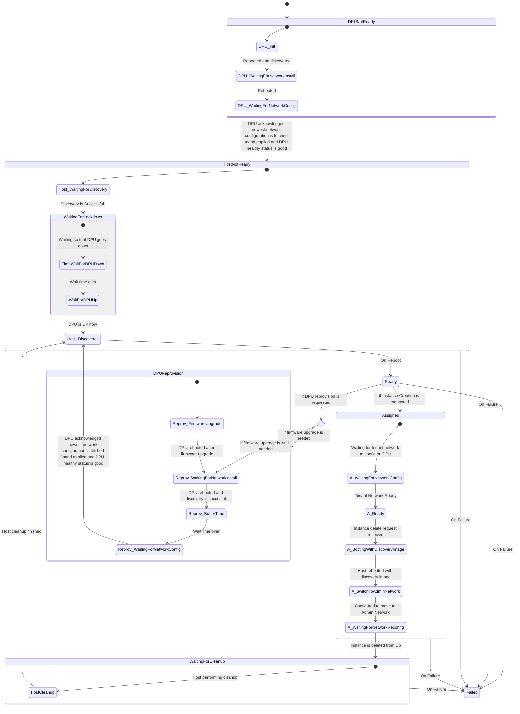

```mermaid
stateDiagram-v2
%%classDef ready fill:green,color:white,font-weight:bold,font-size:30px,stroke-width:2px,stroke:yellow
%%classDef assigned fill:#FFFDD0,font-weight:bold,font-size:23px,stroke-width:2px,stroke:green
%%classDef reprov fill:#F9E6BD,font-weight:bold,font-size:23px,stroke-width:2px,stroke:black
%%classDef hostnotready fill:#CAE2F9,font-weight:bold,font-size:23px,stroke-width:2px,stroke:black
%%classDef dpunotready fill:#C7F3ED,font-weight:bold,font-size:23px,stroke-width:2px,stroke:black
%%classDef cleanup fill:white,font-weight:bold,font-size:23px,stroke-width:2px,stroke:orange
%%classDef failed fill:#f00,color:white,font-size:25px,font-weight:bold,stroke-width:2px,stroke:yellow

  [*] --> DPUNotReady
  state DPUNotReady {
    [*] --> DPU_Init
    DPU_Init --> DPU_WaitingForNetworkInstall: Rebooted and discovered
    DPU_WaitingForNetworkInstall --> DPU_WaitingForNetworkConfig: Rebooted
  }
  DPU_WaitingForNetworkConfig --> HostNotReady: DPU acknowledged newest network configuration is fetched \nand applied and DPU healthy status is good
  state HostNotReady {
    [*] --> Host_WaitingForDiscovery
    Host_WaitingForDiscovery --> WaitingForLockdown: Discovery is Successful.
    state WaitingForLockdown {
      [*] --> TimeWaitForDPUDown: Waiting so that DPU goes down
      TimeWaitForDPUDown --> WaitForDPUUp: Wait time over
    }
    WaitingForLockdown --> Host_Discovered: DPU is UP now.
  }
  Host_Discovered --> Ready: On Reboot
  state Ready <<choice>>
  state FirmwareUpgradeNeeded <<choice>>
  Ready --> FirmwareUpgradeNeeded: if DPU reprovision is requested
  Ready --> Assigned: if Instance Creation is requested

  state Assigned {
    [*] --> A_WaitingForNetworkConfig: Waiting for tenant network to config on DPU
    A_WaitingForNetworkConfig --> A_Ready: Tenant Network Ready
    A_Ready --> A_BootingWithDiscoveryImage: Instance delete request received
    A_BootingWithDiscoveryImage --> A_SwitchToAdminNetwork: Host rebooted with discovery image
    A_SwitchToAdminNetwork --> A_WaitingForNetworkReconfig: Configured to move to Admin Network
  }
  A_WaitingForNetworkReconfig --> WaitingForCleanup: Instance is deleted from Db

  state WaitingForCleanup {
    [*] --> HostCleanup : Host performing cleanup
  }
  HostCleanup --> Host_Discovered: Host cleanup finished
  FirmwareUpgradeNeeded --> DPUReprovision: if firmware upgrade is needed
  FirmwareUpgradeNeeded --> Reprov_WaitingForNetworkInstall: if firmware upgrade is NOT needed
  state DPUReprovision {
    [*] --> Reprov_FirmwareUpgrade
    Reprov_FirmwareUpgrade --> Reprov_WaitingForNetworkInstall: DPU rebooted after firmware upgrade
    Reprov_WaitingForNetworkInstall --> Reprov_BufferTime: DPU rebooted and discovery is succesful.
    Reprov_BufferTime --> Reprov_WaitingForNetworkConfig: Wait time over
  }

  Reprov_WaitingForNetworkConfig --> Host_Discovered: DPU acknowledged newest network configuration is fetched \nand applied and DPU healthy status is good

%% Anystate can move to Failed State based on failure cause.
  DPUNotReady       --> Failed         : On Failure
  HostNotReady      --> Failed         : On Failure
  Ready             --> Failed         : On Failure
  Assigned          --> Failed         : On Failure
  WaitingForCleanup --> Failed         : On Failure
```
