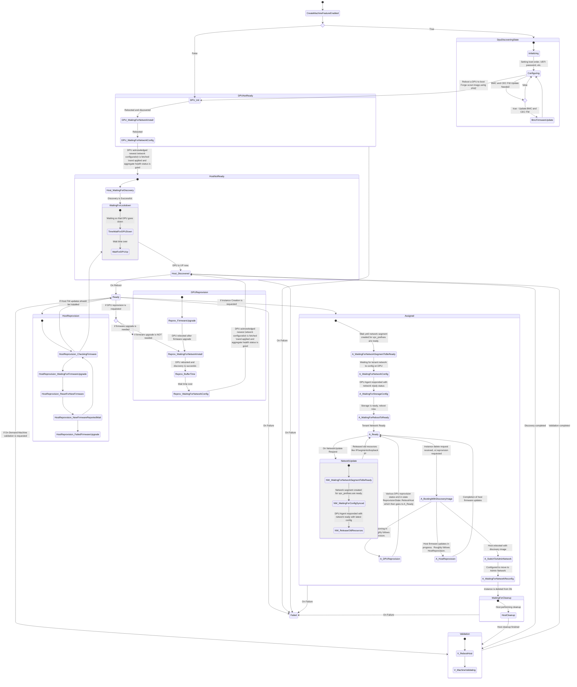

<!-- Keep the empty line after this or here or the diagram will break -->

```mermaid
%%{init: { 'sequence': {'useMaxWidth':false} } }%%

stateDiagram-v2
%%classDef ready fill:green,color:white,font-weight:bold,font-size:30px,stroke-width:2px,stroke:yellow
%%classDef assigned fill:#FFFDD0,font-weight:bold,font-size:23px,stroke-width:2px,stroke:green
%%classDef reprov fill:#F9E6BD,font-weight:bold,font-size:23px,stroke-width:2px,stroke:black
%%classDef hostnotready fill:#CAE2F9,font-weight:bold,font-size:23px,stroke-width:2px,stroke:black
%%classDef dpunotready fill:#C7F3ED,font-weight:bold,font-size:23px,stroke-width:2px,stroke:black
%%classDef cleanup fill:white,font-weight:bold,font-size:23px,stroke-width:2px,stroke:orange
%%classDef failed fill:#f00,color:white,font-size:25px,font-weight:bold,stroke-width:2px,stroke:yellow


state if_state <<choice>>
[*] --> CreateMachineFeatureEnabled
CreateMachineFeatureEnabled --> if_state
if_state --> DPU_Init: False
if_state --> DpuDiscoveringState: True

  state DpuDiscoveringState {
    [*] --> Initializing
    Initializing --> Configuring: Setting boot order, UEFI password, etc.
    state if_state2 <<choice>>
    Configuring --> if_state2: BMC and CEC FW Update Needed
    if_state2 --> Configuring: false
    if_state2 --> BmcFirmwareUpdate: true - Update BMC and CEC FW
    BmcFirmwareUpdate --> Configuring
  }
  Configuring --> DPU_Init: Reboot a DPU to boot Forge scout image using iPXE
  state DPUNotReady {
    DPU_Init --> DPU_WaitingForNetworkInstall: Rebooted and discovered
    DPU_WaitingForNetworkInstall --> DPU_WaitingForNetworkConfig: Rebooted
  }
  DPU_WaitingForNetworkConfig --> HostNotReady: DPU acknowledged newest network configuration is fetched \nand applied and aggregate health status is good
  state HostNotReady {
    [*] --> Host_WaitingForDiscovery
    Host_WaitingForDiscovery --> WaitingForLockdown: Discovery is Successful.
    state WaitingForLockdown {
      [*] --> TimeWaitForDPUDown: Waiting so that DPU goes down
      TimeWaitForDPUDown --> WaitForDPUUp: Wait time over
    }
    WaitingForLockdown --> Host_Discovered: DPU is UP now.
  }
  Host_Discovered --> Ready: On Reboot
  state Ready <<choice>>
  state FirmwareUpgradeNeeded <<choice>>
  Ready --> FirmwareUpgradeNeeded: if DPU reprovision is requested
  Ready --> Assigned: if Instance Creation is requested
  Ready --> Validation: if On-Demand Machine validation is requested
  Ready --> HostReprovision: If Host FW updates should be installed

  state Assigned {
    [*] --> A_WaitingForNetworkSegmentToBeReady: Wait until network segment created for vpc_prefixes are ready.
    A_WaitingForNetworkSegmentToBeReady --> A_WaitingForNetworkConfig: Waiting for tenant network to config on DPU
    A_WaitingForNetworkConfig --> A_WaitingForStorageConfig: DPU Agent responded with network ready status
    A_WaitingForStorageConfig --> A_WaitingForRebootToReady: Storage is ready, reboot now.
    A_WaitingForRebootToReady --> A_Ready: Tenant Network Ready
    A_Ready --> A_BootingWithDiscoveryImage: Instance delete request received, or reprovision requested
    A_BootingWithDiscoveryImage --> A_SwitchToAdminNetwork: Host rebooted with discovery image
    A_SwitchToAdminNetwork --> A_WaitingForNetworkReconfig: Configured to move to Admin Network
    A_BootingWithDiscoveryImage --> A_DPUReprovision: DPU reprovisioning in progress.  Roughly follows DPUReprovision.
    A_DPUReprovision --> A_Ready: Various DPU reprovision states end in state ReprovisionState#58;#58;RebootHost which then goes to A_Ready
    A_BootingWithDiscoveryImage --> A_HostReprovision: Host firmware updates in progress.  Roughly follows HostReprovision.
    A_HostReprovision --> A_Ready: Completion of host firmware updates
    A_Ready --> NetworkUpdate: On NetworkUpdate Request

    state NetworkUpdate {
      [*] --> NW_WaitingForNetworkSegmentToBeReady: 
      NW_WaitingForNetworkSegmentToBeReady --> NW_WaitingForConfigSynced: Network segment created for vpc_prefixes are ready.
      NW_WaitingForConfigSynced --> NW_ReleaseOldResources: DPU Agent responded with network ready with latest config
    }
    NetworkUpdate --> A_Ready: Released old resources like IP/segments/loopback IP
  }
  A_WaitingForNetworkReconfig --> WaitingForCleanup: Instance is deleted from Db

  state WaitingForCleanup {
    [*] --> HostCleanup : Host performing cleanup
  }
  HostCleanup --> Validation: Host cleanup finished
  FirmwareUpgradeNeeded --> DPUReprovision: if firmware upgrade is needed
  FirmwareUpgradeNeeded --> Reprov_WaitingForNetworkInstall: if firmware upgrade is NOT needed
  state DPUReprovision {
    [*] --> Reprov_FirmwareUpgrade
    Reprov_FirmwareUpgrade --> Reprov_WaitingForNetworkInstall: DPU rebooted after firmware upgrade
    Reprov_WaitingForNetworkInstall --> Reprov_BufferTime: DPU rebooted and discovery is succesful.
    Reprov_BufferTime --> Reprov_WaitingForNetworkConfig: Wait time over
  }

  Reprov_WaitingForNetworkConfig --> Host_Discovered: DPU acknowledged newest network configuration is fetched \nand applied and aggregate health status is good

%% Anystate can move to Failed State based on failure cause.
  DPUNotReady       --> Failed         : On Failure
  HostNotReady      --> Failed         : On Failure
  Ready             --> Failed         : On Failure
  Assigned          --> Failed         : On Failure
  WaitingForCleanup --> Failed         : On Failure

  state HostReprovision {
    [*] --> HostReprovision_CheckingFirmware
    HostReprovision_CheckingFirmware --> HostReprovision_WaitingForFirmwareUpgrade

   %%
    HostReprovision_WaitingForFirmwareUpgrade --> HostReprovision_ResetForNewFirmware
    HostReprovision_ResetForNewFirmware --> HostReprovision_NewFirmwareReportedWait
    HostReprovision_NewFirmwareReportedWait --> HostReprovision_FailedFirmwareUpgrade
    HostReprovision_NewFirmwareReportedWait --> HostReprovision_CheckingFirmware
    HostReprovision_FailedFirmwareUpgrade
  }
  HostReprovision_CheckingFirmware --> WaitingForLockdown
  HostReprovision_CheckingFirmware --> Ready

  Host_Discovered --> Validation: Discovery completed
  state Validation {
    [*] --> V_RebootHost
    V_RebootHost --> V_MachineValidating
  }
  Validation --> Host_Discovered: Validation completed
```

