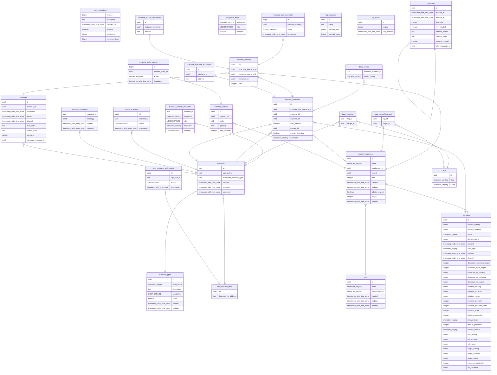

```mermaid
erDiagram
    sqlx_migrations {
        bigint version 
        text description 
        timestamp_with_time_zone installed_on 
        boolean success 
        bytea checksum 
        bigint execution_time 
    }

    vpc_resource_leaf_events {
        bigint id 
        uuid vpc_leaf_id 
        USER-DEFINED action 
        timestamp_with_time_zone timestamp 
    }

    instance_types {
        uuid id 
        character_varying short_name 
        text description 
        USER-DEFINED capabilities 
        boolean active 
        timestamp_with_time_zone created 
        timestamp_with_time_zone updated 
    }

    machines {
        uuid id 
        uuid vpc_leaf_id 
        uuid supported_instance_type 
        timestamp_with_time_zone created 
        timestamp_with_time_zone updated 
        timestamp_with_time_zone deployed 
    }

    vpc_resource_leafs {
        uuid id 
        inet loopback_ip_address 
    }

    machine_topologies {
        uuid machine_id 
        jsonb topology 
        timestamp_with_time_zone created 
        timestamp_with_time_zone updated 
    }

    machine_events {
        bigint id 
        uuid machine_id 
        USER-DEFINED action 
        timestamp_with_time_zone timestamp 
    }

    instances {
        uuid id 
        uuid machine_id 
        timestamp_with_time_zone requested 
        timestamp_with_time_zone started 
        timestamp_with_time_zone finished 
        text user_data 
        text custom_ipxe 
        ARRAY ssh_keys 
        uuid managed_resource_id 
    }

    vpcs {
        uuid id 
        character_varying name 
        character_varying organization_id 
        timestamp_with_time_zone created 
        timestamp_with_time_zone updated 
        timestamp_with_time_zone deleted 
    }

    domains {
        uuid id 
        name domain_catalog 
        name domain_schema 
        character_varying name 
        name domain_name 
        timestamp_with_time_zone created 
        character_varying data_type 
        timestamp_with_time_zone updated 
        timestamp_with_time_zone deleted 
        integer character_maximum_length 
        integer character_octet_length 
        name character_set_catalog 
        name character_set_schema 
        name character_set_name 
        name collation_catalog 
        name collation_schema 
        name collation_name 
        integer numeric_precision 
        integer numeric_precision_radix 
        integer numeric_scale 
        integer datetime_precision 
        character_varying interval_type 
        integer interval_precision 
        character_varying domain_default 
        name udt_catalog 
        name udt_schema 
        name udt_name 
        name scope_catalog 
        name scope_schema 
        name scope_name 
        integer maximum_cardinality 
        name dtd_identifier 
    }

    network_prefixes {
        uuid id 
        uuid segment_id 
        cidr prefix 
        inet gateway 
        integer num_reserved 
    }

    network_prefix_events {
        bigint id 
        uuid network_prefix_id 
        USER-DEFINED action 
        timestamp_with_time_zone timestamp 
    }

    network_segments {
        uuid id 
        character_varying name 
        uuid subdomain_id 
        uuid vpc_id 
        integer mtu 
        timestamp_with_time_zone created 
        timestamp_with_time_zone updated 
        boolean admin_network 
        integer vni_id 
        timestamp_with_time_zone deleted 
    }

    machine_interfaces {
        uuid id 
        uuid attached_dpu_machine_id 
        uuid machine_id 
        uuid segment_id 
        macaddr mac_address 
        uuid domain_id 
        boolean primary_interface 
        character_varying hostname 
    }

    machine_interface_addresses {
        uuid id 
        uuid interface_id 
        inet address 
    }

    tags {
        uuid id 
        character_varying slug 
        character_varying name 
    }

    tags_machine {
        uuid tag_id 
        uuid target_id 
    }

    tags_networksegment {
        uuid tag_id 
        uuid target_id 
    }

    instance_subnets {
        uuid id 
        uuid machine_interface_id 
        uuid network_segment_id 
        uuid instance_id 
        integer vfid 
    }

    instance_subnet_addresses {
        uuid id 
        uuid instance_subnet_id 
        inet address 
    }

    ssh_public_keys {
        character_varying username 
        USER-DEFINED role 
        ARRAY pubkeys 
    }

    mq_msgs {
        uuid id 
        timestamp_with_time_zone created_at 
        timestamp_with_time_zone attempt_at 
        integer attempts 
        interval retry_backoff 
        text channel_name 
        text channel_args 
        interval commit_interval 
        uuid after_message_id 
    }

    mq_payloads {
        uuid id 
        text name 
        jsonb payload_json 
        bytea payload_bytes 
    }

    bg_status {
        uuid id 
        jsonb status 
        timestamp_with_time_zone last_updated 
    }

    dhcp_entries {
        uuid machine_interface_id 
        character_varying vendor_string 
    }

    instance_subnet_events {
        bigint id 
        uuid instance_subnet_id 
        USER-DEFINED action 
        timestamp_with_time_zone timestamp 
    }

    machine_console_metadata {
        uuid machine_id 
        character_varying username 
        USER-DEFINED role 
        character_varying password 
        USER-DEFINED bmctype 
    }

    vpc_resource_leaf_events }o--|| vpc_resource_leafs : ""
    machines }o--|| instance_types : ""
    machines }o--|| vpc_resource_leafs : ""
    instances }o--|| machines : ""
    machine_topologies |o--|| machines : ""
    machine_events }o--|| machines : ""
    machine_interfaces }o--|| machines : ""
    machine_interfaces }o--|| machines : ""
    tags_machine }o--|| machines : ""
    machine_console_metadata }o--|| machines : ""
    instance_subnets }o--|| instances : ""
    network_segments }o--|| vpcs : ""
    machine_interfaces }o--|| domains : ""
    network_segments }o--|| domains : ""
    network_prefixes }o--|| network_segments : ""
    network_prefix_events }o--|| network_prefixes : ""
    machine_interfaces }o--|| network_segments : ""
    tags_networksegment }o--|| network_segments : ""
    instance_subnets }o--|| network_segments : ""
    machine_interface_addresses }o--|| machine_interfaces : ""
    instance_subnets }o--|| machine_interfaces : ""
    dhcp_entries }o--|| machine_interfaces : ""
    tags_networksegment }o--|| tags : ""
    tags_machine }o--|| tags : ""
    instance_subnet_addresses }o--|| instance_subnets : ""
    instance_subnet_events }o--|| instance_subnets : ""
    mq_msgs }o--|| mq_msgs : ""
```
