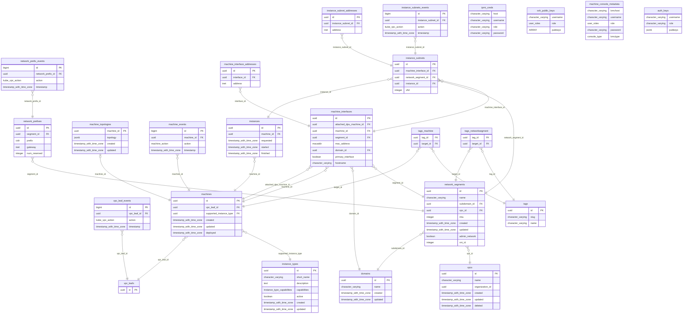

```mermaid
erDiagram
    vpc_leafs {
        uuid id PK
    }

    vpc_leaf_events {
        bigint id PK
        uuid vpc_leaf_id FK
        kube_vpc_action action 
        timestamp_with_time_zone timestamp 
    }

    instance_types {
        uuid id PK
        character_varying short_name 
        text description 
        instance_type_capabilities capabilities 
        boolean active 
        timestamp_with_time_zone created 
        timestamp_with_time_zone updated 
    }

    machines {
        uuid id PK
        uuid vpc_leaf_id FK
        uuid supported_instance_type FK
        timestamp_with_time_zone created 
        timestamp_with_time_zone updated 
        timestamp_with_time_zone deployed 
    }

    instances {
        uuid id PK
        uuid machine_id FK
        timestamp_with_time_zone requested 
        timestamp_with_time_zone started 
        timestamp_with_time_zone finished 
    }

    machine_topologies {
        uuid machine_id PK
        jsonb topology 
        timestamp_with_time_zone created 
        timestamp_with_time_zone updated 
    }

    machine_events {
        bigint id PK
        uuid machine_id FK
        machine_action action 
        timestamp_with_time_zone timestamp 
    }

    domains {
        uuid id PK
        character_varying name 
        timestamp_with_time_zone created 
        timestamp_with_time_zone updated 
    }

    network_segments {
        uuid id PK
        character_varying name 
        uuid subdomain_id FK
        uuid vpc_id FK
        integer mtu 
        timestamp_with_time_zone created 
        timestamp_with_time_zone updated 
        boolean admin_network 
        integer vni_id 
    }

    vpcs {
        uuid id PK
        character_varying name 
        uuid organization_id 
        timestamp_with_time_zone created 
        timestamp_with_time_zone updated 
        timestamp_with_time_zone deleted 
    }

    network_prefixes {
        uuid id PK
        uuid segment_id FK
        cidr prefix 
        inet gateway 
        integer num_reserved 
    }

    network_prefix_events {
        bigint id PK
        uuid network_prefix_id FK
        kube_vpc_action action 
        timestamp_with_time_zone timestamp 
    }

    machine_interfaces {
        uuid id PK
        uuid attached_dpu_machine_id FK
        uuid machine_id FK
        uuid segment_id FK
        macaddr mac_address 
        uuid domain_id FK
        boolean primary_interface 
        character_varying hostname 
    }

    machine_interface_addresses {
        uuid id PK
        uuid interface_id FK
        inet address 
    }

    tags {
        uuid id PK
        character_varying slug 
        character_varying name 
    }

    tags_machine {
        uuid tag_id FK
        uuid target_id FK
    }

    tags_networksegment {
        uuid tag_id FK
        uuid target_id FK
    }

    instance_subnets {
        uuid id PK
        uuid machine_interface_id FK
        uuid network_segment_id FK
        uuid instance_id FK
        integer vfid 
    }

    instance_subnet_addresses {
        uuid id PK
        uuid instance_subnet_id FK
        inet address 
    }

    instance_subnets_events {
        bigint id PK
        uuid instance_subnet_id FK
        kube_vpc_action action 
        timestamp_with_time_zone timestamp 
    }

    ipmi_creds {
        character_varying host 
        character_varying username 
        character_varying role 
        character_varying password 
    }

    ssh_public_keys {
        character_varying username 
        user_roles role 
        ARRAY pubkeys 
    }

    machine_console_metadata {
        character_varying bmchost 
        character_varying username 
        user_roles role 
        character_varying password 
        console_type bmctype 
    }

    auth_keys {
        character_varying username 
        character_varying role 
        jsonb pubkeys 
    }

    vpc_leaf_events }o--|| vpc_leafs : "vpc_leaf_id"
    machines }o--|| vpc_leafs : "vpc_leaf_id"
    machines }o--|| instance_types : "supported_instance_type"
    instances }o--|| machines : "machine_id"
    machine_topologies |o--|| machines : "machine_id"
    machine_events }o--|| machines : "machine_id"
    tags_machine }o--|| machines : "target_id"
    machine_interfaces }o--|| machines : "attached_dpu_machine_id"
    machine_interfaces }o--|| machines : "machine_id"
    instance_subnets }o--|| instances : "instance_id"
    network_segments }o--|| domains : "subdomain_id"
    machine_interfaces }o--|| domains : "domain_id"
    network_segments }o--|| vpcs : "vpc_id"
    network_prefixes }o--|| network_segments : "segment_id"
    machine_interfaces }o--|| network_segments : "segment_id"
    tags_networksegment }o--|| network_segments : "target_id"
    instance_subnets }o--|| network_segments : "network_segment_id"
    network_prefix_events }o--|| network_prefixes : "network_prefix_id"
    machine_interface_addresses }o--|| machine_interfaces : "interface_id"
    instance_subnets }o--|| machine_interfaces : "machine_interface_id"
    tags_machine }o--|| tags : "tag_id"
    tags_networksegment }o--|| tags : "tag_id"
    instance_subnet_addresses }o--|| instance_subnets : "instance_subnet_id"
    instance_subnets_events }o--|| instance_subnets : "instance_subnet_id"
```