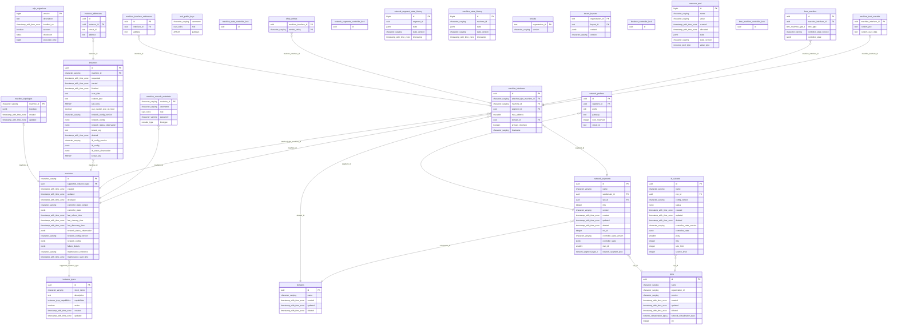

[View SVG](schema.svg)

```mermaid
erDiagram
    sqlx_migrations {
        bigint version PK
        text description
        timestamp_with_time_zone installed_on
        boolean success
        bytea checksum
        bigint execution_time
    }

    instance_types {
        uuid id PK
        character_varying short_name
        text description
        instance_type_capabilities capabilities
        boolean active
        timestamp_with_time_zone created
        timestamp_with_time_zone updated
    }

    machine_topologies {
        character_varying machine_id PK
        jsonb topology
        timestamp_with_time_zone created
        timestamp_with_time_zone updated
    }

    machines {
        character_varying id PK
        uuid supported_instance_type FK
        timestamp_with_time_zone created
        timestamp_with_time_zone updated
        timestamp_with_time_zone deployed
        character_varying controller_state_version
        jsonb controller_state
        timestamp_with_time_zone last_reboot_time
        timestamp_with_time_zone last_cleanup_time
        timestamp_with_time_zone last_discovery_time
        jsonb network_status_observation
        character_varying network_config_version
        jsonb network_config
        jsonb failure_details
        character_varying maintenance_reference
        timestamp_with_time_zone maintenance_start_time
    }

    instances {
        uuid id PK
        character_varying machine_id FK
        timestamp_with_time_zone requested
        timestamp_with_time_zone started
        timestamp_with_time_zone finished
        text user_data
        text custom_ipxe
        ARRAY ssh_keys
        boolean use_custom_pxe_on_boot
        character_varying network_config_version
        jsonb network_config
        jsonb network_status_observation
        text tenant_org
        timestamp_with_time_zone deleted
        character_varying ib_config_version
        jsonb ib_config
        jsonb ib_status_observation
        ARRAY keyset_ids
    }

    domains {
        uuid id PK
        character_varying name
        timestamp_with_time_zone created
        timestamp_with_time_zone updated
        timestamp_with_time_zone deleted
    }

    network_prefixes {
        uuid id PK
        uuid segment_id FK
        cidr prefix
        inet gateway
        integer num_reserved
        text circuit_id
    }

    vpcs {
        uuid id PK
        character_varying name
        character_varying organization_id
        character_varying version
        timestamp_with_time_zone created
        timestamp_with_time_zone updated
        timestamp_with_time_zone deleted
        network_virtualization_type_t network_virtualization_type
        integer vni
    }

    network_segments {
        uuid id PK
        character_varying name
        uuid subdomain_id FK
        uuid vpc_id FK
        integer mtu
        character_varying version
        timestamp_with_time_zone created
        timestamp_with_time_zone updated
        timestamp_with_time_zone deleted
        integer vni_id
        character_varying controller_state_version
        jsonb controller_state
        smallint vlan_id
        network_segment_type_t network_segment_type
    }

    machine_interface_addresses {
        uuid id PK
        uuid interface_id FK
        inet address
    }

    machine_interfaces {
        uuid id PK
        character_varying attached_dpu_machine_id FK
        character_varying machine_id FK
        uuid segment_id FK
        macaddr mac_address
        uuid domain_id FK
        boolean primary_interface
        character_varying hostname
    }

    dhcp_entries {
        uuid machine_interface_id PK
        character_varying vendor_string PK
    }

    ssh_public_keys {
        character_varying username
        user_roles role
        ARRAY pubkeys
    }

    machine_state_controller_lock {
        uuid id
    }

    instance_addresses {
        uuid id
        uuid instance_id FK
        text circuit_id
        inet address
    }

    network_segments_controller_lock {
        uuid id
    }

    network_segment_state_history {
        bigint id PK
        uuid segment_id
        jsonb state
        character_varying state_version
        timestamp_with_time_zone timestamp
    }

    machine_state_history {
        bigint id PK
        character_varying machine_id
        jsonb state
        character_varying state_version
        timestamp_with_time_zone timestamp
    }

    machine_console_metadata {
        character_varying machine_id FK
        character_varying username
        user_roles role
        character_varying password
        console_type bmctype
    }

    ib_subnets {
        uuid id PK
        character_varying name
        uuid vpc_id FK
        character_varying config_version
        jsonb status
        timestamp_with_time_zone created
        timestamp_with_time_zone updated
        timestamp_with_time_zone deleted
        character_varying controller_state_version
        jsonb controller_state
        smallint pkey
        integer mtu
        integer rate_limit
        integer service_level
    }

    tenants {
        text organization_id PK
        character_varying version
    }

    tenant_keysets {
        text organization_id PK
        text keyset_id PK
        jsonb content
        character_varying version
    }

    ibsubnet_controller_lock {
        uuid id
    }

    resource_pool {
        bigint id PK
        character_varying name
        character_varying value
        timestamp_with_time_zone created
        timestamp_with_time_zone allocated
        jsonb state
        character_varying state_version
        resource_pool_type value_type
    }

    bmc_machine_controller_lock {
        uuid id
    }

    bmc_machine {
        uuid id PK
        uuid machine_interface_id FK
        bmc_machine_type_t bmc_type
        character_varying controller_state_version
        jsonb controller_state
    }

    machine_boot_override {
        uuid machine_interface_id PK
        text custom_pxe
        text custom_user_data
    }

    machines }o--|| instance_types : "supported_instance_type"
    machine_topologies |o--|| machines : "machine_id"
    instances }o--|| machines : "machine_id"
    machine_interfaces }o--|| machines : "attached_dpu_machine_id"
    machine_console_metadata }o--|| machines : "machine_id"
    machine_interfaces }o--|| machines : "machine_id"
    instance_addresses }o--|| instances : "instance_id"
    machine_interfaces }o--|| domains : "domain_id"
    network_segments }o--|| domains : "subdomain_id"
    network_prefixes }o--|| network_segments : "segment_id"
    network_segments }o--|| vpcs : "vpc_id"
    ib_subnets }o--|| vpcs : "vpc_id"
    machine_interfaces }o--|| network_segments : "segment_id"
    machine_interface_addresses }o--|| machine_interfaces : "interface_id"
    dhcp_entries }o--|| machine_interfaces : "machine_interface_id"
    bmc_machine }o--|| machine_interfaces : "machine_interface_id"
    machine_boot_override |o--|| machine_interfaces : "machine_interface_id"
```
