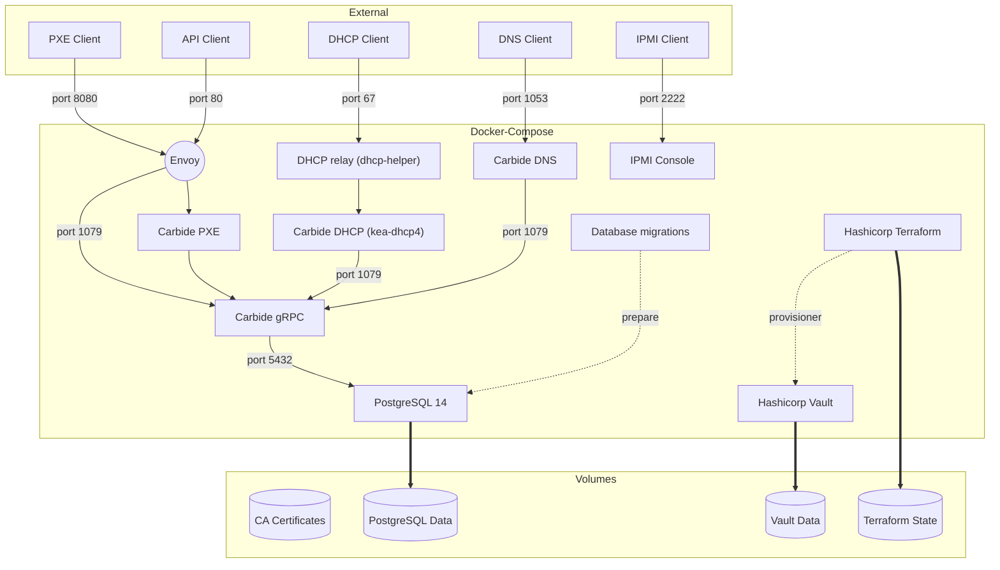

## Docker development workflow

[The docker compose configuration file](docker-compose.yml) contains all of the
software in the control plane in order to make requests to a working Carbide
installation.

The docker-compose configuration starts an environment that looks generally
like this:



These hosts get an IP address in 172.20.0.0/24 subnet.

The container used to run components is specified by [the default
Dockerfile](Dockerfile).  This contains the prereqs to run the components and
where the build actually happens.  The containers run ```cargo watch``` in
order to recompile on changes.

(NOTE: this messes with ```rust-analyzer``` and needs someone to fix it)

## Initialize terraform
Before you can start the carbide development environment you must `init` terraform
to create a terraform state file which we do not checked into VCS.

In ```${REPO_ROOT}/dev/terraform```

```
   docker run -v ${PWD}:/junk --rm hashicorp/terraform -chdir=/junk init
```

## Build a container for running the local dev environment
In order to start the containers containing the forge code, you must first
build a local instance of our runtime container

In ```${REPO_ROOT}```

```
cargo make runtime-container
```

## docker-compose workflow

### First time run ONLY ###

* We depend on a mounted CARGO_HOME directory to speed up dependency downloads after the first run.
You should execute the following stanza prior to bringing up docker-compose for the first time.

```
mkdir $HOME/docker_cargo_home
rustup target add x86_64-unknown-linux-musl
CARGO_HOME=$HOME/docker_cargo_home cargo install cargo-watch --target x86_64-unknown-linux-musl
```

### Run this every time you bring compose up ###
* When you shut down your docker compose environment use the `-v` flag to remove all
volumes.  Failing to do this and then attempting to run tests will result in
errors.

```
docker-compose down -v
docker-compose up --build
```

## Seeding DB

Once docker-compose has started all the machine, seed the database with some test data:

```
cargo make bootstrap-forge-docker
```

This will create

1. a new `Domain`
2. a new `NetworkSegment`
3. a new `Machine`
4. a new `MachineInterface`
5. two new `MachineInterfaceAddress` (IPv4/IPv6)

## Sanity check

The `bootstrap-forge-docker` command above should succeed. Now Carbide has
some data. Query carbide-api:

```
grpcurl -plaintext 127.0.0.1:1079 forge.Forge/FindMachines
```

It should return a JSON object with a `machines` array containing one machine.

