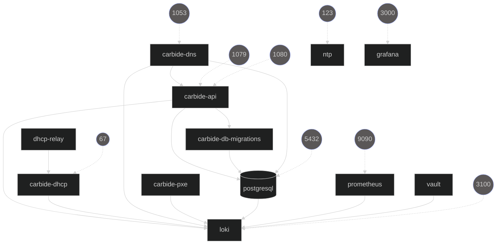

## Docker development workflow

### This Workflow Is Deprecateded! Use the [Kubernetes Workflow](../kubernetes/development.md)
[The docker compose configuration file](https://gitlab-master.nvidia.com/nvmetal/carbide/-/blob/trunk/docker-compose.yml) contains all of the
software in the control plane in order to make requests to a working Carbide
installation.

The docker-compose configuration starts an environment that looks generally
like this:



(Re-generate diagram: `java -jar ~/Downloads/docker-compose-viz-mermaid-1.2.0.jar -f markdown -t DARK -p -V -N -l`)

These hosts get an IP address in 172.20.0.0/24 subnet.

The container used to run components is specified by [the default
Dockerfile](https://gitlab-master.nvidia.com/nvmetal/carbide/-/blob/trunk/Dockerfile).
This contains the prereqs to run the components and where the build actually happens.
The containers run ```cargo watch``` in order to recompile on changes.

## Build a container for running the local dev environment
In order to start the containers containing the forge code, you must first
build a local instance of our runtime container

In ```${REPO_ROOT}```

```
cargo make runtime-container
```

This will build the container that is described by
[the root Dockerfile](https://gitlab-master.nvidia.com/nvmetal/carbide/-/blob/trunk/Dockerfile)

## docker-compose workflow

### First time run ONLY ###

* We depend on a mounted CARGO_HOME directory to speed up dependency downloads after the first run.
You should execute the following stanza prior to bringing up docker-compose for the first time.

```
mkdir $HOME/docker_cargo_home
rustup target add x86_64-unknown-linux-musl # make sure you're in REPO_ROOT when you run this
CARGO_HOME=$HOME/docker_cargo_home cargo install cargo-watch --target x86_64-unknown-linux-musl
```

* Install the Loki logging driver

```
docker plugin install grafana/loki-docker-driver:latest --alias loki --grant-all-permissions
```

### Run this every time you bring compose up ###
* When you shut down your docker compose environment use the `-v` flag to remove all
volumes.  Failing to do this and then attempting to run tests will result in
errors.

```
docker-compose down -v
docker-compose up --detach
cargo run -p bmc-mock
```

If you see errors check you don't have Postgres already running. The unit tests expect a local Postgres instance.
The docker-compose environment starts it's own Postgres on the same port, so they will conflict.

## Seeding DB

Once docker-compose has started all the machine, seed the database with some test data:

```
cargo make bootstrap-forge-docker
```

This will create

1. a new `Domain`
2. a new `NetworkSegment`
3. a new `Machine`
4. a new `MachineInterface`
5. two new `MachineInterfaceAddress` (IPv4/IPv6)

## Sanity check

The `bootstrap-forge-docker` command above should succeed. Now Carbide has
some data. Query carbide-api:

```
grpcurl -insecure 127.0.0.1:1079 forge.Forge/FindMachines
```

It should return a JSON object with a `machines` array containing one machine.

## View logs

There are three ways to view the logs:

- Directly on the command line: `docker-compose logs -f carbide-api`

- Loki via Grafana: http://172.20.0.23:3000/ (forge/forge)
  Select "Explore" on the left, then data source "Loki" top right.

- Loki via [logcli](https://grafana.com/docs/loki/latest/tools/logcli/) - which you'll need to install
```
export LOKI_ADDR='http://172.20.0.25:3100'
logcli query -f -o raw '{compose_service="carbide-api"}' # tail
logcli query -f -o raw '{compose_service="carbide-api"} | logfmt | level!="SPAN" !~ "(?i)casbin"' # query
```

