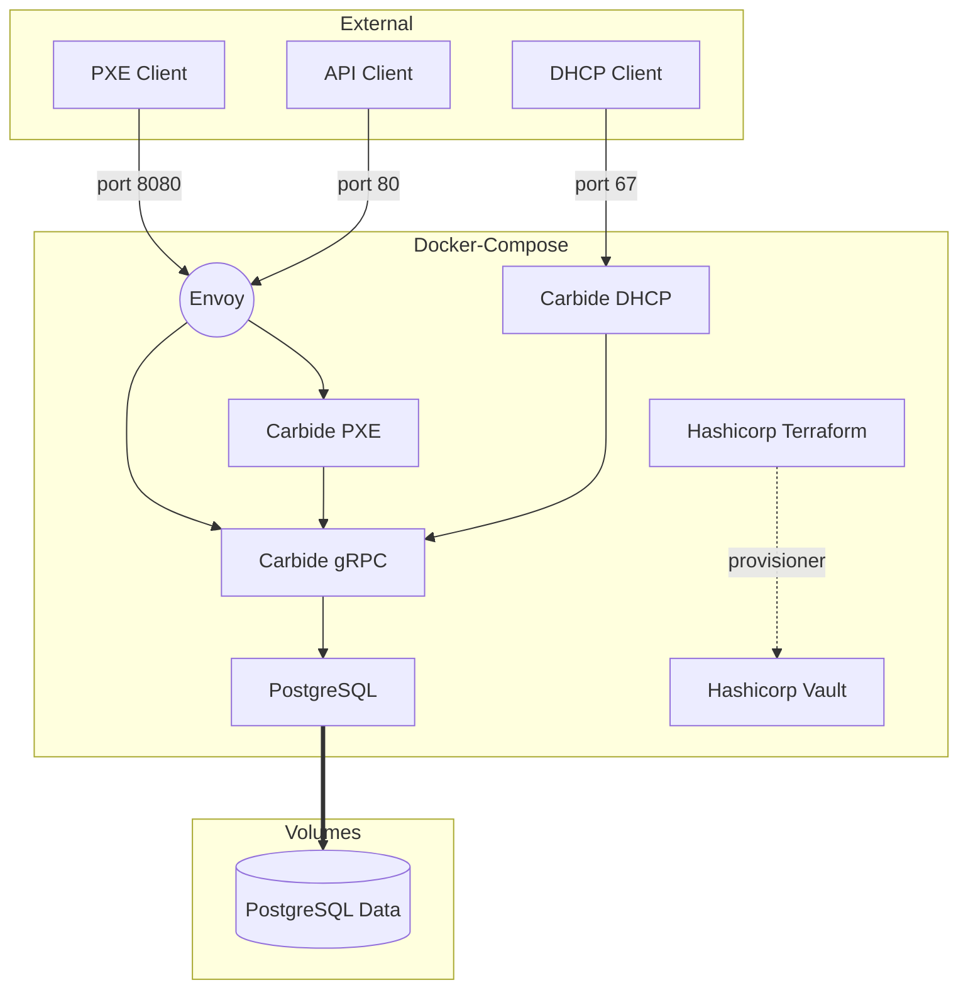

## Docker development workflow

[The docker compose configuration file](docker-compose.yml) contains all of the
software in the control plane in order to make requests to a working Carbide
installation.

The docker-compose configuration starts an environment that looks generally 
like this:




The container used to run components is specified by [the default
Dockerfile](Dockerfile).  This contains the prereqs to run the components and
where the build actually happens.  The containers run ```cargo watch``` in
order to recompile on changes.

(NOTE: this messes with ```rust-analyzer``` and needs someone to fix it)

## Initialize terraform
Before you can start the carbide development environment you must `init` terraform
to create a terraform state file which we do not checked into VCS.

In ```${REPO_ROOT}/dev/terraform```

```
   docker run -v ${PWD}:/junk --rm hashicorp/terraform -chdir=/junk init
```

## Build a container for running the local dev environment
In order to start the containers containing the forge code, you must first
build a local instance of our runtime container

In ```${REPO_ROOT}```

```
cargo make runtime-container
```

## docker-compose workflow

When you shutdowb your docker compose environment use the `-v` flag to remove all 
volumes.  Failing to do this and then attempting to run tests will result in
errors.

```
docker-compose down -v
docker-compose up --build
```

## Seeding DB

If you need to seed the database with some test data you can use

```
cargo make bootstrap-forge-docker
```

This will create

1. a new `Domain`
2. a new `NetworkSegment`
3. a new `Machine`
4. a new `MachineInterface`
5. two new `MachineInterfaceAddress` (IPv4/IPv6)
