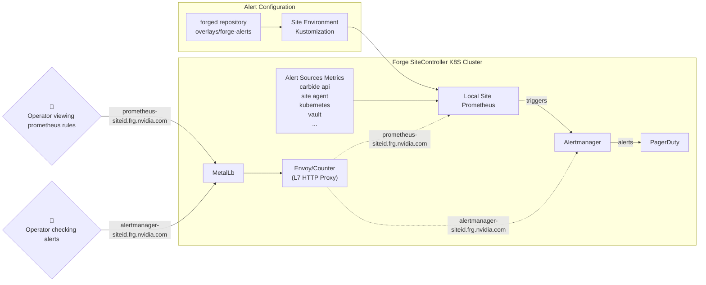

# Forge Site Alerts

## Architecture and overview

Alerts in Forge sites are configured using `PrometheusRule` resources. These rules are evaluated by Prometheus running in the `forge-monitoring` namespace and trigger alerts based on metrics collected from various Forge services.

Alert notifications are handled by Alertmanager, which is deployed as part of the `kube-prometheus-stack` helm chart. Alertmanager can be accessed via `https://alertmanager-siteid.frg.nvidia.com`, e.g. [https://alertmanager-dev3.frg.nvidia.com](https://alertmanager-dev3.frg.nvidia.com).



Alerts are organized in the [forged repository](https://gitlab-master.nvidia.com/nvmetal/forged/-/tree/main/overlays/forge-alerts) using kustomizations:
- Service-based organization (vault, postgres, k8s-control-plane, forge-site, etc.)
- Severity-based categorization (critical, warning)
- Site-specific customization through kustomize transformers

```
overlays/forge-alerts/
├── kustomization.yaml          # Main overlay configuration
├── argocd/                     # ArgoCD-related alerts
│   ├── warning/
│   └── critical/
├── forge-site/                 # Forge-specific alerts
│   ├── warning/
│   └── critical/
...
```

Each service directory contains:
- **warning**: Non-critical alerts that indicate potential issues
- **critical**: High-priority alerts requiring immediate attention

## Kustomization configuration

### Forge site

Each Forge site includes the alert overlay in its kustomization [`envs/pdx-dev3/kustomization.yaml`](https://gitlab-master.nvidia.com/nvmetal/forged/-/blob/main/envs/pdx-dev3/kustomization.yaml):

```yaml
...
resources:
...
  - ../../overlays/forge-alerts
...
```

This configuration automatically prefixes all alert names with the site identifier (e.g., `pdx-dev3-vaultDown`).

## Alert configuration examples

### Infrastructure alerts

Infrastructure alerts monitor core K8s and system components. Example from [`critical/etcdNoLeader-alert.yaml`](https://gitlab-master.nvidia.com/nvmetal/forged/-/blob/main/overlays/forge-alerts/k8s-control-plane/etcd/critical/etcdNoLeader-alert.yaml)

### Service-level alerts

Service alerts monitor specific applications, eg. Vault. Example from [`critical/vault-up-alert.yaml`](https://gitlab-master.nvidia.com/nvmetal/forged/-/blob/main/overlays/forge-alerts/vault/critical/vault-up-alert.yaml):

### Forge-specific alerts

Forge-specific alerts monitor Forge specific metrics. Example from [`critical/unhealthy_hosts.yaml`](https://gitlab-master.nvidia.com/nvmetal/forged/-/blob/main/overlays/forge-alerts/forge-site/critical/unhealthy_hosts.yaml):

## Alert access

### <a name="alertmanager_access"></a>Alertmanager access

The Alertmanager web interface for each site can be accessed via `https://alertmanager-siteid.frg.nvidia.com` without authentication.
For example [https://alertmanager-dev3.frg.nvidia.com](https://alertmanager-dev3.frg.nvidia.com)

## Alerts development pattern

1. **Understand the metrics**: Use the Prometheus web interface at `https://prometheus-siteid.frg.nvidia.com` to explore available metrics and test PromQL queries
2. **Create or modify alert files**: Add new `PrometheusRule` resources or modify existing ones in the appropriate service directory
3. **Test alerts**: Use Prometheus to validate alert expressions before deployment
4. **Submit changes**: Submit a MR to the [forged project](https://gitlab-master.nvidia.com/nvmetal/forged)
