# Forge Site Logs

## Architecture and overview

Logs are produced by various services running on each Forge site.
Usually those services write logs to stdout and stderr, from where kubernetes
will collect them into a set of pod/container log files.

These logs are read by an [OpenTelemetry collector instance](https://gitlab-master.nvidia.com/nvmetal/forged/-/blob/main/bases/opentelemtry-collector/kustomization.yaml) inside the
site, which is deployed into the `otel` namespace.

The collector forwards the logs into a site-local [Grafana Loki](https://grafana.com/oss/loki/) installation. The Loki installation runs on a single side controller node as a stateful service. Therefore log retention is subject to this control plane node staying healthy.

Besides this additional logs are ingested via the OpenTelemetry collector system into Loki:
- 🚧: The Hardware Health service forwards BMC log events via OTLP protocol.
- 🚧: DPUs forward certain logs - e.g. from forge-dpu-agent to the collector on the control plane node.

The Forge [ssh-console](https://gitlab-master.nvidia.com/nvmetal/ssh-console) service also fowards the serial console logs of each Machine via a second instance of the OpenTelemetry collector (running inside the console POD) directly to Loki.

Logs can be queried via the following path:
- Site local Loki can be accessed via the [logcli](https://grafana.com/docs/loki/latest/query/logcli/) tool via `https://loki-siteid.frg.nvidia.com`, e.g. [https://loki-dev3.frg.nvidia.com](https://loki-dev3.frg.nvidia.com).
- Logs can be accessed via the Grafana installation on each site.
The URL for this is is `https://grafana-siteid.frg.nvidia.com`, e.g. [https://grafana-dev3.frg.nvidia.com](https://grafana-dev3.frg.nvidia.com).

All Forge sites also forward their logs to [Kratos](https://confluence.nvidia.com/display/PLATFORM/Kratos+Data+Science+Platform+aaS) from where they will be forwarded to PSOC in order to fulfill certain security requirements.

```mermaid
flowchart LR
    subgraph NVIDIA Cloud
        Kratos --> Heimdall
        Heimdall --> PSOC
    end

    subgraph Forge SiteController K8S Cluster
        K["K8S Logs (/var/log/pods)\ncarbide-api\nsite-agent\nssh-console\npostgres\n..."] --> OTELC["OpenTelemetry Collector"]
        OTELC --> Loki["Grafana Loki"]
        SSHC["Forge SSH console"] -- Machine serial console logs --> SSHLF["Serial Console Log Files per Machine"]
        SSHLF --> SSHCOTELC["SSH console OpenTelemetry Collector"]
        SSHCOTELC --> Loki
        HHH["Forge Hardware Health"] -- Machine event log via OTLP --> OTELC

        Loki -. Short term retention\nEasy setup\nLimited durability .-> LokiLs[(Loki Local Storage)]

        MetalLb --> SiteEnvoy["Envoy/Counter\n(L7 HTTP Proxy)"]
        SiteEnvoy -. "https://grafana-siteid.frg.nvidia.com" .-> SiteGrafana[Grafana\nLog/Metric Query UI\nOICD auth]
        SiteEnvoy -. "https://loki-siteid.frg.nvidia.com" .-> Loki
        SiteGrafana --> Loki

        K -..-> KBOTS["Kratos BOTS"]
        KBOTS --> Kratos
    end

    subgraph DPU
        DPUAGENT["forge-dpu-agent"] -- via stdout --> dpu-systemd-journal
        dpu-systemd-journal --> DPUOTELC["OpenTelemetry collector"]
        DPUOTELC -- authenticated OTLP --> OTELC
    end    

    LV{"🧑\nOperator querying logs via Grafana"} -- https://grafana-siteid.frg.nvidia.com  --> MetalLb

    LV2{"🧑\nOperator querying logs via logcli"} -- https://loki-siteid.frg.nvidia.com  --> MetalLb
```



## Log access

### <a name="site_log_access"></a>Site log access

See [Site metric access](site_metrics.md#site_metric_access) for general information on how to access Grafana on the site.

In Grafana, navigate to the [Explore](https://grafana-dev3.frg.nvidia.com/explore) screen.

Then, select `Loki` as as datasource and enter a valid query. Examples are provided in the section below.

## Query examples

This section provides some query examples. Please reference the [Loki queries](https://grafana.com/docs/loki/latest/query/log_queries/) manual for more details.

- Show logs for the carbide-api service:
    ```
    {k8s_container_name="carbide-api"}
    ```
- Show logs for carbide-api `AllocateInstance` requests.
    ```
    {k8s_container_name="carbide-api"} |= "AllocateInstance"
    ```
- Show client IPs for all `FindMachines` requests on carbide-api:
    ```
    {k8s_container_name="carbide-api"} |= "FindMachines" | logfmt | line_format "{{.client_address}}"
    ```
- Show all `FindInstances` requests which required more than 100ms to process:
    ```
    {k8s_container_name="carbide-api"} |= "FindInstances" | logfmt | timing_elapsed_us > 100000 
    ```
- Show logs for the carbide-pxe service:
    ```
    {k8s_container_name="carbide-pxe"}
    ```
- Show logs for the carbide-pxe service:
    ```
    {k8s_container_name="carbide-dhcp"}
    ```
- Show logs for the ssh-console service:
    ```
    {k8s_container_name="carbide-ssh-console"}
    ```
- Show logs for elektra-site-agent:
    ```
    {k8s_container_name="elektra"}
    ```

## Logging format

Forge services preferably output logs in a structured log format. This allows to easily search similar log entries for certain attributes.

Most Forge services at this point use `logfmt` formatting for this purpose.

Besides just adhering to `logfmt` formatting, Forge services follow the following pattern to allow for more powerful log search and analysis:
- For each user interaction (incoming request), a single canonical log line is emitted that describes all effects of this action. E.g.
    ```
    level=SPAN span_id=0x53503fbcb8afb9b8 span_name=request client_address=100.113.63.236 client_num_certs=2 client_port=51466 http_response_status_code=200 http_url=https://carbide-api.forge-system.svc.cluster.local:1079/forge.Forge/FindInstances otel_status_code=ok request="InstanceSearchQuery { id: None }" rpc_grpc_status_code=0 rpc_grpc_status_description="Code: The operation completed successfully, Message: " rpc_method=FindInstances rpc_service=forge.Forge sql_max_query_duration_summary="SELECT id, machine_id, state :: TEXT, state_version, timestamp FROM machine_state_history WHERE machine_id = $1 ORDER BY id ASC" sql_max_query_duration_us=4000 sql_queries=241 sql_total_query_duration_us=270250 sql_total_rows_affected=1411 sql_total_rows_returned=1451 timing_busy_ns=117856903 timing_elapsed_us=358503 timing_idle_ns=240640257 timing_start_time=2024-04-05T01:59:00.586489613Z
    ```
    This allows to see related attributes in a single line, and allows to filter actions/requests by certain attributes (e.g. search only for failed requests, long running requests, etc.)
- In a similar way, a single log line is emitted for each periodic action that is started inside the service without an external trigger.
    ```
    level=SPAN span_id=0x4a274b2d9f6d514e span_name=state_controller_iteration controller=machine_state_controller error_types="{\"assigned.waitingfornetworkconfig\":{\"missing_data\":1}}" handler_latencies_us="{\"assigned.waitingfornetworkconfig\":{\"min\":261036,\"max\":261036,\"avg\":261036},\"dpunotready.waitingfornetworkconfig\":{\"min\":32772,\"max\":36289,\"avg\":34530},\"assigned.ready\":{\"min\":39466,\"max\":230568,\"avg\":84974},\"ready\":{\"min\":32800,\"max\":43321,\"avg\":39318}}" otel_status_code=ok skipped_iteration=false sql_max_query_duration_summary="SELECT id, machine_id, state :: TEXT, state_version, timestamp FROM machine_state_history WHERE machine_id = $1 ORDER BY id ASC" sql_max_query_duration_us=6000 sql_queries=462 sql_total_query_duration_us=543054 sql_total_rows_affected=2403 sql_total_rows_returned=2477 states="{\"ready\":6,\"assigned.waitingfornetworkconfig\":1,\"dpunotready.waitingfornetworkconfig\":2,\"assigned.ready\":9}" states_above_sla="{\"dpunotready.waitingfornetworkconfig\":2,\"assigned.waitingfornetworkconfig\":1}" times_in_state_s="{\"assigned.ready\":{\"min\":46110,\"max\":6076552,\"avg\":3564854},\"ready\":{\"min\":154317,\"max\":4937437,\"avg\":2488637},\"assigned.waitingfornetworkconfig\":{\"min\":46214,\"max\":46214,\"avg\":46214},\"dpunotready.waitingfornetworkconfig\":{\"min\":284011,\"max\":794944,\"avg\":539477}}" timing_busy_ns=64443591 timing_elapsed_us=36887846 timing_idle_ns=247374997 timing_start_time=2024-04-05T02:05:52.841084164Z
    ```
- Log events outside of the request line are linked to it via a request/span identifier. E.g. the following log line:
    ```
    level=ERROR span_id=0x1ca0839de90f410 msg="Generic error: Network segment mismatch for existing mac address: A0:88:C2:0C:9E:08 expected: f9860f19-37d5-44f6-b637-84de4648cd39 actual from network switch: 341edd9e-4879-470e-a9e0-167c64e00217" location="api/src/lib.rs:241"
    ```
    references the previous `DiscoverDhcp` request for which another log entry exists:
    ```
    level=SPAN span_id=0x1ca0839de90f410 span_name=request client_address=100.113.63.249 client_num_certs=2 client_port=52016 http_response_status_code=200 http_url=https://carbide-api.forge-system.svc.cluster.local:1079/forge.Forge/DiscoverDhcp otel_status_code=error otel_status_message="gRPC Error: Internal error. Message: Generic error: Network segment mismatch for existing mac address: A0:88:C2:0C:9E:08 expected: f9860f19-37d5-44f6-b637-84de4648cd39 actual from network switch: 341edd9e-4879-470e-a9e0-167c64e00217" request="DhcpDiscovery { mac_address: \"A0:88:C2:0C:9E:08\", relay_address: \"10.217.133.65\", vendor_string: Some(\"NVIDIA/BF/OOB\"), link_address: None, circuit_id: None, remote_id: None }" rpc_grpc_status_code=13 rpc_grpc_status_description="Code: Internal error, Message: Generic error: Network segment mismatch for existing mac address: A0:88:C2:0C:9E:08 expected: f9860f19-37d5-44f6-b637-84de4648cd39 actual from network switch: 341edd9e-4879-470e-a9e0-167c64e00217" rpc_method=DiscoverDhcp rpc_service=forge.Forge sql_max_query_duration_summary="SELECT m.id FROM machines m INNER JOIN machine_interfaces mi ON m.id = mi.machine_id INNER JOIN network_segments ns ON mi.segment_id = ns.id INNER JOI..." sql_max_query_duration_us=2000 sql_queries=7 sql_total_query_duration_us=9000 sql_total_rows_affected=7 sql_total_rows_returned=7 timing_busy_ns=4153014 timing_elapsed_us=16079 timing_idle_ns=11919051 timing_start_time=2024-04-05T02:07:21.760168849Z
    ```

