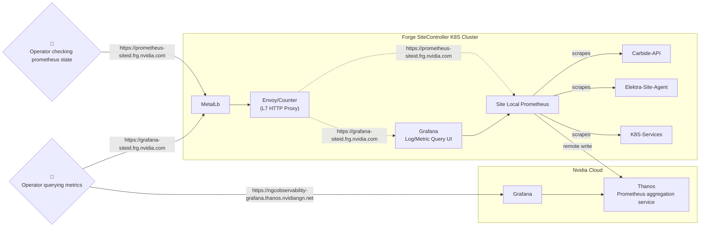

# Forge Site Metrics

## Architecture and overview

Metrics are produced by various services running on each Forge site.
These metrics are collected/scraped by a Prometheus installation inside the
site, which is deployed into the `forge-monitoring` namespace using the
`kube-prometheus-stack` helm chart and various [customizations](https://gitlab-master.nvidia.com/nvmetal/forged/-/blob/fa217bbaeefa3c7be786d89ef783783f1330eeae/bases/argocd/apps/forge-monitoring/forge-monitoring.yaml#L18).

Site local prometheus can be accessed via `https://prometheus-siteid.frg.nvidia.com`, e.g. [https://prometheus-dev3.frg.nvidia.com](https://prometheus-dev3.frg.nvidia.com).

Metrics can then be directly accessed on the site using a Grafana installation that is also part of `forge-monitoring`.
The URL for this is is `https://grafana-siteid.frg.nvidia.com`, e.g. [https://grafana-dev3.frg.nvidia.com](https://grafana-dev3.frg.nvidia.com).

All Forge sites also forward their metrics to [Thanos](https://confluence.nvidia.com/pages/viewpage.action?pageId=381166728)
via the prometheus remote-write protocol. Thanos is an installation of the open source Thanos stack. It is managed as part of NVIDIAs Kratos observability effort.

Metrics for all Forge sites can be viewed on [https://ngcobservability-grafana.thanos.nvidiangn.net/](https://ngcobservability-grafana.thanos.nvidiangn.net/).

## Metric access

### Thanos access

In order to view metrics on Thanos as well as any dashboards hosted on Thanos, users must join the DLs
referenced in [Thanos: Grafana Access - NGC Observability](https://confluence.nvidia.com/pages/viewpage.action?spaceKey=PLATFORM&title=Thanos%3A+Grafana+Access#Thanos:GrafanaAccess-8.NGCObservability).

For viewing access the DL `grafana-ngcobservability-viewer` is required, editing access requires `grafana-ngcobservability-editor`.

Thanos access is only possible from a set of allowlisted VPN endpoints. These endpoints are documented on the linked Thanos page.

### Site metric access

The Grafana endpoints on sites (e.g. [https://grafana-dev3.frg.nvidia.com](https://grafana-dev3.frg.nvidia.com)) support login via single sign on (Active Directory / OICD). Select `Sign in with AzureAD` on the login page.

In order for the sign in to succeed, users need to be members of the DL groups `TODO`.
