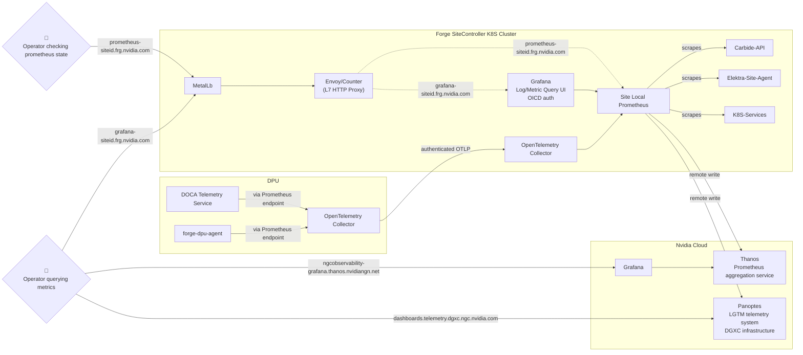

# Forge Site Metrics

## Architecture and overview

Metrics are produced by various services running on each Forge site.
These metrics are collected/scraped by a Prometheus installation inside the
site, which is deployed into the `forge-monitoring` namespace using the
`kube-prometheus-stack` helm chart and various [customizations](https://gitlab-master.nvidia.com/nvmetal/forged/-/blob/fa217bbaeefa3c7be786d89ef783783f1330eeae/bases/argocd/apps/forge-monitoring/forge-monitoring.yaml#L18).

Site local prometheus can be accessed via `https://prometheus-siteid.frg.nvidia.com`, e.g. [https://prometheus-dev3.frg.nvidia.com](https://prometheus-dev3.frg.nvidia.com).

Metrics can then be directly accessed on the site using a Grafana installation that is also part of `forge-monitoring`.
The URL for this is is `https://grafana-siteid.frg.nvidia.com`, e.g. [https://grafana-dev3.frg.nvidia.com](https://grafana-dev3.frg.nvidia.com).

All Forge sites also forward their metrics to multiple external observability systems:

1. **Thanos**: [Cloud Prometheus-as-a-Service](https://confluence.nvidia.com/pages/viewpage.action?pageId=381166728) is managed as part of NVIDIA's Kratos observability (Slack #nv-kratos). Metrics for all Forge sites can be viewed on [CloudGrafana](https://ngcobservability-grafana.thanos.nvidiangn.net/dashboards/f/M5RKIc3Vk/).

2. **Panoptes**: [NVIDIA's LGTM (Logs, Metrics, Traces)](https://confluence.nvidia.com/pages/viewpage.action?pageId=2867001671) telemetry system running on DGXC infrastructure (Slack #dgxc-observability-support). Forge sites forward both metrics and logs to Panoptes [regional endpoints](site_metrics.md#panoptes_regional_endpoints).

## Metric access

### Thanos access

In order to view metrics on Thanos as well as any dashboards hosted on Thanos, users must join the DLs
referenced in [Thanos: Grafana Access - NGC Observability](https://confluence.nvidia.com/pages/viewpage.action?spaceKey=PLATFORM&title=Thanos%3A+Grafana+Access#Thanos:GrafanaAccess-8.NGCObservability).

For viewing access the DL `grafana-ngcobservability-viewers` is required, editing access requires `grafana-ngcobservability-editors`.

Thanos access is only possible from a set of allowlisted VPN endpoints. These endpoints are documented on the linked Thanos page.

### Site metric access

The Grafana endpoints on sites (e.g. [https://grafana-dev3.frg.nvidia.com](https://grafana-dev3.frg.nvidia.com)) support login via single sign on (Active Directory / OICD). Select `Sign in with AzureAD` on the login page.

In order for the sign in to succeed, users need to be members of the following DL groups:
| DL Group                          | Permission       |
|-----------------------------------|------------------|
| `grafana-ngcobservability-viewers`| Grafana Viewer   |
| `grafana-ngcobservability-editors`| Grafana Editor   |
| `swngc-forge-dev`                 | Grafana Admin    |
| `ngc-forge-sre`                   | Grafana Admin    |

These group permissions can be reviewed at the bottom of the `Users and Groups` page in the
[Forge Grafana Azure Portal](https://portal.azure.com/#view/Microsoft_AAD_IAM/ManagedAppMenuBlade/~/Users/objectId/ccf37af4-c630-4025-9e87-cf59868ae205/appId/dda30e19-7fe7-415f-9750-adc7ee3e0ebd).

### Panoptes metrics access

Prometheus on each Forge site is configured with a second remote write endpoint for Panoptes in site-specific [`remote_write_values.yaml`](https://gitlab-master.nvidia.com/nvmetal/forged/-/blob/main/envs/pdx-dev3/site/forge-monitoring/config/remote_write_values.yaml#L26-47) files.

#### Regional endpoints

Panoptes uses region-specific endpoints:
- **US East**: `us-east-1.aws.telemetry.dgxc.ngc.nvidia.com`
- **US West**: `us-west-2.aws.telemetry.dgxc.ngc.nvidia.com`
- **Europe**: `eu-north-1.aws.telemetry.dgxc.ngc.nvidia.com`
- **Asia Pacific**: `ap-northeast-1.aws.telemetry.dgxc.ngc.nvidia.com`

Each site is configured with the appropriate regional endpoint based on its geographical location.

#### Authentication secrets

Authentication credentials for Panoptes are managed through the [`overlays/lgtm-secret-dgxc`](https://gitlab-master.nvidia.com/nvmetal/forged/-/tree/main/overlays/lgtm-secret-dgxc) kustomization overlay, which generates:
- `lgtm-prom-secret-dgxc`: Contains basic auth credentials for Prometheus metrics remote write
- `lgtm-otel-secret-dgxc`: Contains OAuth2 client credentials for OpenTelemetry logs forwarding

Each site includes this overlay in its kustomization and has site-specific credential keys (e.g., `username-pdx-dev3`, `password-pdx-dev3`, `client_secret_pdx-dev3`).
