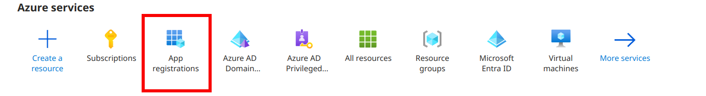
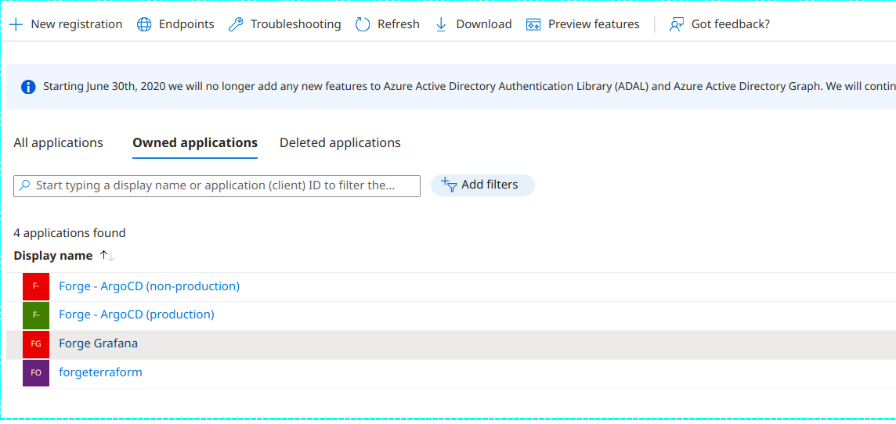
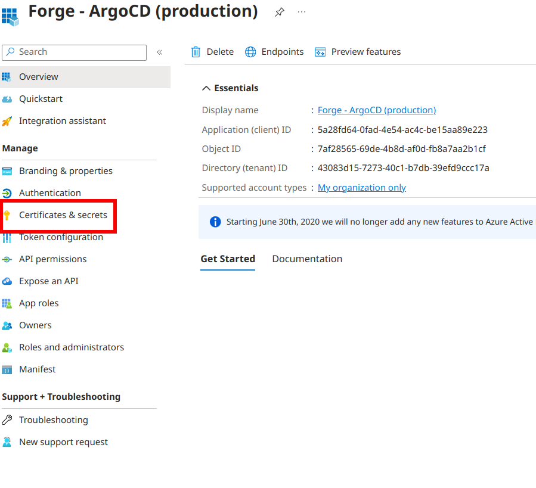
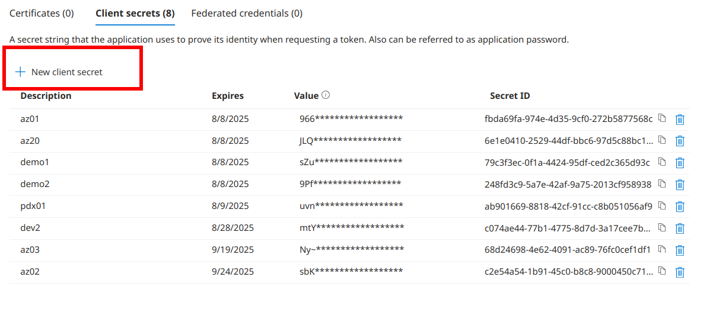
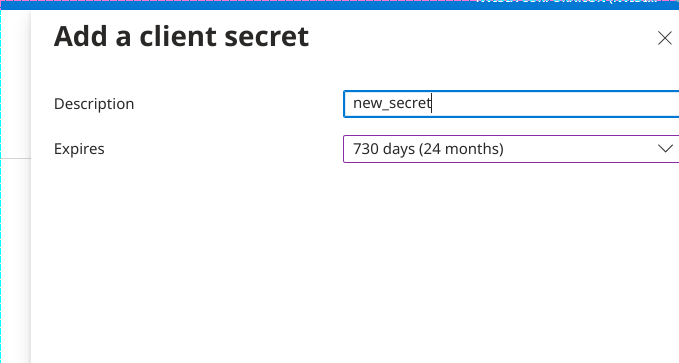
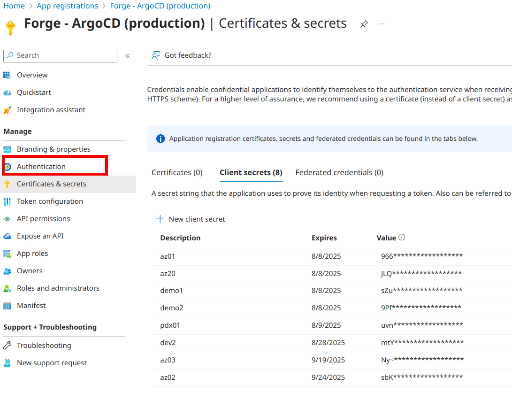
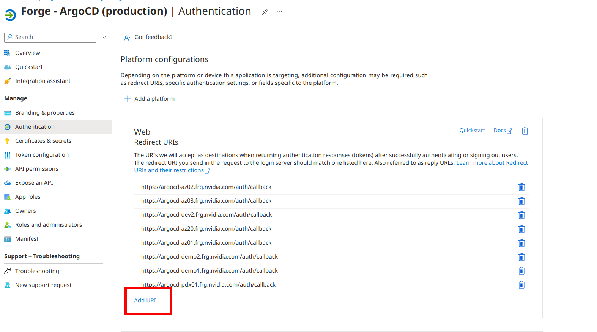

# Azure OIDC and Forge

You must be a member of the Forge SRE or Forge DEV groups in Active Directory.  This document is intended for use by Forge SRE and DEV only.  If you are trying to set up a Forge site that Forge SRE does not manage,  you must modify ArgoCD to accommodate your setup.

Each Forge site needs to have a redirect URI added to the Azure OIDC and, in the case of ArgoCD, a site-specific secret.

There is a single shared secret in some cases, such as Grafana.  The likelihood of someone causing harm to a forge site through grafana is low.  Argo is our deployment system; thus, the security controls are stricter

## Adding new client secrets

1. Login to azure.com using your Nvidia SSO credentials
2. Select "App Registrations"

3. Choose which application you want to change

4. Click "Certificates & Secrets"

5. Click "New Client Secret"

6. Fill in the new client's secret details and click "Add" at the bottom

  a. Make note of the new secret `Value`.  It will need to be added into`forged`

## Adding redirect URLs to Azre OIDC  config

1. Login to azure.com using your Nvidia SSO credentials
2. Select "App Registrations"

3. Choose which application you want to change

4. Select "Authentication"

5. Click "Add URI" and fill in the URI value


## Adding in Forged repo

The ArgoCD SSO secret is required during the bootstrapping of a new environment

1. In `envs/<env>/bootstrap/secerts` create new file `secret.enc.env`.
2. Inside `secret.enc.env` include the following:

```ini
url="https://<url of argocd>
oidc.azure.clientSecret="<secretGeneratedInAzure>"
```

3. Encrypt the file using sops: `sops -e -i secret.enc.env`
4. Create a file `envs/<env>/bootstrap/secret-generator.yaml`

```yaml
apiVersion: viaduct.ai/v1
kind: ksops
metadata:
  name: argocd-sso-generator
  annotations:
    config.kubernetes.io/function: |
        exec:
          path: ksops
secretFrom:
  - metadata:
      labels:
        app.kubernetes.io/part-of: argocd
      name: argocd-sso
      namespace: argocd
    envs:
      - ./secrets/secret.enc.env
```

5. Inside the `kustomization.yaml` file in the bootstrap directory, make sure it includes:

```yaml
...
generators:
  - secret-generator.yaml
```

6. Proceed with bootstrapping the new environment
