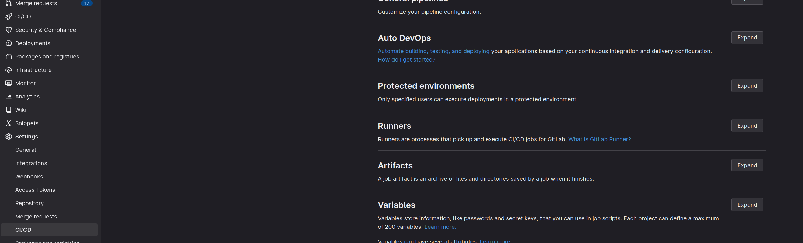
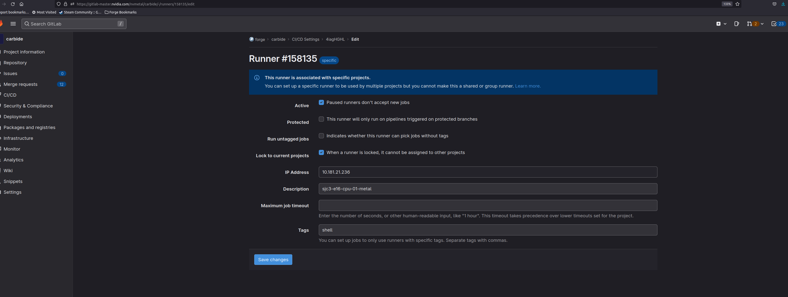

When CI gives you this:

> E: You don't have enough free space in /var/cache/apt/archives/.

Then runner has run out of disk space.  This is almost invariably because of old docker images from older builds.

We've attempted to automate this by creating a cronjob that runs hourly on our gitlab runners, but you might still occasionally see this error.

If you do, you need to first find the IP address of the gitlab runner.

Log in to Gitlab.

Go In the Settings page, CI/CD, Expand Gitlab Runners 

Select the runner that's causing an issue, and select the Edit button (looks like a pencil next to the name), which will bring up this screen 

Now that you have the IP address, shell into it (use nvinit if you need to), and `sudo su` to `root`.

The relevant cronjob is stored here as a shell script (included for posterity in case we ever have another runner):
```
root@sjc3-e16-cpu-01:~# cat /etc/cron.hourly/docker-prune
#!/usr/bin/env bash
#delete a docker image if it's older than 12 hours and currently unused
docker system prune -af  --filter "until=12h"
```

Now simply execute this script.  Output should be similar to the following.
```
root@sjc3-e16-cpu-01:~# /etc/cron.hourly/docker-prune
Deleted Images:
untagged: gitlab-master.nvidia.com:5005/ngc-devops-public/devops-tools:latest
untagged: gitlab-master.nvidia.com:5005/ngc-devops-public/devops-tools@sha256:c7aeb50bfb5eca86cf3ff452ba59db952b5bbcbf2521b8428317fba22961e91e
deleted: sha256:95e0fa3bf6dd0377d91b27fe4ed8feaac6eae8d7d439ffb6171e49c14de14139
deleted: sha256:edf3a1acb15272dbb7a416572db2873bd27458846f9d62e38bcea96db6aa3833
deleted: sha256:9c23e99353e411fdb775b42f3bdeb7155cb190edaad169aa31cec31fe639f92b
deleted: sha256:8ae10fd840b9bd952bdb44cf759c8d6aface3a0e4a61919b75213c7de0dda5b1
deleted: sha256:32f562090a59dff74ea9345fcc354fddecc3ea885fa1cc6d5a8de6e19c7289f6
deleted: sha256:fe2d670c60605ce9f36f8a29d64b58f93eb16d9eacdde77e6c210adeb713a2f0
deleted: sha256:f9c9127d8fe31a73ba673c5f8cda1bc15eec25606e7b00bafe00c4bb7d4b8dd6
deleted: sha256:79a547b64afee496fbc5200f19fd678c17edad3938faafa1ebf52d01248ef101
deleted: sha256:03f0095c71c11f45509cbf125b4365329aa9e8bf0912c53528c40e68b212c323
untagged: postgres:14.4-alpine
untagged: postgres@sha256:044d29fc1be0f32f0e9a77f1f1ab3c9a2016b7654491a882a3c4824999ef1dd6
deleted: sha256:83efe9bd2da65157932d9792394589bb103812d740d749b7460add5b42c59584
deleted: sha256:30a8e2982453523e9ed23ce3a334e84c01ee4d908fa109eb021b4dcd81940d1d
deleted: sha256:406723dc1f344029b8c0ca25a10fb86c04dee6286e9861937937797ad62f391f
deleted: sha256:b64c3b8a470f57653f51aa5366210c7ae5cc833d178e61b8002167a6555c77ef
deleted: sha256:640f71c0fb511d56fff6847de7cb6cde6724ca491b92777664d9029b5283c7b1
deleted: sha256:514309a76495ea7d9807dfa3c1d68eac7c04b33d29fe6f32a7b19f5dffb76e72
deleted: sha256:bbb4fb9f65a439d82e016e821589a53a5b50ea14f4e2aabca8cf2028ea76835f
deleted: sha256:24c5c90aca3b06ae78911ce299dfdc3676edbb3c4692c50ca15594dabea1615e
untagged: urm.nvidia.com/swngc-ngcc-docker-local/forge/carbide/x86_64/forge-helm:v0.0.1-562-g9399319c
untagged: urm.nvidia.com/swngc-ngcc-docker-local/forge/carbide/x86_64/forge-helm@sha256:479a87393b44933651baba42a5685a7504595da029f78bac78c8a84f360b442a
deleted: sha256:49c841aa56115081942f91fb8e7bd349dbfec3715a76bb52547f87164f5e0a04
deleted: sha256:e8d597be39cbcc8bc26011fee028177f9f0bb5f57878934444b2e83837059b7e
deleted: sha256:e8db5c6997594339da33cfaab42d1eef005f2e7203631d5e77f03f10f4bdb073
deleted: sha256:ae744cc13e4c418ffb2ac9995daff198396ad04f83a19aedddedf3251cafcca6
deleted: sha256:8599a7cbc68d7128a585db45b8e8c94dd3504d48a60c59c45bd7d19ab9ce594a
deleted: sha256:75f26943d9f9e9f4ec7400b89aa225043b1c3dfbc02f6c6964cc1defda775fb4
deleted: sha256:ae8b83d90489fe2bf04d365e5f765fa19c28e1746ccb48cb14e233b1f99573b9
deleted: sha256:4bf9df21e8f608cfec8d55be9517fb1b5f68b442c0339b9f5147d6c1c6667f9a
deleted: sha256:292b8b005f9c0e2dd242dae1763b9cd63cbc99d1e43b05023d0f336f3f962832
deleted: sha256:33fd9c61e025cb081c5031935836a00f38d277219893abdc91797107e39e25f1
deleted: sha256:95aceb8e39e9130724923db77d70f3bcfb113bcc4a514deb1787edfa146d607f
deleted: sha256:86ed290ebe967c3a02fd8274b4bfadb9d2aa07e67d4997b08c3b720205b40d38
deleted: sha256:c1a6a457b876c4c34259dd6bbde8f11192a5376c7cf9e3ff6a5a0a82fa000f21
deleted: sha256:add9afa94d0c6f8eac9112e07a134127dc55b7f05c48cdae2d28ca198f046bfe
deleted: sha256:c1162ccabee4d2111a37a8580f912e2f3064f2af6223da5d6dd846bc9afd7490
deleted: sha256:3949283b36419cbeed17601e86f45f3cb82e769266831992c529f93ca007c63a

Total reclaimed space: 6.811GB
```