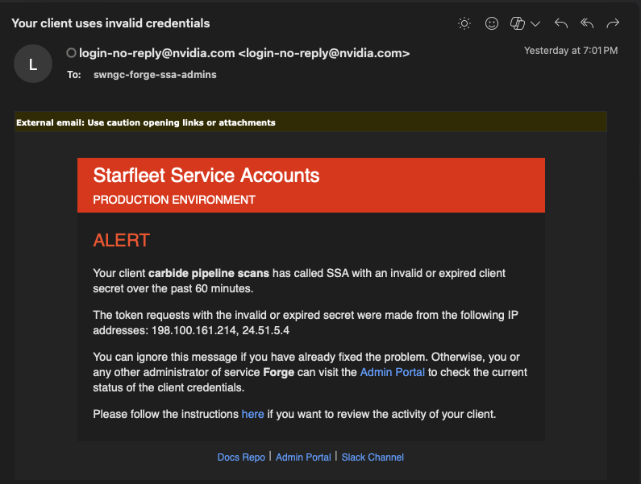
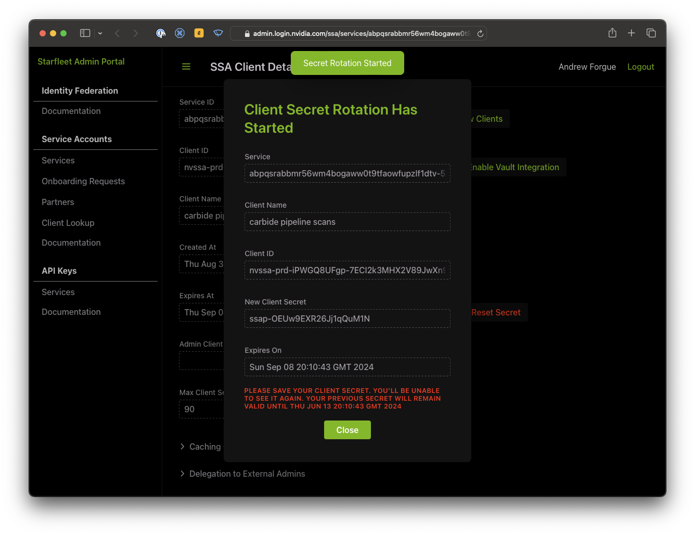

Update the SSA secret for nSpect pipeline scans
===============================================

nSpect uses Starfleet authentication to authenticate the Forge CI/CD pipeline against nSpect to be able to trigger scanning and results uploading to nSpect for security scanning results.

This is done in several jobs (check the `.gitlab-ci.yml` file for current jobs, This would include jobs that refer to nSpect or Pulse or similar.

Right now it's:

- nspect-container-scan-x86_64
- nspect-source-scan-x86_64

These jobs use a CI/CD environment variable secret that is the SSA authentication secret.

**It expires every 90 days**

Email gets sent to  `swngc-forge-ssa-admins@nvidia.com` when secrets are nearing expiration, or have expired and are still used, it will look like this:

If you get this email, pipeline scans are *broken*

How to rotate the secrets
-------------------------

- [Login to the SSA interface](https://admin.login.nvidia.com/ssa/services/abpqsrabbmr56wm4bogaww0t9tfaowfupzlf1dtv-5w/clients/nvssa-prd-iPWGQ8UFgp-7ECI2k3MHX2V89JwXn9PagXP6t2xCIXI?continue) for the SSA client.

The service ID should be: `abpqsrabbmr56wm4bogaww0t9tfaowfupzlf1dtv-5w`
The client ID should be: `nvssa-prd-iPWGQ8UFgp-7ECI2k3MHX2V89JwXn9PagXP6t2xCIXI`

The secret may or may not be expired.  If it is expired you can only reset the secret, if it is not expired you can start a rotation (rotating allows both keys to be used until you "commit" the rotation which will delete the old secret.

1.) Click reset or rotate, depending on what you want, select the lifetime:

2.) You will be displayed the new secret, you will not be shown the secret again.  (The secret in the image is not a valid secret for anything)

3.) [The Secret needs to get put into the gitlab ci/cd secrets for nvmetal (forge)](https://gitlab-master.nvidia.com/groups/nvmetal/-/settings/ci_cd)

4.) Update the secrets for `SSA_CLIENT_SECRET` and `SF_CLIENT_SECRET` to the new secret.

5.) If you are doing a rotation (not reset), then you can commit the rotation, but you may want to test that the new secret is used during a CI/CD run of something that uses an nspect pipeline scan.

6.) You are done.
