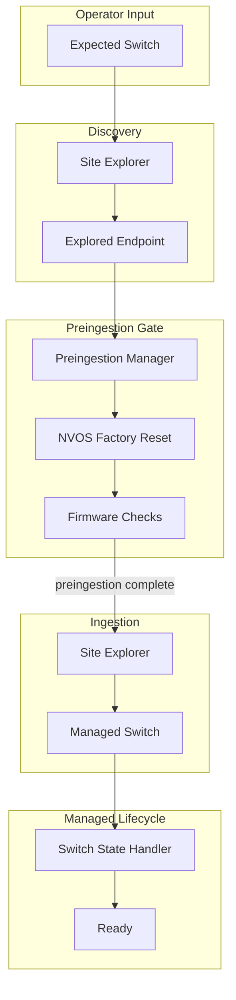
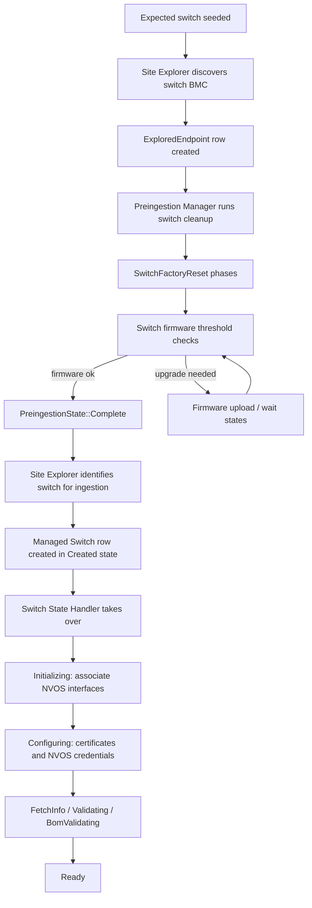

# Switch Preingestion Design

## Overview

Switch preingestion prepares a discovered switch BMC before Site Explorer creates
the managed `Switch` object. Switches and machines follow separate preingestion
paths, while sharing the same explored-endpoint gate and operator-visible status
model.

## Goals

- Gate managed switch creation on `preingestion_state == Complete`.
- Reuse `explored_endpoints` and `PreingestionManager`.
- Run a visible factory-reset cleanup stage before firmware checks.
- Apply switch firmware policy (BMC-only by default).
- Keep machine preingestion unchanged.

## Abstract Architecture

High-level view of how switch discovery, preingestion, ingestion, and managed
lifecycle connect:



| Layer | Component | Responsibility |
|-------|-----------|----------------|
| Input | Expected switch | Declares the switch to discover and ingest |
| Discovery | Site Explorer | Probes BMC and records explored endpoint |
| Preingestion gate | Preingestion Manager | Cleans NVOS and satisfies firmware policy |
| Ingestion | Site Explorer | Creates managed switch after gate passes |
| Managed lifecycle | Switch State Handler | Configures, validates, and brings switch to ready |

Preingestion runs on the explored endpoint only. The switch state handler starts
only after the managed switch exists.

## End-to-End Flow

Detailed progression from discovery through ready:



## Connection to Switch State Handler

Switch preingestion and the switch state handler are separate lifecycle stages with a
clear handoff:

| Stage | Owner | When it runs |
|-------|-------|--------------|
| Discovery | Site Explorer | Switch BMC is probed and written to `explored_endpoints` |
| Preingestion | Preingestion Manager | Before any managed `Switch` row exists |
| Ingestion | Site Explorer | After `preingestion_state == Complete` |
| Managed lifecycle | Switch State Handler | After the managed `Switch` row is created |

### Handoff sequence

1. **Expected switch is configured** with BMC MAC, NVOS MAC addresses, and optional
   bootstrap NVOS credentials.
2. **Site Explorer discovers the switch BMC**, records the exploration report, and
   creates or updates the explored endpoint.
3. **Preingestion Manager** picks up the explored switch endpoint and runs the switch
   cleanup and firmware flow described in this document.
4. **Ingestion gate** — Site Explorer only considers switch BMC endpoints whose
   preingestion state is `Complete`.
5. **Managed switch creation** — Site Explorer matches the explored switch to the
   expected switch, generates a switch ID, inserts the managed `Switch` row, and
   links the BMC machine interface to that switch.
6. **Switch State Handler** processes the new switch independently of preingestion.

### What happens after preingestion

Once the managed `Switch` exists, the switch state handler owns post-ingestion work.
See [Switch State Diagram](state_machines/switch.md) for the full FSM. At a high
level:

```text
Created
  -> Initializing (WaitForOsMachineInterface)
  -> Configuring (ConfigureCertificate, RotateOsPassword)
  -> FetchInfo
  -> Validating
  -> BomValidating
  -> Ready
```

- **Initializing** waits for NVOS machine interfaces discovered by Site Explorer to
  be associated with the managed switch.
- **Configuring** provisions switch certificates and stores fresh NVOS admin
  credentials in the vault for ongoing management.
- **Ready** means the switch is available for tenant and rack workflows.

Preingestion prepares the switch for safe ingestion. The switch state handler
configures and validates the switch after ingestion.

### Responsibility boundary

- **Preingestion** cleans NVOS state, removes old certificate history, reboots NVOS,
  deletes stored pre-ingestion credentials, and applies switch firmware policy.
- **Switch State Handler** does not re-run preingestion. It assumes the explored
  endpoint gate has already passed and focuses on managed-switch configuration.
- **Site Explorer** does not create a managed switch until preingestion is complete,
  and does not perform NVOS factory-reset cleanup itself.

### Operator-visible states

Operators can observe progress in two places:

1. **Before managed switch exists** — explored-endpoint preingestion state and
   factory-reset phase (`UnsetApps`, `SaveConfig`, `RebootDefaultOs`, `DeleteCerts`).
2. **After managed switch exists** — switch controller state (`Created`,
   `Initializing`, `Configuring`, `Ready`, etc.).

A switch BMC may sit in preingestion for some time before a managed `Switch` row
appears. That is expected: preingestion must finish before ingestion begins.

## NVOS Factory Reset

Before firmware checks, switch preingestion SSHs to NVOS and runs the cleanup
steps below.

### Phase 1 — `UnsetApps` (unset certificates and cluster state)

Run over SSH in order. Each command appends `|| true` so a missing object does
not fail the cleanup stage:

```bash
nv unset system api mtls ca-certificate || true
nv unset system api certificate || true
nv unset system gnmi-server certificate || true
nv unset cluster state disabled || true
```

| Command | Purpose |
|---------|---------|
| `nv unset system api mtls ca-certificate` | Remove mTLS CA certificate from the NVOS API |
| `nv unset system api certificate` | Remove the NVOS API server certificate |
| `nv unset system gnmi-server certificate` | Remove the gNMI server certificate |
| `nv unset cluster state disabled` | Clear cluster disabled state |

After the unset commands, delete all stored certificate history on NVOS using
shell loops over `nv show` output:

```bash
for i in $(nv show system security certificate); do
  nv action delete system security certificate "$i" || true
done

for i in $(nv show system security ca-certificate); do
  nv action delete system security ca-certificate "$i" || true
done
```

| Loop | Purpose |
|------|---------|
| Entity certificate loop | Delete all stored entity certificates and key data |
| CA certificate loop | Delete all stored CA certificates and key data |

Each delete appends `|| true` so already-removed or invalid tokens from the
`nv show` output do not fail the cleanup stage.

Finally, remove any leftover certificate files under the NVOS admin home
directory:

```bash
rm -rf "$HOME/certs/"* || true
```

SSH target resolution:

- Match `expected_switches` by BMC MAC from the explored endpoint address.
- NVOS IP from `nvos_ip_address` or DHCP-learned NVOS MAC.
- Credentials from `CredentialKey::SwitchNvosAdmin` or expected-switch username/password.

If no NVOS SSH target is available, the phase is logged and skipped.

SSH/connect failures retry on the next preingestion iteration.

### Phase 2 — `SaveConfig` (apply and persist)

After unset completes, run:

```bash
nv config apply -y
nv config save
```

Non-zero exit codes are retried on the next iteration (unlike unset, these do
not use `|| true`).

### Phase 3 — `RebootDefaultOs`

Reboot NVOS into the default OS image after the certificate and cluster-state
cleanup has been applied and saved. This phase is about the switch OS, not a BMC
factory reset. Errors are logged and the stage continues.

### Phase 4 — `DeleteCerts`

Delete stored NVOS admin credentials from the vault:

```text
CredentialKey::SwitchNvosAdmin { bmc_mac_address }
```

Deletion is idempotent; missing credential manager or BMC MAC is logged and
skipped.

After `DeleteCerts`, switch firmware threshold checks run.

## State Model

The factory-reset cleanup is represented as one visible preingestion stage with
four ordered phases:

- `UnsetApps`
- `SaveConfig`
- `RebootDefaultOs`
- `DeleteCerts`

Each phase is persisted in the explored-endpoint preingestion state so operators
can see where a switch is in the cleanup sequence.

## State Transitions

```text
Initial / InitialBmcReset / SetNtpServers
    -> SwitchFactoryReset { UnsetApps }
    -> SwitchFactoryReset { SaveConfig }
    -> SwitchFactoryReset { RebootDefaultOs }
    -> SwitchFactoryReset { DeleteCerts }
    -> firmware threshold checks
    -> Complete OR firmware upload states
```

After NTP, switches route to factory-reset cleanup. Machines continue through
their own time-sync and remediation checks instead.

### Unsupported host-only states on switches

Preingestion fails immediately if a switch enters:

- `BfbRecoveryNeeded`, `BfbPlatformPowercycle`, `BfbCopyInProgress`, `BfbInstallationWait`
- `InitialReset`, `TimeSyncReset`

## Component Responsibilities

### Site Explorer

- Discovers switch BMCs and maintains explored-endpoint records.
- May seed bootstrap NVOS credentials from expected-switch configuration during
  exploration.
- Identifies switch BMCs ready for ingestion once preingestion is `Complete`.
- Creates the managed `Switch` row and links the BMC machine interface.
- Does not run NVOS factory-reset cleanup.

### Preingestion Manager

- Runs switch cleanup, firmware checks, and firmware uploads before ingestion.
- Uses expected-switch and explored-endpoint data to reach NVOS over SSH.
- Marks the explored endpoint `Complete` when switch preingestion is satisfied.
- Does not create managed switches or drive switch controller states.

### Switch State Handler

- Starts only after Site Explorer creates the managed `Switch`.
- Associates NVOS machine interfaces, configures certificates, and progresses the
  switch to `Ready`.
- Owns all post-ingestion switch lifecycle work.
- Does not modify explored-endpoint preingestion state.

## Firmware Policy

Switch firmware policy is separate from machine firmware policy. The default
switch firmware ordering is BMC only. Host defaults, such as UEFI updates, do not
apply to switches.

## Observability

- Count of switches in preingestion.
- Count of machines in preingestion.
- Per-endpoint preingestion state and phase.

## Test Strategy

- Switch with acceptable BMC firmware completes after cleanup.
- Switch with old BMC firmware reaches `UpgradeFirmwareWait` after cleanup.
- Switch never enters `TimeSyncReset` or host power-cycle flows.
- `SwitchFactoryReset` phases are visible in persisted state.
- NVOS cleanup commands match the factory-reset script.
- Site Explorer creates a managed switch only after preingestion is `Complete`.
- Switch State Handler transitions a newly created switch from `Created` toward
  `Ready` after ingestion.
