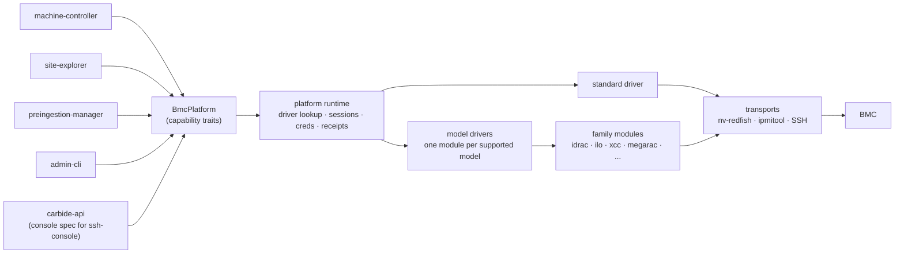
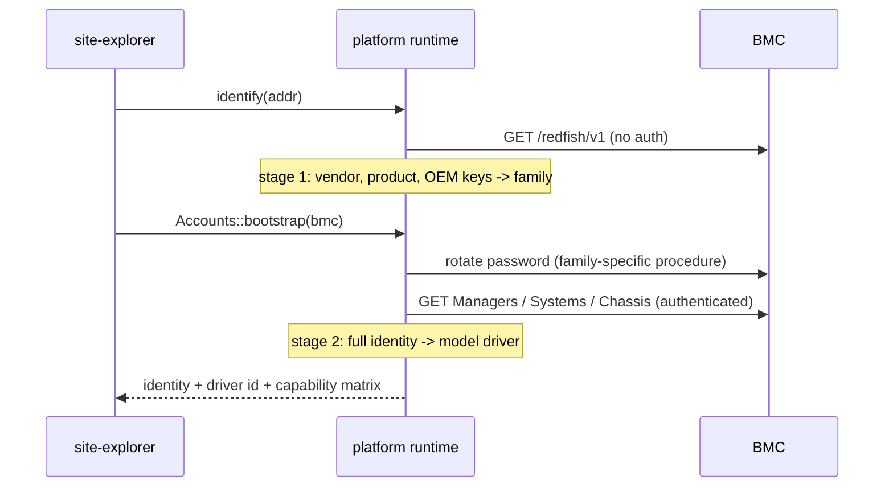

# BMC Driver Platform

Author: Krish Dandiwala

## 1. Problem statement

NICo manages bare-metal machines through their BMCs. Every lifecycle step that touches hardware is a BMC interaction: powering a host, applying BIOS settings, setting boot order, locking the BMC down, rotating credentials, updating firmware, attaching a serial console. Most of this runs over Redfish; some hardware requires IPMI or SSH for specific operations.

Knowledge about how each machine model behaves is spread across two external repositories and at least six places in NICo. Adding support for a new model takes coordinated releases of `libredfish` and `nv-redfish`, changes to three identity enums, new branches in controller code, a row added by hand to `docs/hcl.md`, and trial and error against a live BMC. Fixing behavior for one model risks regressing another, because models share vendor modules and controllers branch on vendor inline.

This design replaces that with a driver layer. Each machine model gets one module that declares how NICo identifies it, which operations it supports on which firmware, how its BMC deviates from standard Redfish, and how to reach its serial console. Everything else in NICo talks to hardware through small capability interfaces and never branches on vendor or model.

### 1.1 Terms


| Term              | Meaning                                                                                                                         |
| ----------------- | ------------------------------------------------------------------------------------------------------------------------------- |
| nv-redfish        | External NVIDIA crate: typed Redfish client generated from DMTF schemas. Kept as the only protocol layer.                       |
| libredfish        | External NVIDIA crate holding today's per-vendor behavior. Deleted by this design.                                              |
| Capability        | A small group of related hardware operations behind one trait, for example `HostPower`.                                         |
| Driver            | A compiled-in module for one machine model: identity rule, capability matrix, deviations from standard Redfish, console spec.   |
| Family            | A module for one BMC firmware stack (iDRAC, iLO, XCC, MegaRAC, and so on) holding behavior shared by every model on that stack. |
| Quirk             | Any behavior where hardware deviates from standard Redfish or from other hardware of the same kind.                             |
| Capability matrix | A driver's declaration of which operations work, on which firmware, and why not otherwise.                                      |


## 2. Goals and non-goals


### 2.1 Goals

- One module per machine model holds all model-specific behavior, including console access and any IPMI or SSH use.
- Controllers, Site Explorer, and ssh-console contain no vendor or model branches.
- NICo detects hardware, selects the driver, and discovers capabilities automatically. Operators configure nothing for supported hardware.
- The same model on different firmware versions is expressed inside one driver as declared version gates, not as scattered version checks.
- Every BMC mutation is tested against a simulator that enforces what the real firmware requires; a new driver is tested on real hardware before it merges. The HCL is generated from driver metadata.
- Adding hardware support is one pull request to the NICo repository.
- An optional agent workflow can draft or update drivers against a test BMC, under the same review and validation gates as human contributions.


### 2.2 Non-goals

- No runtime-loaded drivers (no dlopen, no WASM). Drivers compile into the NICo binaries.
- No tenant- or operator-facing driver configuration in normal operation.
- No changes to discovery mechanics: DHCP handling, exploration scheduling, and endpoint locking keep their current shape.
- Read-only paths (health collectors, inventory, exploration reports) stay on `nv-redfish` directly. The platform covers writes, status reads that drive decisions, and console access.
- NVLink switches (managed through NVUE REST in component-manager) and host-side agents (Scout) are out of scope.
- No redesign of state machine states. State names and transitions stay; persisted payloads change where job-id fields become receipts.


## 3. Current gaps

**One trait, every vendor.** The `Redfish` trait has 104 methods (libredfish `src/lib.rs:81-682`), implemented by 13 vendor modules totaling about 21,000 lines, in an external git dependency pinned by tag (v0.46.3). Adding a method touches every module; shipping a fix means a libredfish release plus a pin bump.

**Four identity mappings.** `RedfishVendor` (16 variants, libredfish), `BMCVendor` (9, `crates/bmc-vendor`), `HwType` (16, `crates/bmc-explorer/src/hw/mod.rs:34`), and ssh-console's vendor table (`crates/ssh-console/src/bmc/vendor.rs:70-93`), with `conv.rs` mapping between them. They drift: power shelves are identified in one and rejected by another.

**Vendor branches outside any hardware layer.** About 40, roughly 25 in machine-controller. Examples:


| Where                                            | Branches on           | What it does                                                                                                        |
| ------------------------------------------------ | --------------------- | ------------------------------------------------------------------------------------------------------------------- |
| `machine-controller/src/handler.rs:5435`         | Lenovo (XCC)          | Uses `ACPowercycle` where others use `ForceOff`                                                                     |
| `machine-controller/src/handler.rs:11928`        | model "SR650 V4", DGX | Host reset through IPMI chassis reset; Redfish restart cuts DPU power                                               |
| `machine-controller/src/handler.rs:3508`         | Lenovo (XCC)          | Falls back to ipmitool BMC cold reset when Redfish dies after NIC firmware update                                   |
| `machine-controller/src/handler.rs:12712, 13180` | Dell, DGX H100        | Reroutes boot-order drift through BIOS setup (Dell pending-job collision); skips boot-order remediation on DGX H100 |
| `machine-controller/src/handler.rs:1204`         | Dell                  | Only Dell machines enter BOSS storage cleanup states                                                                |
| `machine-controller/src/handler.rs:2407`         | vendor SEL text       | Detects host reboot from vendor-specific event log strings                                                          |
| `preingestion-manager/src/lib.rs:1257`           | Lenovo (XCC), Nvidia  | Issues an automatic BMC reset after BMC firmware update                                                             |
| `site-explorer/src/bmc_endpoint_explorer.rs:762` | HPE                   | Tolerates up to five intermittent 401s across exploration attempts                                                  |


Console access is one more copy of the same problem: ssh-console hard-codes activation commands, prompts, ports, and escape sequences per vendor (Dell `connect com2`, HPE `vsp`, SR650 V4's fallback commands, DPU on port 2200), and power shelves return an error marked TODO.

**Async mutations, five copies.** A mutation returns `Option<String>`: a Dell job id, a task, or nothing. Five state families each persist their own id field (`bios_job_id`, `set_boot_order_jid`, `uefi_password_jid`, `secure_erase_jid`, `create_boss_volume_jid`) and carry their own copy of the same poll-reboot-poll-recover scaffold.

**Hardware knowledge has no home.** BIOS attribute names live in three places (site config maps, libredfish vendor modules, `bmc-explorer/src/hw/` tables), and apply and verify are 30 separate implementations that drift. Firmware thresholds are buried constants: BlueField NIC-mode reads fail below `BF-24.07-14` (libredfish `src/nvidia_dpu.rs:1258`), MGX C2 needs BMC `01.05.01` for SSIF (libredfish `src/supermicro.rs:68`), Lenovo GB300 spells infinite boot `LEM0003=50`.

**Writes are untested.** `bmc-mock` accepts whatever NICo sends; `RedfishSim` (about 2,400 lines) models only what someone thought to model. Nothing fails if a driver stops sending AMI's `If-Match` header or stops parsing Dell's job id.

## 4. Proposed architecture


### 4.1 Overview

Two new crates:

```text
crates/bmc-platform/   Capability traits, request and response types, OperationReceipt,
                       PlatformIdentity, CapabilityMatrix, ConsoleSpec, errors.
                       Small, stable dependencies. Controllers depend on this crate only.

crates/bmc-drivers/    The runtime (identification, driver selection, session pooling,
                       credential resolution, receipt polling, transports, metrics),
                       the standard driver, family modules, and one module per model.
                       Only service setup code depends on this crate.
```




The platform is a library inside each service, constructed once at startup the way `RedfishClientPool` is today; there is no new network service. ssh-console is the exception: it's a separate deployment, doesn't link the drivers, and gets the console spec (plain data, section 6.5) from `forge.GetBmcMetaData`, which carbide-api answers from its own platform instance.

The runtime is the layer between the traits and the drivers, and it owns four things:

- **Driver lookup.** Identification happens only during exploration (section 5.3). Operations pass the persisted selection in `BmcRef`, and lookup is a map access. The one caller without a persisted selection is admin-cli pointed at a raw address (and tests): there the runtime runs the same identification exploration uses, with the caller-supplied credentials, and keeps the result in memory for the life of the process.
- **Credentials.** Per-BMC vault entries with the site-wide fallback, read through the existing credential reader. `BmcRef` carries the credential key, never the secret; the runtime caches secrets briefly and drops them on auth failure. Bootstrap and rotation are the `Accounts` capability (section 5.2).
- **Sessions.** Redfish authenticates with session tokens: one `SessionService` session per endpoint per service process (the platform is a library, so each service holds its own, as today's client pools do), created lazily and shared across that process's callers. Login and refresh are serialized per endpoint so concurrent callers don't stampede a BMC into lockout; re-login happens once on token expiry, logout on idle and shutdown. A runtime setting (`auth_mode: session | basic`, default `session`) switches to per-request basic auth for incidents; family declarations override the setting in both directions (bootstrap steps blocked by the forced password-change state and broken session services use basic auth, hardware that rejects basic auth stays on sessions). Sessions, cached service roots (absorbed from `NvRedfishClientPool`), and cached secrets drop on auth failure, credential rotation, BMC reset, and firmware update. IPMI and SSH connect per operation.
- **Receipt polling.** The `check(receipt)` path in section 4.3.

The transports are the only code that opens connections. The Redfish transport is `nv-redfish`, whose `SessionService` support provides the token login the session pool uses. The IPMI transport absorbs `crates/ipmi` (ipmitool subprocess, password via environment). The SSH transport absorbs the BMC-facing parts of `crates/ssh` (russh, the 2048-bit DH floor some BMCs need, and a host-key policy hook; today every BMC SSH connection skips host-key verification).

### 4.2 Capabilities

The platform replaces the 104-method client with one trait per capability group:


| Capability     | Operations                                                                                                                                                      | Main callers                                    |
| -------------- | --------------------------------------------------------------------------------------------------------------------------------------------------------------- | ----------------------------------------------- |
| `HostPower`    | power state, on, off, cycle, AC cycle, host reset                                                                                                               | machine-controller, preingestion, site-explorer |
| `BmcControl`   | BMC reset, reset to defaults, readiness readback, reboot evidence, NTP and time setup                                                                           | machine-controller, preingestion, site-explorer |
| `MachineSetup` | BIOS intents apply and status, UEFI password, NVRAM clear, serial redirect enable                                                                               | machine-controller, site-explorer               |
| `BootOrder`    | DPU-first order, boot once, infinite boot, HTTP boot                                                                                                            | machine-controller, site-explorer               |
| `SecureBoot`   | status, enable, disable, certificates, TPM clear                                                                                                                | machine-controller                              |
| `Lockdown`     | host lockdown and BMC-only lockdown, independently                                                                                                              | machine-controller, site-explorer               |
| `Accounts`     | credential bootstrap, user create and delete, password rotation, policy, IPMI-over-LAN                                                                          | site-explorer, credential-rotation              |
| `Firmware`     | multipart and simple update, inventory, post-update reset policy                                                                                                | preingestion, machine-controller                |
| `Storage`      | BOSS volume create and secure erase                                                                                                                             | machine-controller                              |
| `DpuControl`   | NIC mode, rshim enable and disable, BFB install (one composite receipt: rshim, transfer, task), install progress, ERoT reset, host privilege, service passwords | machine-controller, preingestion, site-explorer |
| `Attestation`  | SPDM evidence collection trigger and its task                                                                                                                   | spdm-controller                                 |
| `Console`      | returns the console spec for ssh-console                                                                                                                        | carbide-api                                     |


Notes on scope:

- Host lockdown and BMC-only lockdown stay separate operations, because existing workflows disable BMC lockdown around BIOS and storage writes and re-enable it afterward.
- Enabling serial redirect is a BIOS setting and belongs to `MachineSetup`. Attaching to the console is `Console`. They are different operations on different paths today and stay separate.
- `DpuControl` includes the operations that run over SSH today (rshim toggling, BFB copy, install-marker checks from `obmc-console-client`). The capability is the interface; the transport behind it is the driver's business.
- Boot-order and related setup requests identify the boot interface as today: MAC plus Redfish interface id, so each family can use its native identifier.

A handler takes the narrow trait it needs (`Arc<dyn HostPower>`) or the umbrella `Arc<dyn BmcPlatform>` that composes all of them. `BmcRef` carries what is needed to reach the BMC: address, credential key, and the selection recorded at exploration (a model id, a family, or standard; section 5.3). It holds no database handles and no secrets. All three fields come from the endpoint lookup each service already performs for BMC access data (machine-controller's `lookup_bmc_access_info`, preingestion's endpoint records, carbide-api's machine lookup); that lookup returns the persisted selection, and the code that builds the `BmcRef` copies it in.

```rust
#[async_trait]
pub trait HostPower: Send + Sync {
    async fn power_state(&self, bmc: &BmcRef) -> Result<PowerState, PlatformError>;
    async fn set_power(&self, bmc: &BmcRef, req: PowerRequest)
        -> Result<OperationReceipt, PlatformError>;
}
```


### 4.3 Operation receipts

Every mutation returns an `OperationReceipt` stating what the BMC actually did and how to follow up:

```rust
#[derive(Serialize, Deserialize)]   // persisted inside controller state, so serde-stable
pub enum OperationReceipt {
    /// Accepted immediately. Confirm with the indicated readback; BMCs often
    /// report success before the state actually changes.
    Done { verify: Readback },
    /// Standard Redfish task (TaskService/Tasks/{id}).
    Task(TaskRef),
    /// Vendor job queue item (for example Dell JID_*).
    Job(JobRef),
    /// The BMC reports the requested state already holds
    /// (for example Dell returns 409 when powering off a machine that is off).
    AlreadySatisfied,
}
```

A readback is the read that confirms a write took effect (power state after a reset, lockdown status after a lockdown write); the standard driver declares one per operation. The runtime owns the follow-up: `check(receipt)` returns `Pending`, `NeedsHostReboot`, `Done`, or `Failed { reason }`, normalizing task states, vendor job states, and readback loops behind one call. Controllers keep their own retry budgets and state transitions; they stop interpreting job JSON. Receipts serialize into controller state, replacing the five ad hoc job-id fields, so they must stay backward-compatible across releases like any persisted state.

### 4.4 Errors

Every capability method returns `Result<_, PlatformError>`:

```rust
pub enum PlatformError {
    /// The matrix says No; returned before any request is sent.
    Unsupported { op: Op, reason: &'static str },
    /// Transport failure. What it means (give up, keep waiting through a
    /// BMC reset) is the controller's call, since it depends on state.
    Unreachable,
    /// Auth failures the runtime can classify: bad credentials, the forced
    /// password-change state, a suspected lockout.
    Auth(AuthError),
    /// A Redfish error no rule consumed, with the vendor's diagnosis intact.
    Bmc { status: u16, message_id: Option<String>, message: String },
}
```

A Redfish error response goes through the family's error rules (section 7.2) before it becomes an error at all: a rule can turn it into a receipt outcome (Dell's 409 becomes `AlreadySatisfied`) or a typed variant (403 plus the `PasswordChangeRequired` message id becomes `Auth`). Whatever falls through surfaces as `Bmc` with the status and Redfish `MessageId` preserved, so logs carry the vendor's own diagnosis. Controllers branch on the variant, never on message strings.

## 5. Hardware and firmware identification


### 5.1 PlatformIdentity

The runtime builds one identity from cheap reads: always the service root, then Managers, Systems, or Chassis only when needed.

```rust
pub struct PlatformIdentity {
    pub vendor: Option<String>,               // service root Vendor
    pub product: Option<String>,              // service root Product
    pub oem_keys: Vec<String>,                // strong vendor fingerprint (for example "Ami")
    pub manager_model: Option<String>,
    pub manager_firmware: Option<String>,     // normalized per family, see 5.4
    pub system_manufacturer: Option<String>,
    pub system_model: Option<String>,
    pub system_sku: Option<String>,
    pub part_number: Option<String>,          // MGX C2 is detected by part number fragment
    pub bios_version: Option<String>,
    pub chassis_manufacturer: Option<String>, // power-shelf fallback
}
```

This preserves today's special identification cases as data: Lite-On and Delta power shelves carry no service-root vendor and are identified by chassis manufacturer; the NVIDIA P3809 root is disambiguated by chassis contents; LenovoAMI is a Lenovo root plus an `Ami` OEM key; BlueField model (BF2, BF3, BF4) comes from the product string. `PlatformIdentity` replaces `RedfishVendor`, `BMCVendor`, `HwType`, and ssh-console's vendor table as the single identity source.

### 5.2 Identity before credentials

Many BMCs arrive in a forced password-change state and reject most reads until the password is rotated, but the rotation procedure is itself hardware-specific. The service root breaks the loop: Redfish requires it to be readable without authentication, and it stays readable in the forced-change state.




Stage 1 selects a family from service-root evidence alone, through one declarative table in the runtime's identification module (`runtime/identify.rs` in the section 6.2 layout) mapping vendor string, OEM keys, and product to a family, the same evidence today's `ServiceRoot::vendor()` match uses. Families don't register the way model drivers do; this table is the only place they are matched, both here and for the family-fallback rung in section 5.3. Adding a family means the family module plus one row here. The credential-change procedure is always a family property, never a model property: iDRAC uses pre-provisioned account slots, XCC changes the password by account id 1, Viking falls back to id 2 on `PasswordChangeRequired`, and NVIDIA GBx00 factory firmware returns 403 on `/Systems` until rotation, so the runtime must not issue any eager read before a credential operation. That last rule is enforced structurally: stage-1 clients fetch nothing but the service root.

Stage 2 completes the identity after credentials work, re-scores, and caches. A family-level match upgrades to a model match without starting over.

### 5.3 Selection

Each model driver declares an identity rule. During exploration, and only there, every rule is scored against the endpoint's evidence and the strongest match wins:

1. Exact model match (rule may include a firmware range, for the rare case where two firmware generations share almost nothing and ship as two drivers).
2. Recognized family, no model file: family policies run on standard implementations. The machine works and is reported as unlisted.
3. No recognized family: the standard driver attempts the operation with plain standard Redfish.
4. Otherwise the operation fails with a typed `Unsupported` error, not a 404 mid-workflow.

The persisted selection has the same three shapes as the ladder: a model id, a family, or standard. That is what lets family fallback and deleted-driver recovery resolve without probing; a bare model id couldn't express either.

The scoring adds no BMC traffic of its own: exploration already reads the service root, systems, and chassis for the report, so the evidence is in hand and rescoring it is local computation. When the winner changes, the new selection is written to the endpoint record and the change is logged, because it always means something happened: a firmware update, a reset to factory defaults, or a release that shipped a better-matching driver. The first two also set the endpoint's re-exploration flag, so they are picked up without waiting for the next scheduled run. Between explorations, operations carry the persisted selection in `BmcRef`, and a driver that finds the BMC no longer matching what it expects flags the endpoint for re-exploration rather than probing inline.

CI runs every driver's identity rule over the committed fixtures and fails if any fixture matches two drivers at the same score.

The exploration report records the selected `driver_id` and the machine's capability matrix: the per-operation support list (AC power cycle yes, boot-order verification no with a reason, and so on), defined in section 7.1. The API and UI read support from the report instead of asking the BMC, and operation metrics are labeled with the driver id.

### 5.4 Firmware identity and gates

Firmware evidence (manager firmware, BIOS version) is part of the identity, normalized per family since vendors format versions differently (`6.10.30.00`, `BF-24.07-14`, `01.05.01`).

Firmware is not a dispatch axis. There are no per-firmware modules; a firmware difference changes rows inside the driver:

- **Version gates** for known thresholds. A support entry in the capability matrix (section 7.1) or a BIOS attribute mapping (section 7.3) can carry a firmware range: NIC-mode reads on BlueField are marked supported from `BF-24.07-14`, and SSIF on the MGX C2 from BMC `01.05.01`. Each threshold is one gated entry instead of a version check in code.
- **Presence probes** for differences that do not track versions cleanly: a BIOS mapping row may list alternative attribute names tried in order of presence (HPE's virtualization key), and error rules may map a vendor message id to a fallback (Dell's read-only `SYS410`). Probes live in driver declarations, never in controllers.


## 6. Driver model and interfaces


### 6.1 The Driver trait

```rust
pub trait Driver: Send + Sync {
    fn info(&self) -> &'static DriverInfo;
    fn matches(&self, id: &PlatformIdentity) -> MatchScore;
    fn capabilities(&self, id: &PlatformIdentity) -> CapabilityMatrix;
    fn console_spec(&self, id: &PlatformIdentity) -> ConsoleSpec;

    fn host_power(&self) -> Option<&dyn HostPower> { None }
    fn bmc_control(&self) -> Option<&dyn BmcControl> { None }
    // ... one accessor per capability, all defaulting to None
}

pub struct DriverInfo {
    pub id: &'static str,   // "lenovo-sr650-v4"
    pub family: Family,
}
```

An accessor performs nothing itself: it returns the driver's implementation of one capability trait, and the operations are separate methods on that trait. `bmc_control()` hands back a `BmcControl`, whose methods are BMC reset, reset to defaults, and the readiness readback, the same way `HostPower` in section 4.2 carries `power_state` and `set_power`.

Three rules keep this small:

1. **The standard driver is the reference implementation.** It implements every capability using only standard Redfish, through nv-redfish.
2. **Model drivers are overlays.** A `None` accessor means "use standard through my family's policies." A driver overrides only where its hardware deviates.
3. **Deviations are data where possible, code only where necessary.** Most vendor differences are small: a required header, a different attribute name, a job id to parse. Section 7 expresses these as policy fields and table rows instead of code.


### 6.2 Families and models

Family modules hold what belongs to the BMC firmware stack: write policies, credential bootstrap procedures, job parsers, reboot-evidence patterns, shared capability implementations. Families are plain modules; they are never selected directly and never registered.

Model drivers are one module per supported machine and are the unit of support: one module per HCL row, and one place to look when a machine misbehaves.

```text
crates/bmc-drivers/src/
  runtime/                 identify, select, sessions, credentials, receipts, transports
  standard/                reference implementation (standard Redfish only)
  families/
    idrac.rs               job queue, 409 semantics, account slots 3..16, apply-on-reset
    ilo.rs                 connection close on iLO < 7, 401 retry, presence-probed attrs
    xcc.rs                 boot-order attributes, IPMI reset fallbacks
    megarac.rs             If-Match on every write, upload endpoint (Viking, LenovoAMI, Lenovo GB300)
    supermicro.rs          boot-option paths, SSIF host interface
    nvidia.rs              NVIDIA's OpenBMC-derived BMC: GBx00 (incl. SMC GB300), GH200, Vera Rubin, GB switch
    bluefield.rs           NIC mode, rshim and BFB over SSH, DPU credentials
    powershelf.rs          Lite-On and Delta shared minimal behavior
  models/
    dell_r750/             mod.rs (identity rule, matrix, overrides) + bios.rs (attr tables)
    lenovo_sr650_v4/
    hpe_dl380_gen12/
    nvidia_gb200_nvl/
    bluefield3/
    ...one per HCL row; a single file when the model has no BIOS tables
  registry.rs              the explicit list of model drivers
```

Only model drivers register, in one explicit list. Adding hardware adds a module and a registry line; removing support deletes them.

A driver's id is its module name with underscores turned into hyphens, so `models/lenovo_sr650_v4` becomes `lenovo-sr650-v4`: vendor first, then the model, with a qualifier added only when one model splits into two drivers by firmware (section 5.3). A registry test keeps ids unique and matching their module names. Because ids end up in endpoint records, HCL rows, metrics, and break-glass pins, a shipped id never changes; if a release deletes a driver, endpoints still carrying its id are flagged for re-exploration and run on the family or standard driver until re-identified.

### 6.3 A model driver, concretely

Illustrative, using known SR650 V4 behavior:

```rust
// models/lenovo_sr650_v4/mod.rs
pub static DRIVER: ModelDriver = ModelDriver {
    info: DriverInfo {
        id: "lenovo-sr650-v4",
        family: Family::Xcc,
    },
    identity: rule!(system_model == "ThinkSystem SR650 V4"),
    // Matrix rows that differ from the xcc family baseline (section 7.1).
    // Empty: this model supports exactly what the family supports.
    support_overrides: &[],
    // Redfish GracefulRestart cuts power to the DPU on this model.
    host_reset: ResetMethod::IpmiChassisReset,
    console: ConsoleSpec::SshShell {
        port: 22,
        activate: &["console kill 1", "console 1"],
        fallback: &[&["console kill", "console start"]],
        prompt: "\nsystem>",
        escape_filter: EscapeSeq::EscParen,
    },
    bios: bios::TABLE,               // models/lenovo_sr650_v4/bios.rs
    // Code replacing how an operation runs (section 7.2's escape hatch).
    // None: this model's deviations are all data.
    custom_impls: CustomImpls::NONE,
};
```

`ModelDriver` is the authoring shape; a blanket `impl Driver for ModelDriver` in the runtime turns it into the section 6.1 trait, so model modules never implement `Driver` by hand. An engineer reading this file can answer "what does NICo do differently on this machine" without reading anything else. The two override fields do different jobs: `support_overrides` changes whether an operation is offered (matrix rows), and `custom_impls` changes how one runs (trait implementations in this module, for deviations no data field can express). Populated, they look like this:

```rust
    // The DGX H100 reports stale boot order, so verification is off.
    support_overrides: &[
        (Op::BootOrderVerify, Support::No { reason: "BMC reports stale boot order" }),
    ],
    // This machine names its DPU boot entries differently. The custom impl
    // is built wrapping the family implementation, overrides one method,
    // and delegates the rest to the wrapped impl.
    custom_impls: CustomImpls {
        boot_order: Some(&ThisModelBootOrder),
        ..CustomImpls::NONE
    },
```


### 6.4 Transports and reset methods

Drivers declare transport behavior; the runtime executes it. Reset methods are the clearest case, replacing today's inline fallbacks:

```rust
pub enum ResetMethod {
    Redfish,                     // standard
    RedfishThenIpmiColdReset,    // xcc family: Redfish can die after NIC firmware update
    IpmiChassisReset,            // SR650 V4, DGX: keeps DPU powered
    IpmiRawThenChassis,          // legacy DPU raw reset, then chassis
}
```

Site Explorer's rate-limited ipmitool BMC reset and admin-cli's `--use-ipmitool` flag become callers of the same declared methods.

### 6.5 Console spec

Console access is data. ssh-console keeps its transports (russh sessions, ipmitool SOL in a PTY), its certificate authentication, and its log capture, and deletes its vendor table. Per machine it receives:

```rust
pub enum ConsoleSpec {
    /// SSH to the BMC shell, run commands to attach the serial console.
    SshShell {
        port: u16,
        activate: &'static [&'static str],
        fallback: &'static [&'static [&'static str]],  // tried on activation failure
        prompt: &'static str,          // BMC shell prompt; reappearing means detached
        escape_filter: EscapeSeq,      // stripped so users cannot drop the session
    },
    /// SSH session lands directly on the console.
    SshDirect { port: u16 },
    /// IPMI serial-over-LAN.
    IpmiSol { port: u16 },
    /// No console on this hardware.
    None { reason: &'static str },
}
```


## 7. Capability and quirk handling


### 7.1 Capability matrix

NICo knows how to attempt a fixed list of operations: power on, AC power cycle, set boot order, verify boot order, lockdown, NIC mode read, and so on. The list is defined once, in `bmc-platform`. The capability matrix is one machine's answer sheet: for every operation on that list, exactly one answer.

```rust
pub enum Support {
    Yes,
    No { reason: &'static str },                  // "XE9680 cannot PXE boot"
    FirmwareAtLeast { version: &'static str },    // "BF-24.07-14"
}
```

Two things the matrix isn't. It isn't the capability traits: the traits are how code calls an operation, the matrix says whether this machine supports it. And it isn't inferred from code: a model driver with no power code of its own still answers `Yes` to power operations, because the standard implementation handles them. `No` is always a written declaration with a reason, never an absence.

The answers come from three layers, and a later layer wins per operation: the standard baseline (which answers every operation: `Yes` where standard Redfish covers it, `No` where it would need vendor code), then the family's changes, then the model's. A Dell XE9680:


| Operation          | Baseline                 | idrac family                | dell_xe9680 model              | Answer for this machine |
| ------------------ | ------------------------ | --------------------------- | ------------------------------ | ----------------------- |
| Power on           | Yes                      |                             |                                | Yes                     |
| BOSS volume create | No: not standard Redfish | Yes: Dell OEM storage paths |                                | Yes                     |
| PXE boot           | Yes                      |                             | No: this model cannot PXE boot | No, with that reason    |


A model file lists only its own rows, and most list none (section 6.3). The middle layer always comes from the family named in `DriverInfo`.

The runtime refuses a `No` operation with the typed reason before sending anything. Controllers branch on answers instead of vendor names: only machines that answer `Yes` to BOSS operations enter the BOSS cleanup states. The exploration report and the HCL print the matrix, with firmware-gated rows feeding the HCL's firmware column.

### 7.2 Write policies

The standard driver implements each kind of mutation exactly once. The Redfish spec leaves a few decisions open per write, and those decision points are where vendors actually disagree. A family's choices at those points form its `WritePolicy`:

```rust
pub struct WritePolicy {
    pub concurrency: EtagMode,          // NotRequired | IfMatchStar | FetchEtag
    pub destination: WriteTarget,       // Direct | PendingSettings
    pub apply_time: Option<ApplyTime>,  // for example OnReset
    pub result: AsyncResult,            // Immediate | RedfishTask | OemJob(parser)
    pub errors: &'static [ErrorRule],   // 409 => AlreadySatisfied; SYS410 => Fallback
}
```

A family declares one policy per kind of mutation (a BIOS write, a firmware upload, a power action), a small set of constants in the family module, because the answers differ by operation even within one family: on iDRAC a power action applies immediately, a BIOS write stages pending settings and creates a job, a firmware upload returns a task. The struct exists because its consumer is the shared write path in the standard driver, which takes those choices as parameters instead of letting each family carry its own copy of the flow. A policy cannot introduce behavior; it can only choose among behaviors the shared write path supports. "MegaRAC requires `If-Match` on every write" is one field instead of an 1,800-line module; "Dell BIOS writes stage to pending settings, create a job, and apply on reset" is three fields plus a job-id parser. Each initial field corresponds to behavior that appears in several libredfish vendor modules today. A deviation no field can express becomes a capability override in code, at the narrowest scope that covers it: the model file, or the family when the whole stack shares it. When the same override appears in a second file, the shared write path gains that step and the difference becomes a policy field, so nothing stays implemented twice.

### 7.3 BIOS intents

Machine setup is the worst case for divergence: the settings NICo needs are the same everywhere, but names and values are not. The platform defines setup **intents** (virtualization on, UEFI boot mode, serial redirect, boot retry, performance profile). Drivers map intents to attributes as tables:

```rust
pub struct BiosMapping {
    pub intent: SetupIntent,
    pub attribute: AttrName,       // one name, or FirstPresent(&["ProcVirtualization", "IntelProcVtd", "ProcAmdIoVt"])
    pub value: AttrValue,
    pub firmware: Option<VersionRange>,   // gated renames
}
```

BIOS tables layer the same way the capability matrix does: the family supplies a table, the model file adds or overrides rows, and for the same intent a model row wins. A `bios.rs` for a Lenovo machine with an AMI BMC, illustrative:

```rust
// models/lenovo_hs350x/bios.rs (family: megarac)
// Model rows only. The megarac family table supplies the rest, for
// example the SETUP001 UEFI password attribute shared by all AMI BMCs.
pub static TABLE: &[BiosMapping] = &[
    BiosMapping {
        intent: SetupIntent::VirtualizationOn,
        attribute: One("ProcessorVmxEnable"),
        value: Enum("Enable"),
        firmware: None,
    },
    BiosMapping {
        intent: SetupIntent::InfiniteBootRetry,
        attribute: One("EndlessBoot"),          // the AMI spelling of boot retry
        value: Enum("Enabled"),
        firmware: None,
    },
    // BMC 2.10 renamed the console redirect attribute. Both rows stay
    // while the fleet is mixed; the gate picks the right one per machine.
    BiosMapping {
        intent: SetupIntent::SerialConsoleRedirect,
        attribute: One("ConsoleRedirectionEnable0"),
        value: Enum("Enabled"),
        firmware: Some(fw!("<2.10")),
    },
    BiosMapping {
        intent: SetupIntent::SerialConsoleRedirect,
        attribute: One("SerialConsoleRedirect"),
        value: Enum("Enabled"),
        firmware: Some(fw!(">=2.10")),
    },
];
```

One shared implementation consumes the table in both directions. Apply writes attributes through the family's write policy. Status reads current and pending values, maps them back through the same table, and returns a per-intent result: `Satisfied`, `PendingReboot`, `Mismatch { expected, actual }`, or `Unsupported`. Because apply and status share one table, they can't disagree about what "set up" means; today's 30 paired implementations collapse into tables plus one engine. The per-model expectation tables in `bmc-explorer/src/hw/` merge into these driver tables, leaving one source for BIOS attribute truth.

Redfish doesn't standardize BIOS attribute names, so these tables stay necessary even on fully standard hardware.

## 8. Integrations


### 8.1 machine-controller

Every handler gets its hardware client from `create_redfish_client_from_machine` (`crates/machine-controller/src/context.rs:79`). That function returns platform capability handles instead of `Box<dyn Redfish>`, with the `BmcRef` built from the machine's stored endpoint data, including the selection recorded at exploration. It is the primary seam, not the only one: handlers also call pool-level helpers directly (`uefi_setup` and the UEFI rotation paths), and those move onto the same traits in the same phases. State names, transitions, and the 30-second reconcile tick don't change.

What changes inside handlers, using BIOS configuration as the example:

Today: `machine_setup()` returns `Option<String>`; the handler stores `bios_job_id`, then walks `WaitForBiosJobScheduled`, reboots, walks `WaitForBiosJobCompletion`, and runs its own recovery ladder, interpreting Dell job JSON along the way. Boot order, BOSS erase, BOSS create, and UEFI password each repeat this with their own field and ladder.

After:

```rust
// apply once; receipt replaces bios_job_id inside the state enum
let receipt = setup.apply(&bmc, &intents).await?;
state.transition(WaitingForBiosSetup { receipt });

// every tick
match platform.check(&receipt).await? {
    Progress::Pending          => Wait,
    Progress::NeedsHostReboot  => power.set_power(&bmc, Reboot).await?,
    Progress::Done             => state.transition(next),
    Progress::Failed { reason } => recovery.attempt(reason),   // budget stays in the controller
}
```

The controller keeps transitions, retry budgets, and stuck thresholds. The platform interprets job states, readbacks, and benign errors. Choreography that spans capabilities also stays in the controller: Supermicro needs a host reboot after BMC unlock before boot-order reads are trustworthy, and the driver declares that prerequisite as data while the controller orders the steps. The five duplicated ladders collapse into this one pattern, and the vendor branches in section 3's table are replaced by matrix rows, reset methods, and policies.

### 8.2 preingestion-manager

Preingestion keeps its own loop (it is not a state-controller plugin) and swaps `RedfishClientPool` for the platform: firmware upload through `Firmware` with receipts, BFB install as one composite `DpuControl` operation whose receipt covers rshim enable, image transfer, and the update task, post-update BMC resets driven by the family's declared policy instead of the inline vendor branch at `lib.rs:1257`, install-progress markers through `DpuControl` instead of raw SSH.

### 8.3 Site Explorer

Site Explorer keeps exploration scheduling, endpoint locking, credential selection policy and vault writes, remediation decisions, and endpoint state. Exploration reports stay on the nv-redfish read path. What changes:

- **Classification.** The probe stack in `redfish.rs` (`get_redfish_vendor`, `probe_bmc_vendor`, `is_viking`, chassis fallback) is replaced by one `identify(bmc)` call. The endpoint report records driver id and matrix instead of vendor strings.
- **Status reads that drive remediation** (`lockdown_status`, `machine_setup_status`, `is_infinite_boot_enabled`, credential validation) move to the same capability traits machine-controller uses, so both callers read the same structured results from one implementation.
- **Mutations** (BMC reset, power, secure boot disable, lockdown, machine setup, boot order, NIC mode, NVRAM clear, user management, password rotation) move onto capability traits. The per-vendor password dispatch in `RedfishClientPool::set_bmc_root_password` (`crates/redfish/src/libredfish/mod.rs:361`) becomes each family's `Accounts` bootstrap, selected on stage-1 identity (section 5.2).


### 8.4 ssh-console

ssh-console asks carbide-api for connection details today and derives everything else from a vendor enum. The `GetBmcMetaData` response gains the `ConsoleSpec`; the vendor table, the port-selection switch, and the per-vendor activation constants are deleted. Transport code (russh, ipmitool PTY, session logging, escape filtering, the existing fuzz tests) is unchanged. Power shelves return a declared `None` with a reason the UI can show, instead of a runtime error.

### 8.5 Everything else

admin-cli's `redfish` command group is about 60 subcommands today, each individually wrapping a `Redfish` trait method. They split three ways:

- **Capability operations.** Each becomes a thin subcommand: parse arguments into the operation's request type from `bmc-platform`, call the capability trait, print the receipt or result. The request types derive their own argument parsers, so adding an operation costs one dispatch line in the CLI, and none of the 60 wrappers carries vendor logic. A command against hardware whose matrix says `No` prints the typed reason instead of a vendor-specific 404.
- **Inventory and metrics reads** (chassis, managers, ethernet interfaces, PCIe devices, power and thermal metrics). These stay on the nv-redfish read path and its schema-generated types, like every other read-only surface (section 2.2).
- **Raw diagnostics.** A read-only GET passthrough for arbitrary endpoints stays available for debugging, explicitly outside the driver model.

Trait methods that exist today only to back a CLI wrapper follow the same split; nothing becomes a capability just to preserve a wrapper. power-shelf-controller consumes a matrix that marks almost everything unsupported. `credential-rotation` keeps its persisted orchestration (crash markers, current and target secret generations, change-then-verify); `Accounts` supplies the family-specific hardware steps it calls.

## 9. Testing and validation

Driver tests run against `bmc-mock`, which NICo already has: its fixtures and per-hardware state modules carry over, with drivers as the caller instead of libredfish. New models add fixtures the same way they do today. Controller tests mock the capability traits directly, replacing the roughly 2,400-line `RedfishSim`; machine-a-tron keeps its dev-simulation role.

The conformance suite is the standard driver's capability tests, parameterized by the driver's matrix, runnable against a real BMC (`admin-cli driver validate <bmc>`). It is the same suite for all three uses: validating a new driver, checking how far a new BMC gets on standard Redfish alone, and revalidating after a firmware bump. Destructive checks (NVRAM clear, storage erase, firmware) run only with an explicit flag and only outside production.

A driver PR is ready when three things are true: the suite passed on the real machine, fixtures for bmc-mock are committed, and the PR is reviewed. Drivers version with the NICo release; dropping support is deleting the module.

## 10. AI-assisted driver development

The inputs to hardware enablement are a BMC address and credentials, and most of the work is observation and transcription. That makes it a good agent task, provided the agent has no more trust than any external contributor.

Workflow:

1. **Probe.** The agent is pointed at a designated test BMC. It explores read-only: service root, managers, systems, chassis, registries, and the per-capability resources the standard driver uses. A harness, not agent self-discipline, enforces the boundary: GET-only HTTP proxy, rate limits, a session-scoped account, no credential mutations.
2. **Draft.** It compares observations against what the standard driver expects and drafts a model module: identity rule, family assignment, capability matrix, BIOS rows where inferable, sanitized fixtures, and an HCL row marking every mutation it could not exercise.
3. **Validate (supervised).** The conformance suite runs against the test BMC. Mutations require the BMC to be on the lab's test-inventory allowlist and an operator to approve the run; destructive checks are gated individually. The agent iterates on failures the same way an engineer would, but through the suite, not free-form requests.

Safety and review controls, as rules:

- Generated code is untrusted code. Human review is required, and the security model is identical to an external contribution.
- The same bar as human PRs applies: suite run on the test BMC (started by an operator), fixtures committed, review.

The same workflow updates existing drivers: after a firmware release, the agent re-probes, diffs observed behavior against committed fixtures, and proposes firmware-gated rows.

## 11. Rollout and migration plan

One capability at a time. The platform lands next to the existing pool; callers move per capability; libredfish is deleted when its call count reaches zero. The system runs mixed at every step, but mixed by capability, never by operation: each phase moves one operation type across all callers at once, so any given mutation is always served by exactly one stack.

1. Land `crates/bmc-platform` (traits, receipts, identity, errors) with mock implementations and controller tests. No behavior change.
2. Land the `crates/bmc-drivers` runtime, standard driver, and identification. Run identification in shadow mode in Site Explorer: `identify()` runs beside the current vendor detection, results are compared and logged, nothing consumes them. After the soak period shows zero mismatches, persist the selection to endpoint records and backfill existing endpoints; phase 3 depends on that.
3. Migrate `HostPower` and `BmcControl` across machine-controller, preingestion-manager, and site-explorer. The IPMI transport lands here with the reset methods. Widest surface, simplest semantics; proves receipts and readbacks.
4. Migrate `Accounts`. It is the most family-specific capability, and from here on a newly discovered BMC enters the fleet on the new path end to end: stage-1 identity, family bootstrap, stage-2 identity, driver selection. Rotation keeps its orchestration and today's session invalidation (section 8.5); only the hardware steps move.
5. Migrate `Lockdown`, `BootOrder`, `MachineSetup` (BIOS intents), and UEFI password. These status reads drive state advancement and stall machines when wrong.
6. Migrate `Firmware`, `DpuControl`, `SecureBoot`, and `Storage`. The SSH transport lands here with the DPU operations.
7. Serve `ConsoleSpec` through `GetBmcMetaData`; delete ssh-console's vendor table; delete `crates/ipmi` and the BMC-facing parts of `crates/ssh`, whose logic moved into the transports in phases 3 and 6.
8. Delete the libredfish dependency, `crates/redfish/src/libredfish/` including `conv.rs` and `RedfishSim`, and the three identity enums. The serialized vendor field in exploration reports stays as a legacy projection until every reader is gone. Generate the HCL from driver metadata and rewrite `docs/development/new_hardware_support.md` around the driver workflow.


## 12. Open questions

1. How much raw Redfish access do drivers get? Proposal: typed nv-redfish access by default; raw requests allowed but flagged in review as deviations from standard Redfish.

