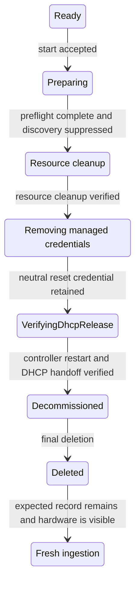

# Managed Resource Decommissioning Workflow

## Status

Draft

## Summary

This document defines the lifecycle behavior shared by NICo decommissioning
workflows. Decommissioning returns a managed resource to an unmanaged,
pre-ingestion state. An operator can then either physically remove the resource
or delete its record and let the still-connected hardware be discovered and
ingested again.

Resource-specific documents define the hardware cleanup and exact controller
states:

- [Managed host decommissioning](/docs/design/decommissioning/managed-host-decommissioning.md)
  resets the host and its DPUs and installs a vanilla BFB on each managed DPU.
- [Managed switch decommissioning](/docs/design/decommissioning/managed-switch-decommissioning.md)
  resets NVOS configuration and credentials and resets BMC credentials.
- [Managed power shelf decommissioning](/docs/design/decommissioning/managed-power-shelf-decommissioning.md)
  resets PMC credentials.
- [Rack-scale decommissioning with NICo Flow](/docs/design/decommissioning/rack-decommissioning.md)
  orchestrates those workflows across an entire rack.

The same lifecycle defines dependency-safe ordering when an entire rack is
decommissioned.

## Terminology

- **Decommissioning** is the convergent hardware and control-plane cleanup that
  ends in a retained terminal record.
- **Final deletion** removes a successfully decommissioned resource from NICo.
  It is deliberately separate from decommissioning.
- **Force deletion** is an administrative recovery mechanism. It does not prove
  that hardware is neutral and is not a substitute for decommissioning or final
  deletion.
- An **expected-resource record** is the corresponding `expected_machines`,
  `expected_switches`, or `expected_power_shelves` entry that permits Site
  Explorer to ingest known hardware.
- A **management controller** is a host or switch BMC or a power-shelf PMC.

## Common invariants

Every resource-specific decommissioning workflow preserves these invariants:

1. There is at most one active decommissioning operation for a resource.
2. A decommissioning resource is excluded from allocation, reprovisioning,
   updates, repair, maintenance selection, and other exclusive operations.
3. The terminal `Decommissioned` state performs no more hardware work.
4. Decommissioning and final deletion preserve the expected-resource record.
5. Per-device credentials remain available until the last operation that needs
   them has succeeded.
6. A resource enters `Decommissioned` only after required hardware cleanup is
   verified and NICo-managed per-device credentials have been removed.
7. Retriable work is idempotent and resumes from persisted progress rather than
   repeating already verified device work.
8. A switch or power shelf cannot begin decommissioning while any managed host
   on its rack is in use.

## Common lifecycle

The names of intermediate controller states are resource-specific, but every
workflow follows the same lifecycle:



### Rack dependency gate and ordering

The complete orchestration contract, Flow API, and operator workflow are
defined in
[Rack-scale decommissioning with NICo Flow](/docs/design/decommissioning/rack-decommissioning.md).

Decommissioning a switch, power shelf, or whole rack must not interrupt a
managed host that is still in use. Before accepting one of those operations,
NICo resolves the rack association and verifies that no managed host on the
rack:

- is referenced by an instance or active allocation;
- is being provisioned, reprovisioned, updated, or repaired; or
- is participating in maintenance or another operation that depends on rack
power or switching.

If NICo cannot resolve the rack or prove that every managed host is unused,
preflight fails without changing hardware.

A rack-wide decommissioning operation proceeds in dependency order:

1. stop new allocations and exclusive rack operations;
2. decommission every managed host and wait for each one to reach
   `Decommissioned`;
3. decommission every managed switch and wait for each one to reach
   `Decommissioned`; and
4. decommission every managed power shelf and wait for each one to reach
   `Decommissioned`.


The parent rack operation persists per-resource progress so a retry does not
repeat a resource that already reached `Decommissioned`. Final deletion remains
an explicit operator action and is not part of this dependency sequence.

An individually requested switch or power-shelf decommissioning operation does
not require the rack's hosts to be decommissioned, but it does require every
host on the rack to pass the unused-host gate above.

### Eligibility and preflight

A start request is accepted only when the target resource is exactly `Ready`,
is not in use, and is not participating in maintenance or another exclusive
operation. Before changing hardware, NICo resolves:

- the canonical resource and all management-controller MAC addresses;
- the expected-resource record;
- the credentials required by every cleanup operation; and
- all resource-specific reset artifacts, installation methods, and cleanup
capabilities.

A missing required input fails preflight. NICo must not silently omit an
unsupported required cleanup operation.

### Discovery suppression

After preflight succeeds, NICo adds each management-controller MAC address to
the ignore table and sets `suppress_site_explorer` to `true`. One already queued
or in-flight Site Explorer pass may finish, but Site Explorer starts no new
exploration for that controller.

The ignore record remains through decommissioning and terminal retention. This
prevents discovery from recreating or mutating a resource while NICo is
cleaning it up.

### Resource cleanup

Each resource-specific workflow defines a converge-and-verify procedure for the
configuration and credentials NICo placed on the hardware. A write is made only
when needed, required resets or power cycles are performed, and the result is
read back before advancing.

### Managed credential removal

Credential removal occurs after the last hardware operation that needs each
credential. NICo resets the device credential and verifies the replacement
credential before entering `VerifyingDhcpRelease`. It removes credentials that
are no longer needed, but retains access to the verified neutral credential
required to reset the management controller. Any remaining per-device
credential and rotation state is removed only after the reset and DHCP handoff
succeed.
Resource-specific documents identify the credentials and other trust material
that must be removed.

Site-wide credentials and shared lockdown input key material are not deleted.

### Verifying DHCP release

After hardware cleanup, NICo performs the following operation for every
management controller:

1. atomically sets `suppress_dhcp` to `true` and clears
   `dhcp_discover_suppressed_at` for each management-controller MAC whose
   suppression changes from `false` to `true`;
2. invalidates the DHCP record cache so subsequent DHCP requests observe the
   suppression;
3. uses the retained, verified reset credential to restart the management
   controller with Redfish `Manager.Reset` or the vendor-equivalent operation;
4. returns `DHCPNAK`, if the restarted controller sends `DHCPREQUEST` for its old
   address; the NAK forces the DHCP client back to INIT.
5. suppresses incoming `DHCPDISCOVER`, returns no
   `DHCPOFFER`, and atomically records `dhcp_discover_suppressed_at`;
6. waits for `dhcp_discover_suppressed_at` to be set for every management
   controller, proving that each DHCP client discarded its old address and
   returned to the initial DHCP state;
7. revokes the old DHCP leases, releases their address allocations, and removes
   any remaining per-device reset-credential and rotation state; and
8. commits the transition to `Decommissioned`.

Clearing the timestamp happens only when `suppress_dhcp` changes from `false`
to `true`. A retry that finds suppression already enabled preserves an existing
timestamp. If any required timestamp remains null, the resource remains in
`VerifyingDhcpRelease`; its address allocation and reset credential are
retained. A retry does not reset a controller whose suppressed discovery is
already recorded. A reset is otherwise idempotent and may be reissued according
to the normal retry policy.

The resource is then excluded from capacity and health remediation. Rack
health may report it as administratively absent, but no controller may try to
return it to `Ready`.

### Final deletion and reingestion

Final deletion is accepted only from exactly `Decommissioned`. It removes the
resource and its associated NICo state, address state, and ignore-table rows in
the resource-specific transaction boundary. The expected-resource record
remains.

Removing the ignore rows makes still-connected expected hardware eligible for
normal discovery and ingestion from the beginning. Physically absent hardware
stays absent. An operator may remove the expected-resource record separately
after decommissioning when the hardware should not be ingested again.

## Management-controller ignore table

Add a table owned by the site inventory domain:

```sql
CREATE TABLE ignored_bmc_macs (
    bmc_mac_address MACADDR PRIMARY KEY,
    reason TEXT NOT NULL,
    suppress_site_explorer BOOLEAN NOT NULL DEFAULT FALSE,
    suppress_dhcp BOOLEAN NOT NULL DEFAULT FALSE,
    dhcp_discover_suppressed_at TIMESTAMPTZ,
    created_at TIMESTAMPTZ NOT NULL DEFAULT NOW(),
    updated_at TIMESTAMPTZ NOT NULL DEFAULT NOW()
);
```

Site Explorer loads this table on each iteration and filters an endpoint as
soon as its MAC is known, before authentication, credential rotation, inventory
persistence, power control, or managed-resource creation.


For a MAC with `suppress_dhcp` set, NICo handles the message as follows:

- `DHCPREQUEST` returns a `DHCPNAK` disposition; and
- `DHCPDISCOVER` atomically sets `dhcp_discover_suppressed_at` and returns a
  no-offer disposition.

The table covers the BMC or PMC management-controller MAC used to discover each
managed host, switch, or power shelf.

## Failure and retry behavior

Failures remain in the current decommissioning substate. The normal state
handler outcome records the redacted error, retry count, last-attempt time, and
retry schedule. A resume request clears an exhausted retry delay and reruns the
current substate; it does not implicitly skip a required criterion.

Operations must be idempotent:

- an already absent account, password, or resource is successful only when the
desired absence is verified;
- asynchronous operation identifiers are persisted before polling;
- a replacement credential is verified before the old secret is deleted; and
- deleting an already absent secret or ignore row succeeds.

If a resource API permits an operator to skip a failed step, the
resource-specific design must identify which steps are optional and record the
skip in the completion summary. A required cleanup criterion cannot be skipped
while still claiming successful decommissioning.

## Shared verification requirements

Every resource workflow must verify that:

- only an eligible `Ready` resource can begin decommissioning;
- switch and power-shelf decommissioning is rejected while any managed host on
the rack is in use;
- rack decommissioning completes hosts before switches and switches before
power shelves;
- missing identity, expected-resource, credential, or capability inputs fail
before hardware mutation;
- every substate resumes correctly after a controller restart;
- credentials remain until dependent hardware operations finish;
- ignored management controllers are neither explored nor served by DHCP;
- each management controller is restarted with a verified credential after DHCP
  suppression is committed;
- a suppressed `DHCPREQUEST` receives `DHCPNAK`, and a suppressed `DHCPDISCOVER` receives no offer;
- every required management controller has a non-null
  `dhcp_discover_suppressed_at` before its address allocation is released and
  its retained reset credential is removed or the resource enters
  `Decommissioned`;
- final deletion is rejected before `Decommissioned`;
- final deletion preserves the expected-resource record and removes ignore
rows;
- connected hardware is rediscovered after final deletion, while absent
hardware is not recreated; and
- stale resource credentials cannot use authenticated APIs during
decommissioning, after terminal completion, or after deletion.
