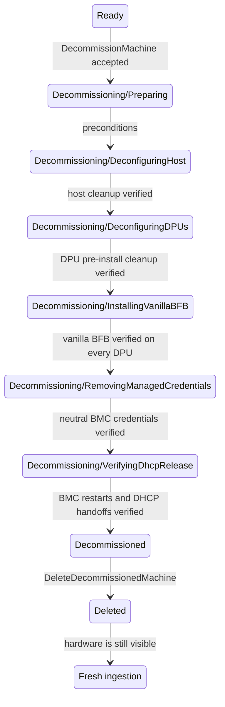

# Managed Host Decommissioning

## Status

Draft

## Summary

This document defines the managed-host specialization of the
[shared decommissioning lifecycle](/docs/design/decommissioning/decommissioning-workflow.md).
Decommissioning can be used for two purposes:

- physically removing the machine from the site; or
- returning the machine to a neutral state and then ingesting it again as a
  fresh machine.

Decommissioning starts only when the managed host is in `Ready`. NICo removes
the configurations and credentials it placed on the host and its DPUs, installs
a vanilla BFB on every managed DPU, and then ends in the terminal
`Decommissioned` state.

During decommissioning, NICo applies the shared BMC ignore
behavior to every host and DPU BMC MAC. Site Explorer is suppressed before
hardware cleanup. Before terminal completion, DHCP is suppressed and every BMC
must return to `DHCPDISCOVER`; only then are its old lease and address allocation
released.

The terminal record is retained until an operator explicitly requests final
deletion, which is different from force deletion. Final deletion removes the
machine and its associated state, but does not touch the `expected_machines`
entry. By default it also removes the BMC ignore entries so connected hardware
can be discovered and ingested again. An operator can instead retain the ignore
entries to defer rediscovery. Hardware that has been physically removed stays
absent. The site manager can remove the machine from `expected_machines` after
the process is complete.

## Terminology and invariants

In this document, **managed host** means the host machine plus every DPU linked
to it. The host workflow inherits all
[common invariants](/docs/design/decommissioning/decommissioning-workflow.md#common-invariants).
Therefore,
the host and its DPUs are one decommissioning unit: no member can participate
in allocation, reprovisioning, update, repair, or rack maintenance while the
workflow is active, and the unit cannot enter `Decommissioned` until cleanup
has succeeded for every member.

## Proposed state model

Add two states to `ManagedHostState`:

```rust
Decommissioning {
    decommissioning_state: DecommissioningState,
},
Decommissioned,
```

Multi-DPU steps contain a map keyed by DPU machine ID so one completed DPU is not repeated after another DPU fails. Each substate also persists retry count, last redacted error, and the time of the last attempt in the normal controller outcome fields.

```rust
enum DecommissioningState {
    Preparing,
    DeconfiguringHost,
    DeconfiguringDPUs {
        dpu_states: HashMap<MachineId, DpuDecommissionState>,
    },
    InstallingVanillaBFB {
        dpu_states: HashMap<MachineId, VanillaBFBInstallState>,
    },
    RemovingManagedCredentials,
    VerifyingDhcpRelease,
}
```

The externally reported state strings are exactly:

- `Decommissioning/Preparing`
- `Decommissioning/DeconfiguringHost`
- `Decommissioning/DeconfiguringDPUs`
- `Decommissioning/InstallingVanillaBFB`
- `Decommissioning/RemovingManagedCredentials`
- `Decommissioning/VerifyingDhcpRelease`
- `Decommissioned`

### State diagram



### Transition criteria

| From                         | To                           | Required criteria                                                                                                                                                                                                                                                         |
| ---------------------------- | ---------------------------- | ------------------------------------------------------------------------------------------------------------------------------------------------------------------------------------------------------------------------------------------------------------------------- |
| `Ready`                      | `Decommissioning/Preparing`  | The request is authorized; the managed host is exactly `Ready`; no instance references the host; no decommission operation exists; the host is not participating in rack maintenance or another exclusive operation.                                                      |
| `Preparing`                  | `DeconfiguringHost`          | The BMC MACs and `expected_machines` row exist; suppress site explorer in the ignore table; the correct vanilla artifact and installation method resolve for every DPU; all credentials needed for cleanup are readable; pending update/reprovision requests are cleared. |
| `DeconfiguringHost`          | `DeconfiguringDPUs`          | lockdown is disabled; UEFI password is cleared; BIOS reset; in-band BMC/IPMI policy restored; NIC/SuperNIC lockdown cleared; The host is rebooted when required by the vendor operation.                                                                                  |
| `DeconfiguringDPUs`          | `InstallingVanillaBFB`       | NIC/SuperNIC lockdown is removed, DPU UEFI settings are reset, one-time boot overrides are cleared, and any DPF or extension-service resources that would reconfigure the DPU are removed for every DPU. No DPU agent changes are needed after this point.                |
| `InstallingVanillaBFB`       | `RemovingManagedCredentials` | Every managed DPU has completed vanilla BFB installation; Redfish/DPF reports success. For a zero-DPU or NIC-mode host this is a no-op.                                                                                                                                   |
| `RemovingManagedCredentials` | `VerifyingDhcpRelease`       | Host and DPU BMC credentials are reset and the neutral credentials needed for the final BMC resets are verified; other per-device secrets and rotation markers are absent; DPU OS credentials disappeared with the vanilla BFB.                                             |
| `VerifyingDhcpRelease`       | `Decommissioned`             | Every host and DPU BMC restart is issued after DHCP suppression; every ignore row has a non-null `dhcp_discover_suppressed_at`; old leases and address allocations are released; any remaining per-device credential state is absent.                                       |
| `Decommissioned`             | deleted                      | `DeleteDecommissionedMachine` is authorized; all associated database and external control-plane resources are absent; machine rows are removed atomically; ignore rows are removed unless retention is requested; `expected_machines` remains.                            |

## State behavior

### `Decommissioning/Preparing`

The API changes `Ready` to `Preparing`. The step fails if the host BMC MAC, expected-machine entry, required credentials, or vanilla artifact cannot be resolved. This validation happens before NICo changes hardware.

All BMC MAC addresses are added to the
[shared ignore table](/docs/design/decommissioning/decommissioning-workflow.md#bmc-ignore-table),
and `suppress_site_explorer` is set to `true`.

### `Decommissioning/DeconfiguringHost`

Decommissioning the host is vendor-specific, so these steps are general:

- disable BIOS/BMC lockdown;
- clear the host UEFI administrator password;
- reset BIOS settings to factory default;
- restore in-band BMC/IPMI policy to its decommission value; and
- remove NICo-applied NIC/SuperNIC lockdown from host-visible devices.

Each operation is a converge-and-verify operation: read current state, write
only if needed, perform required resets or power cycles, and read back the
result. Unsupported required operations block decommissioning rather than
silently succeeding.

### `Decommissioning/DeconfiguringDPUs`

For every managed DPU, NICo performs all cleanup that requires the NICo DPU OS
or agent before replacing that OS:

- unlock NIC/SuperNIC devices using the current lockdown key;
- clear DPU UEFI passwords and NICo boot overrides; and
- delete DPF/other resources that would otherwise reprovision or reconfigure
  the device.

Because entry is from `Ready`, tenant configuration should already be absent.

### `Decommissioning/InstallingVanillaBFB`

The vanilla image is the existing unmodified pre-ingestion BFB artifact already
served by NICo.

Artifact selection is by DPU model and supported provisioning source. The
preferred installation order is:

1. DPF/DMS when the DPU is DPF-managed and that integration supports an
  explicit vanilla deployment;
2. Redfish `UpdateService`/`SimpleUpdate` when supported; or
3. the existing BMC-rshim copy path.

UEFI HTTP boot may be used only when it can install the vanilla artifact
without serving NICo customization. Installation completion is verified using
the Redfish/DPF task result and the resulting DPU system-image identity.

For multi-DPU hosts, the parent state advances only after every DPU reports the
expected vanilla identity.

### `Decommissioning/RemovingManagedCredentials`

Credential removal is deliberately late. Until this state, NICo retains the
credentials needed to retry hardware operations.

#### Host

- The host BMC credentials are factory reset and verified. NICo retains access
  to the verified neutral credential until it issues the final BMC reset.

#### DPU

- The vanilla install removes DPU OS SSH keys, HBN credentials, client
  certificates, NICo trust roots, and agent enrollment material from the DPU
  filesystem.
- The DPU BMC credentials are factory reset and verified. NICo retains access
  to each verified neutral credential until it issues the final BMC reset.

#### NICo control plane

NICo deletes machine-specific credential material that is no longer needed,
including:

- `BmcRoot` and `BmcForgeAdmin` secrets for every known BMC MAC;
- `DpuSsh` and `DpuHbn` secrets for every DPU machine ID;
- BMC, host-UEFI, and DPU-UEFI credential-rotation convergence rows; and
- outstanding BMC sessions and machine-scoped enrollment tokens.

Any per-BMC credential state required to use the verified neutral credential is
retained through the final reset and removed before `Decommissioned`.

Site-wide credentials and lockdown input key material are not deleted.

### `Decommissioning/VerifyingDhcpRelease`

This state performs the control-plane cutover:

1. Atomically set `suppress_dhcp` to true and clear
   `dhcp_discover_suppressed_at` for every host and DPU BMC entering
   suppression.
2. Invalidate the DHCP record cache.
3. Use the verified neutral credentials to restart every host and DPU BMC whose
   suppressed discovery is not already recorded.
4. Return `DHCPNAK` if a restarted BMC enters INIT-REBOOT and requests its old
   address, forcing its DHCP client back to INIT. Suppress the resulting
   `DHCPDISCOVER`, return no offer, and set
   `dhcp_discover_suppressed_at`.
5. Wait for `dhcp_discover_suppressed_at` for every host and DPU BMC.
6. Revoke the old leases, release their address allocations, and remove any
   remaining per-BMC credential and rotation state.
7. Transition to `Decommissioned`.

The state controller checks the complete BMC MAC set resolved during
`Preparing`. One null `dhcp_discover_suppressed_at` keeps the managed host in
`VerifyingDhcpRelease` and retains the corresponding address allocation and reset
credential. Idempotent retries preserve timestamps already set after
suppression began and do not reset a BMC whose handoff is complete.

### `Decommissioned`

NICo retains enough inventory and the completion summary for an operator to verify what was successfully decommissioned. The machine is excluded from capacity and health remediation. Rack health may report it as administratively absent, but the rack controller must not attempt to return it to `Ready`.

The only normal mutation accepted in this state is final deletion. The shared
workflow defines the ignore-table retention and reingestion behavior.

## APIs and authorization

### Start decommissioning

```protobuf
rpc DecommissionMachine(DecommissionMachineRequest)
    returns (DecommissionMachineResponse);

message DecommissionMachineRequest {
  MachineId machine_id = 1;
  string message = 2;
}
```

The response returns the canonical host machine ID.

### Resume/retry

```protobuf
rpc ResumeMachineDecommissioning(ResumeMachineDecommissioningRequest)
    returns (DecommissionMachineResponse);
```

This API clears an exhausted retry delay and asks the controller to run the
current substate again; it does not skip a failed criterion or choose a later
state by default.

The operator may force-skip a failing step only when the step is explicitly
declared optional for handoff. Required cleanup criteria cannot be skipped
while reporting the host as successfully decommissioned.

### Final deletion

```protobuf
rpc DeleteDecommissionedMachine(DeleteDecommissionedMachineRequest)
    returns (DeleteDecommissionedMachineResponse);

message DeleteDecommissionedMachineRequest {
  MachineId machine_id = 1;
  bool retain_ignore_entries = 2;
}

message DeleteDecommissionedMachineResponse {
  repeated string retained_bmc_mac_addresses = 1;
}
```

The request requires the canonical host ID and is accepted only from exactly
`Decommissioned`. It deletes the host, associated DPUs, interfaces, explored
endpoints, observations, measurements, health records, DNS/DHCP state,
allocation state, and DPF/extension resources.

The `expected_machines` row is deliberately preserved.

By default, the final transaction removes the machine rows and corresponding
`ignored_bmc_macs` rows. With `retain_ignore_entries` set, it removes the
machine rows but marks and retains every host and DPU BMC ignore row; the
response reports those MAC addresses. The shared release API removes them
later. A reachable BMC becomes eligible for normal discovery and ingestion only
after its ignore row is removed. If the machine is absent, no managed-host
record is recreated.

## Failure and retry behavior

The host follows the
[shared failure and retry behavior](/docs/design/decommissioning/decommissioning-workflow.md#failure-and-retry-behavior).
In addition:

- "already unlocked," "password absent," "account absent," and "resource not
found" are successful results when verified;
- asynchronous Redfish and DPF task IDs are persisted before polling;
- DPU credential replacement verifies the replacement credential before
  deleting the previous secret; and
- DPU secret deletion treats an absent key as success.

## Verification plan

In addition to the
[shared verification requirements](/docs/design/decommissioning/decommissioning-workflow.md#shared-verification-requirements),
unit and integration tests should cover:

- a missing vanilla artifact or unsupported installation method fails before
  hardware mutation;
- zero-, one-, and multi-DPU transitions, including one DPU retrying after a
  sibling completes;
- vanilla BFB completion is verified without a DPU-agent heartbeat;
- the terminal transition requires `dhcp_discover_suppressed_at` for every host
  and DPU BMC;
- a retry preserves previously recorded suppressed discoveries;
- every host and DPU BMC is restarted after DHCP suppression using a verified
  neutral credential;
- old BMC DHCP lease requests receive `DHCPNAK`; and
- old BMC address allocations are not released before all required suppressed
  discoveries are recorded;
- final deletion removes all host and DPU BMC ignore rows by default; and
- final deletion with `retain_ignore_entries` preserves all of them until the
  shared release API is called.

Hardware qualification must exercise each supported host vendor, BlueField
generation, BFB installation method, multi-DPU topology, and required power
cycle.
