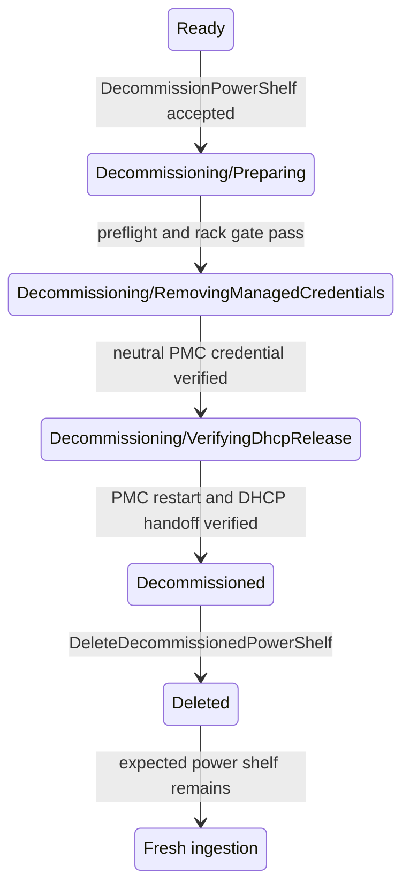

# Managed Power Shelf Decommissioning

## Status

Draft

## Summary

This document defines the managed-power-shelf specialization of the
[shared decommissioning lifecycle](/docs/design/decommissioning/decommissioning-workflow.md).
A managed
power shelf is returned to a neutral state by resetting its PMC management
credential and removing NICo's stored per-shelf credential state. No firmware,
configuration, or power-state change is required by this design.

Decommissioning starts only from `Ready` and only when no managed host on the
power shelf's rack is in use. It ends in the retained terminal
`Decommissioned` state. Final deletion preserves the
`expected_power_shelves` record so a connected shelf can be discovered and
ingested again.

## Invariants

The power-shelf workflow inherits all
[common invariants](/docs/design/decommissioning/decommissioning-workflow.md#common-invariants).
In
particular:

1. The PMC credential is reset and verified before NICo removes its stored
   credential.
2. The power shelf cannot enter `Decommissioned` while the credential reset is
   unverified.
3. Decommissioning does not change shelf power state or firmware.
4. `expected_power_shelves` is preserved by decommissioning and final deletion.

## Proposed state model

Add two states to `PowerShelfControllerState`:

```rust
Decommissioning {
    decommissioning_state: PowerShelfDecommissioningState,
},
Decommissioned,
```

```rust
enum PowerShelfDecommissioningState {
    Preparing,
    RemovingManagedCredentials,
    VerifyingDhcpRelease,
}
```

Each substate persists its retry count, last redacted error, last-attempt time,
and any asynchronous operation identifier in the normal controller outcome
fields.

The externally reported state strings are:

- `Decommissioning/Preparing`
- `Decommissioning/RemovingManagedCredentials`
- `Decommissioning/VerifyingDhcpRelease`
- `Decommissioned`

### State diagram



### Transition criteria

| From | To | Required criteria |
| --- | --- | --- |
| `Ready` | `Decommissioning/Preparing` | The request is authorized; the power shelf is exactly `Ready`; its rack is known; no managed host on the rack is in use; and no maintenance, firmware, rack, or other exclusive operation is active. |
| `Preparing` | `RemovingManagedCredentials` | The PMC MAC and `expected_power_shelves` record exist; Site Explorer is suppressed for the PMC; and the current and neutral PMC credentials are available. |
| `RemovingManagedCredentials` | `VerifyingDhcpRelease` | The PMC credential reset is verified; the neutral credential needed for the final PMC reset remains available; other NICo-held PMC credential material, sessions, and rotation markers are absent. |
| `VerifyingDhcpRelease` | `Decommissioned` | The PMC restart is issued after DHCP suppression; `dhcp_discover_suppressed_at` is non-null; the old lease and address allocation are released; any remaining per-shelf credential state is absent. |
| `Decommissioned` | deleted | `DeleteDecommissionedPowerShelf` is authorized; associated power-shelf state and the PMC ignore row are removed; `expected_power_shelves` remains. |

## State behavior

### `Decommissioning/Preparing`

The start API changes `Ready` to `Preparing`. The state first applies the
[rack unused-host gate](/docs/design/decommissioning/decommissioning-workflow.md#rack-dependency-gate-and-ordering).
It then resolves the expected-power-shelf record, PMC identity, current PMC
credential, and defined neutral credential before changing hardware.

After preflight succeeds, NICo adds the PMC MAC to `ignored_bmc_macs` and sets
`suppress_site_explorer` to `true`. Pending maintenance, firmware, and other
power-shelf requests are cleared so another controller cannot act on the shelf
during decommissioning.

### `Decommissioning/RemovingManagedCredentials`

NICo resets the PMC password to its factory or other defined neutral value,
then reconnects with that value to verify the reset. NICo retains access to the
neutral credential for the final PMC reset, while removing per-shelf credential
material that is no longer needed, active sessions, and credential-rotation
markers.

The operation is converge-and-verify. A PMC already using the neutral password
is successful after authentication verifies that state. An unreachable PMC or
unsupported password-reset operation blocks decommissioning rather than being
treated as success.

This workflow does not power the shelf off, reset its configuration, or change
its firmware. The management-controller reset in `VerifyingDhcpRelease`
restarts only the PMC so its DHCP client begins a new exchange.

### `Decommissioning/VerifyingDhcpRelease`

The power shelf follows the
[shared DHCP-release verification](/docs/design/decommissioning/decommissioning-workflow.md#verifying-dhcp-release):
suppress PMC DHCP, invalidate the DHCP cache, and restart the PMC with the
verified neutral credential. If the PMC enters INIT-REBOOT, a `DHCPREQUEST` for
the old address receives `DHCPNAK`, forcing the client back to INIT; the
resulting `DHCPDISCOVER` receives no offer and sets
`dhcp_discover_suppressed_at`. Only then are the old lease and address allocation
released, any remaining per-shelf credential state removed, and the shelf
transitioned to `Decommissioned`. A null timestamp leaves the shelf in
`VerifyingDhcpRelease` with its reset credential and allocation retained.

### `Decommissioned`

NICo retains the power-shelf inventory and completion summary for operator
verification. The shelf is excluded from rack health remediation, maintenance,
firmware, and power operations. The only normal mutation accepted in this state
is final deletion.

## APIs and authorization

### Start decommissioning

```protobuf
rpc DecommissionPowerShelf(DecommissionPowerShelfRequest)
    returns (DecommissionPowerShelfResponse);

message DecommissionPowerShelfRequest {
  PowerShelfId power_shelf_id = 1;
  string message = 2;
}
```

The response returns the canonical power-shelf ID.

### Resume/retry

```protobuf
rpc ResumePowerShelfDecommissioning(
    ResumePowerShelfDecommissioningRequest
) returns (DecommissionPowerShelfResponse);
```

The API reruns the current persisted substate. It does not skip the credential
reset or advance past an unverified result.

### Final deletion

```protobuf
rpc DeleteDecommissionedPowerShelf(
    DeleteDecommissionedPowerShelfRequest
) returns (DeleteDecommissionedPowerShelfResponse);
```

The request is accepted only from exactly `Decommissioned`. It removes the
power shelf, interfaces, observations, health records, DNS/DHCP state, stored
operation state, and PMC ignore row. The `expected_power_shelves` record is
deliberately preserved.

The existing `DeletePowerShelf` and `AdminForceDeletePowerShelf` operations do
not perform or prove this cleanup and are not substitutes for decommissioning.

## Verification plan

In addition to the
[shared verification requirements](/docs/design/decommissioning/decommissioning-workflow.md#shared-verification-requirements),
unit, integration, and hardware qualification must cover:

- rejection when the rack is unknown or any managed host on it is in use;
- rejection while power-shelf maintenance, firmware, rack, or other exclusive
  work is active;
- PMC password reset and verification, including an already-neutral PMC;
- retry after the password write succeeds but verification or stored cleanup
  fails;
- retention of the PMC credential through the final management-controller
  reset and DHCP handoff;
- no power-state, configuration, or firmware change during decommissioning;
- restart of the PMC after DHCP suppression using the verified neutral credential;
- a PMC request for the old lease receiving `DHCPNAK` rather than being dropped;
- a suppressed PMC `DHCPDISCOVER` is recorded before the old address allocation
  is released;
- terminal exclusion from rack and power-shelf controller work; and
- final deletion preserving `expected_power_shelves` and permitting
  reingestion of still-connected hardware.
