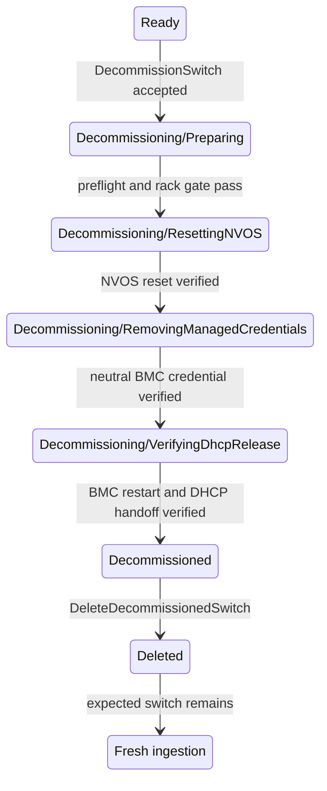

# Managed Switch Decommissioning

## Status

Draft

## Summary

This document defines the managed-switch specialization of the
[shared decommissioning lifecycle](/docs/design/decommissioning/decommissioning-workflow.md).
A managed
switch is returned to a neutral state by resetting its NVOS configuration and
password, resetting its BMC credentials, and removing NICo's stored per-switch
credential state.

Decommissioning starts only from `Ready` and only when no managed host on the
switch's rack is in use. It ends in the retained terminal `Decommissioned`
state. Final deletion preserves the `expected_switches` record so a connected
switch can be discovered and ingested again.

## Invariants

The switch workflow inherits all
[common invariants](/docs/design/decommissioning/decommissioning-workflow.md#common-invariants).
In
particular:

1. NVOS is reset and verified before NICo removes the NVOS credential it needs
   to perform that reset.
2. The BMC credential is reset and verified before NICo removes its stored BMC
   credential.
3. The switch cannot enter `Decommissioned` while any required reset is
   unverified.
4. `expected_switches` is preserved by decommissioning and final deletion.

## Proposed state model

Add two states to `SwitchControllerState`:

```rust
Decommissioning {
    decommissioning_state: SwitchDecommissioningState,
},
Decommissioned,
```

```rust
enum SwitchDecommissioningState {
    Preparing,
    ResettingNVOS,
    RemovingManagedCredentials,
    VerifyingDhcpRelease,
}
```

Each substate persists its retry count, last redacted error, last-attempt time,
and any asynchronous operation identifier in the normal controller outcome
fields.

The externally reported state strings are:

- `Decommissioning/Preparing`
- `Decommissioning/ResettingNVOS`
- `Decommissioning/RemovingManagedCredentials`
- `Decommissioning/VerifyingDhcpRelease`
- `Decommissioned`

### State diagram



### Transition criteria

| From | To | Required criteria |
| --- | --- | --- |
| `Ready` | `Decommissioning/Preparing` | The request is authorized; the switch is exactly `Ready`; its rack is known; no managed host on the rack is in use; and no maintenance, reprovisioning, rack firmware, or other exclusive operation is active. |
| `Preparing` | `ResettingNVOS` | The BMC MAC and `expected_switches` record exist; Site Explorer is suppressed for the BMC; BMC and NVOS credentials are readable; and pending switch operations are cleared. |
| `ResettingNVOS` | `RemovingManagedCredentials` | NICo-managed NVOS configuration is removed, the NVOS password is reset to its neutral value, and both outcomes are verified. |
| `RemovingManagedCredentials` | `VerifyingDhcpRelease` | The BMC credential reset is verified; the neutral credential needed for the final BMC reset remains available; other NICo-held BMC and NVOS credential material and rotation markers are absent. |
| `VerifyingDhcpRelease` | `Decommissioned` | The BMC restart is issued after DHCP suppression; `dhcp_discover_suppressed_at` is non-null; the old lease and address allocation are released; any remaining per-switch credential state is absent. |
| `Decommissioned` | deleted | `DeleteDecommissionedSwitch` is authorized; associated switch state and the BMC ignore row are removed; `expected_switches` remains. |

## State behavior

### `Decommissioning/Preparing`

The start API changes `Ready` to `Preparing`. The state first applies the
[rack unused-host gate](/docs/design/decommissioning/decommissioning-workflow.md#rack-dependency-gate-and-ordering).
It then resolves the expected-switch record, BMC identity, BMC credential, and
NVOS credential before changing hardware.

After preflight succeeds, NICo adds the BMC MAC to `ignored_bmc_macs` and sets
`suppress_site_explorer` to `true`. Pending maintenance, reprovisioning,
firmware, and configuration requests are cleared so another controller cannot
reconfigure the switch during decommissioning.

### `Decommissioning/ResettingNVOS`

NICo uses the current NVOS credential to:

1. remove NICo-applied NVOS configuration and restore the supported neutral
   configuration;
2. reset the NVOS password to its neutral value; and
3. reconnect with the reset credential and verify both the configuration and
   password reset.

The operation is converge-and-verify. A switch already in the neutral state is
successful after verification. NICo retains the old and reset credentials until
the reset credential has been used successfully.

### `Decommissioning/RemovingManagedCredentials`

NICo resets the switch BMC credential to its factory or other defined neutral
value and verifies the reset credential. It retains access to that neutral
credential for the final BMC reset, while removing NICo-held credential material
that is no longer needed, including NVOS credentials, certificate or enrollment
material, sessions, and credential-rotation markers.

The BMC reset happens after the NVOS work so a retry can still use the BMC when
needed to recover or inspect the switch.

### `Decommissioning/VerifyingDhcpRelease`

The switch follows the
[shared DHCP-release verification](/docs/design/decommissioning/decommissioning-workflow.md#verifying-dhcp-release):
suppress BMC DHCP, invalidate the DHCP cache, and restart the BMC with the
verified neutral credential. If the BMC enters INIT-REBOOT, a `DHCPREQUEST` for
the old address receives `DHCPNAK`, forcing the client back to INIT; the
resulting `DHCPDISCOVER` receives no offer and sets
`dhcp_discover_suppressed_at`. Only then are the old lease and address allocation
released, any remaining per-switch credential state removed, and the switch
transitioned to `Decommissioned`. A null timestamp leaves the switch in
`VerifyingDhcpRelease` with its reset credential and allocation retained.

### `Decommissioned`

NICo retains the switch inventory and completion summary for operator
verification. The switch is excluded from rack capacity, health remediation,
maintenance, reprovisioning, and firmware work. The only normal mutation
accepted in this state is final deletion.

## APIs and authorization

### Start decommissioning

```protobuf
rpc DecommissionSwitch(DecommissionSwitchRequest)
    returns (DecommissionSwitchResponse);

message DecommissionSwitchRequest {
  SwitchId switch_id = 1;
  string message = 2;
}
```

The response returns the canonical switch ID.

### Resume/retry

```protobuf
rpc ResumeSwitchDecommissioning(ResumeSwitchDecommissioningRequest)
    returns (DecommissionSwitchResponse);
```

The API reruns the current persisted substate. It does not skip a required reset
or advance past an unverified result.

### Final deletion

```protobuf
rpc DeleteDecommissionedSwitch(DeleteDecommissionedSwitchRequest)
    returns (DeleteDecommissionedSwitchResponse);
```

The request is accepted only from exactly `Decommissioned`. It removes the
switch, interfaces, observations, health records, DNS/DHCP state, stored
operation state, and BMC ignore row. The `expected_switches` record is
deliberately preserved.

The existing `DeleteSwitch` and `AdminForceDeleteSwitch` operations do not
perform or prove this cleanup and are not substitutes for decommissioning.

## Verification plan

In addition to the
[shared verification requirements](/docs/design/decommissioning/decommissioning-workflow.md#shared-verification-requirements),
unit, integration, and hardware qualification must cover:

- rejection when the rack is unknown or any managed host on it is in use;
- rejection while switch maintenance, reprovisioning, rack firmware, or
  configuration work is active;
- NVOS configuration and password reset, including an already-neutral switch;
- retry after the NVOS reset succeeds but its verification or BMC reset fails;
- retention of NVOS and BMC credentials until their last dependent operations;
- verification of the replacement password before stored credential removal;
- restart of the BMC after DHCP suppression using the verified neutral credential;
- a BMC request for the old lease receiving `DHCPNAK;
- a suppressed BMC `DHCPDISCOVER` is recorded before the old address allocation
  is released;
- terminal exclusion from rack and switch controller work; and
- final deletion preserving `expected_switches` and permitting reingestion of
  still-connected hardware.
