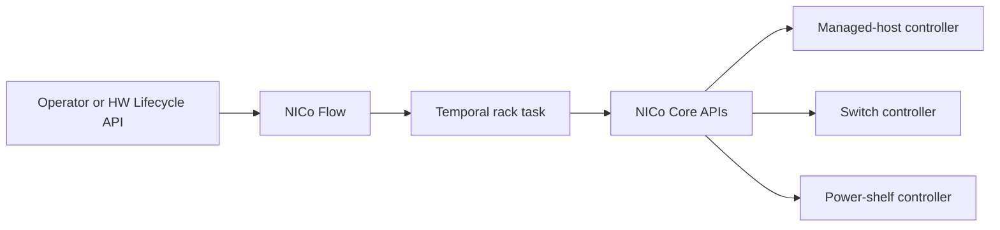
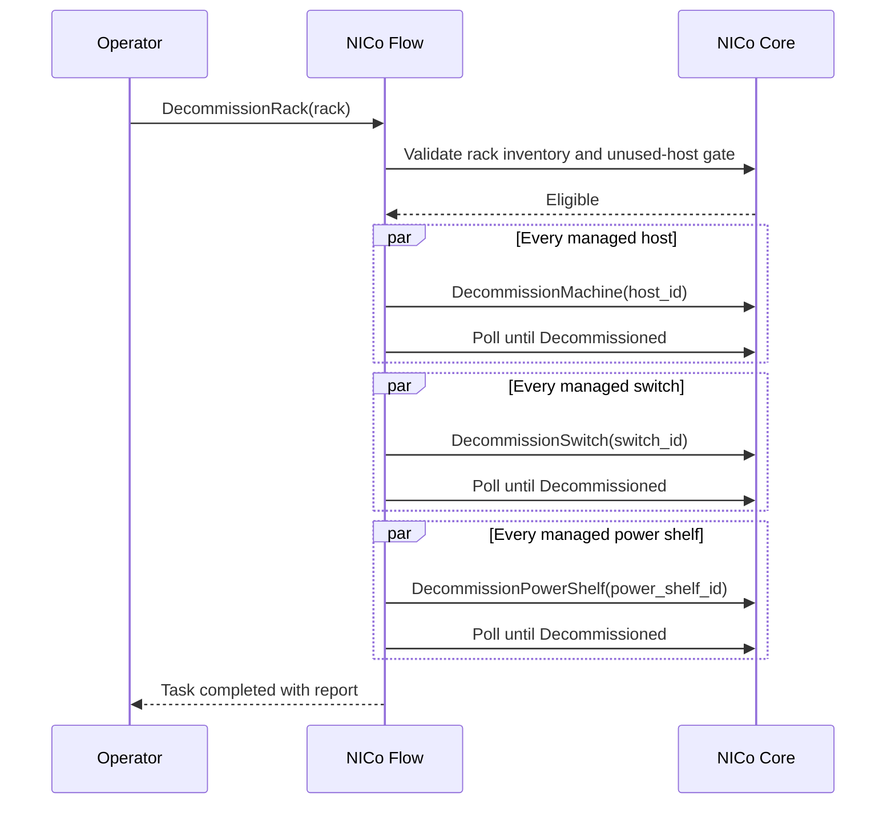

# Rack-Scale Decommissioning with NICo Flow

## Status

Draft

## Summary

This document defines how an operator starts decommissioning for an entire rack
through NICo Flow. Flow creates one durable task for the rack and drives the
resource-specific NICo Core decommissioning APIs in dependency order:

1. managed hosts on compute trays;
2. managed switches; and
3. managed power shelves.

Every component in one stage must reach `Decommissioned` before Flow starts the
next stage. Flow does not perform hardware cleanup itself. NICo Core owns each
resource state machine and the cleanup defined by the
[managed host](/docs/design/decommissioning/managed-host-decommissioning.md),
[managed switch](/docs/design/decommissioning/managed-switch-decommissioning.md),
and
[managed power shelf](/docs/design/decommissioning/managed-power-shelf-decommissioning.md)
designs.

Final deletion is not part of the rack task. The task leaves the rack and its
components in their retained terminal states for operator verification.

## Architecture

The operation follows the existing rack-administration service path:




NICo Flow owns rack target resolution, task conflicts, stage ordering, durable
execution, retries, cancellation, and progress reporting. NICo Core remains the
source of truth for hardware state, eligibility, credentials, and terminal
completion.

## Preconditions

Rack-scale decommissioning requires:

- NICo Flow and its Temporal namespace to be deployed and healthy;
- current Flow inventory for the target rack, including compute, NVSwitch, and
power-shelf component associations;
- a NICo Core resource ID for every Flow component selected in the rack;
- no active conflicting Flow task for the rack; and
- all resource-specific credentials, expected-resource records, artifacts, and
reset capabilities required by the three component workflows.

The unused-host gate is mandatory. Before stage 1 starts, Flow asks NICo Core to
verify that no managed host on the rack:

- is referenced by an instance or active allocation;
- is being provisioned, reprovisioned, updated, or repaired; or
- is participating in maintenance or another exclusive operation.

The gate has no override. If the rack association is missing, inventory is
incomplete, or NICo cannot prove that every managed host is unused, the task
fails before starting any component decommissioning operation.

Once accepted, the rack task is exclusive with allocation and other rack
lifecycle operations. New allocation, maintenance, power, firmware, bring-up,
and decommissioning work for the rack must be rejected or queued until the task
finishes or is cancelled.

## Flow API

Add a rack operation to the Flow gRPC service:

```protobuf
rpc DecommissionRack(DecommissionRackRequest)
    returns (SubmitTaskResponse);

message DecommissionRackRequest {
  OperationTargetSpec target_spec = 1;
  string description = 2;
  optional QueueOptions queue_options = 3;
  optional UUID rule_id = 4;
}
```

`target_spec` must contain rack targets. Component targets and rack targets with
a component-type filter are rejected because this operation decommissions the
entire rack. As with other Flow rack operations, a request may name more than
one rack, but Flow creates and returns one independent task ID per rack.

The operation adds:

- task type `decommission`;
- operation code `decommission`;
- Temporal workflow name `Decommission`; and
- an exclusive rack-task conflict entry against allocation, power, firmware,
bring-up, maintenance, and another decommissioning task.

There is intentionally no readiness or unused-host override.

### Start an operation

In production, the operator starts the operation through the authenticated HW
Lifecycle API. That service resolves the site and forwards the rack target to
NICo Flow through its generated gRPC client. 

The caller supplies an unfiltered rack target by rack ID or rack name and an
optional description, queue policy, or rule override. Flow returns the rack
task ID in `SubmitTaskResponse`. The caller retains that ID to monitor or cancel
the operation through the existing task APIs.

### Monitor the operation

Use the existing `GetTasksByIDs` API with the returned task ID. The task report
includes:

- current stage: `compute`, `nvswitch`, or `power_shelf`;
- each targeted Core resource ID and last observed controller state;
- whether its start request was accepted, already active, or already complete;
- retry count and last redacted error; and
- completed and total counts for each component type.

The task reaches `TASK_STATUS_COMPLETED` only after every selected resource is
`Decommissioned`. A terminal task report is retained for audit and operator
verification.

## Target resolution and frozen plan

When Flow accepts the request, it resolves the rack to a concrete component set
and persists that set in the task before dispatching stage 1. The frozen plan
contains:

- every compute component and its canonical managed-host ID;
- every NVSwitch component and its canonical switch ID; and
- every power-shelf component and its canonical power-shelf ID.

Flow compares this set with NICo Core's current rack membership. Missing,
duplicated, unassociated, or cross-rack components fail preflight. Inventory
changes after the plan is frozen do not silently expand or shrink the running
task; they stop the task for operator review.

For each planned resource, these states are valid when a stage begins:

- `Ready`: call the resource's start-decommissioning API;
- `Decommissioning/*`: do not start a second operation; observe and wait for the
existing operation;
- `Decommissioned`: count it as already complete; or
- any other state: fail the stage without advancing to the next component type.

This makes a resubmitted rack task converge after a previous partial run while
preserving the one-operation-per-resource invariant.

## Default decommissioning rule

The default Flow operation rule has three sequential stages. Components within
one stage may run in parallel, subject to `max_parallel`; stages never overlap.

```yaml
name: Default Rack Decommissioning
description: Decommission compute, then NVSwitches, then power shelves
operation_type: decommission
operation: decommission
steps:
  - component_type: compute
    stage: 1
    max_parallel: 0
    main_operation:
      name: DecommissionControl
    post_operation:
      - name: WaitDecommissioned

  - component_type: nvswitch
    stage: 2
    max_parallel: 0
    main_operation:
      name: DecommissionControl
    post_operation:
      - name: WaitDecommissioned

  - component_type: powershelf
    stage: 3
    max_parallel: 0
    main_operation:
      name: DecommissionControl
    post_operation:
      - name: WaitDecommissioned
```

`DecommissionControl` dispatches by component type:


| Flow component type | NICo Core operation                                         | Completion state                                       |
| ------------------- | ----------------------------------------------------------- | ------------------------------------------------------ |
| `compute`           | `DecommissionMachine` using the canonical managed-host ID   | Managed host and every linked DPU are `Decommissioned` |
| `nvswitch`          | `DecommissionSwitch` using the canonical switch ID          | Switch is `Decommissioned`                             |
| `powershelf`        | `DecommissionPowerShelf` using the canonical power-shelf ID | Power shelf is `Decommissioned`                        |


`WaitDecommissioned` polls NICo Core rather than relying on a fixed delay. It
persists progress in the task report while Core persists the detailed resource
substate.

## Execution sequence




The switch stage is never dispatched until every managed host has completed.
The power-shelf stage is never dispatched until every managed switch has
completed.

## Failure, retry, and cancellation

A failure stays in its current stage:

- a compute failure prevents all switch and power-shelf starts;
- a switch failure prevents all power-shelf starts; and
- a power-shelf failure leaves the task incomplete but does not undo completed
hosts or switches.

Temporal retries transient activities according to the selected rule. A retry
re-reads Core state before acting: `Decommissioned` is success,
`Decommissioning/*` is observed without submitting another start request, and
`Ready` receives the idempotent start request.

After retry exhaustion, an operator corrects the underlying resource problem
and submits `DecommissionRack` again. The new task freezes the rack membership
again and converges from persisted Core state; it does not repeat cleanup on
resources already in `Decommissioned`.

Cancelling the Flow task prevents new stages and stops Flow polling. It does not
roll back hardware changes or force a Core resource out of its persisted
decommissioning state. A Core controller may therefore finish work that Flow
started before cancellation. The operator must inspect Core state before
resubmitting or taking manual action.

## Completion and final deletion

Successful task completion means every planned managed host, switch, and power
shelf reached `Decommissioned` and remains protected from rediscovery by its
management-controller ignore record.

The operator then chooses one of two follow-up paths:

- **Physical removal:** remove the rack's expected-resource records when the
site should no longer ingest that hardware, then use the resource-specific
final-deletion APIs.
- **Fresh ingestion:** leave the expected-resource records in place and use the
resource-specific final-deletion APIs. Removing the ignore records makes the
connected hardware eligible for discovery and ingestion again.

Deleting or purging the Flow inventory rack is a separate inventory operation.
`DeleteRack` and `PurgeRack` do not substitute for Core decommissioning or prove
that hardware cleanup succeeded.

## Verification plan

Unit and integration coverage must verify:

- only unfiltered rack targets are accepted;
- one Flow task and one frozen component plan are created per rack;
- missing or cross-rack inventory fails before any start request;
- an allocated or otherwise in-use host fails the rack gate before stage 1;
- compute start requests fan out before any switch request;
- all compute resources must reach `Decommissioned` before stage 2 starts;
- all switches must reach `Decommissioned` before stage 3 starts;
- retries observe active or completed Core states without duplicating starts;
- a failed stage never dispatches a later component type;
- cancellation prevents later stages without claiming rollback;
- the task report exposes per-resource state and redacted failures;
- successful completion leaves expected-resource and ignore records intact;
and
- Flow rack deletion is not treated as successful hardware decommissioning.

End-to-end qualification must cover empty component groups, multiple resources
per type, a partial failure in each stage, Flow and Temporal restarts, Core
restart during polling, task cancellation, resubmission after failure, and
multi-rack requests producing independent per-rack tasks.