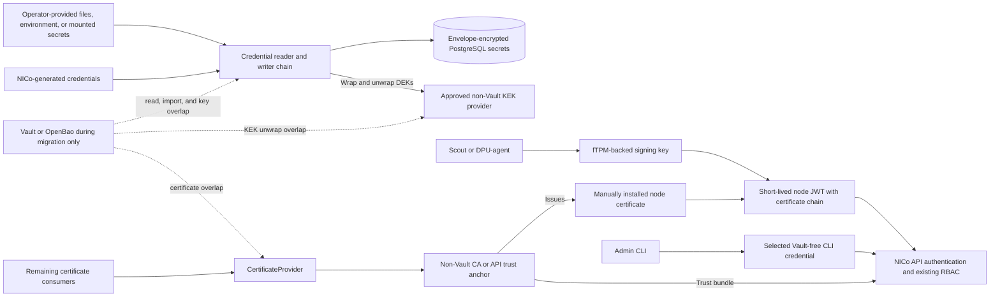

# Vault-Free NICo Runtime

## High-Level Design

## Revision History

| Version | Date | Modified By | Description |
| :---: | :---: | :--- | :--- |
| 0.1 | 2026-08-27 | Bill Minckler | Initial high-level design across the three Vault-elimination epics |
| 0.2 | 2026-08-28 | Bill Minckler | Reconcile the design with the current epic subtasks and implementation |
| 0.3 | 2026-08-28 | Bill Minckler | Separate the completed target design from implementation status and cross-epic intermediate states |

## 1. Purpose and Scope

This document defines the target architecture for running NICo without
Vault/OpenBao. It covers the three related epics:

- [Phase 1: credential storage](https://github.com/NVIDIA/infra-controller/issues/195)
- [Phase 2: node API authentication](https://github.com/NVIDIA/infra-controller/issues/5199)
- [Phase 3: remaining key and certificate services](https://github.com/NVIDIA/infra-controller/issues/5200)

The design is intentionally high level. The following subsystem designs remain
authoritative for their implementation:

- [PostgreSQL-backed secret storage](postgres-secrets/README.md)
- [Secrets-storage operator contract](../configuration/secrets-storage.md)
- [Node-auth bearer JWTs](machine-identity/node-auth-jwt.md)
- [Machine-identity JWT-SVIDs and signing-key storage](machine-identity/spiffe-svid-sdd.md)
- [Certificate-provider separation implementation](https://github.com/NVIDIA/infra-controller/pull/2881)

The three phases are tracking boundaries, not a requirement to implement each
part serially. Work can proceed in parallel where the dependencies in
[Section 4](#4-migration-and-dependency-order) permit it.

### 1.1 Goals

- Make Vault/OpenBao optional during migration and absent from the supported
  steady-state runtime and recovery path.
- Preserve credential confidentiality, machine identity, and existing RBAC
  semantics.
- Migrate live sites incrementally, with explicit overlap and rollback paths.
- Keep storage, key custody, node authentication, and certificate issuance as
  separate provider boundaries.
- Fail clearly when a required non-Vault provider or node credential is
  unavailable.

### 1.2 Non-Goals

- Repeating the low-level designs linked above.
- Removing TLS or certificates from every NICo service. Phase 2 removes machine
  mTLS as the Scout and DPU-agent API credential; transport TLS and other
  certificate consumers remain. The admin CLI uses no Vault-issued credential,
  and the selected Vault-free authentication method may retain mTLS.
- Using the BlueField IRoT key as the node-JWT signing credential. The DPU OS
  cannot use that key to prove possession, so the target uses a signing key that
  is accessible to the node software and protected by a hardware-backed holder.
- Defining full measured-boot or runtime attestation for DPUs.

## 2. End-State Design Summary

| Phase | Completed state |
| :--- | :--- |
| 1 — credentials | NICo-managed credentials are envelope-encrypted in PostgreSQL; operator-provided credentials come from file, environment, or mounted-secret sources; no credential consumer constructs or depends directly on a Vault client |
| 2 — authentication | Scout and DPU-agent sign short-lived bearer JWTs with hardware-backed keys and certificates rooted outside Vault; the API preserves the existing machine principal and RBAC policy; the admin CLI uses no Vault-issued credential |
| 3 — keys and certificates | An approved non-Vault provider owns the PostgreSQL KEKs; machine-identity signing-key encryption uses the shared KMS-backed envelope; every required certificate is issued and validated through a non-Vault provider |

## 3. Target Architecture

The end state has four independent security boundaries:

1. PostgreSQL stores encrypted credential records; an approved non-Vault KEK
   provider owns the KEKs.
2. Nodes sign their own short-lived authentication tokens with hardware-backed
   keys. The API maps the verified certificate identity to the same machine
   principal used by the current RBAC policy.
3. Certificate consumers use a provider backed by a non-Vault CA. Node
   authentication no longer requires a Vault-issued mTLS certificate, but the
   node JWT design still requires a certificate corresponding to its signing
   key and chaining to a trust anchor that remains after Vault PKI is retired.
4. The admin CLI uses the selected Vault-free credential: either mTLS backed by
   an operator-managed non-Vault PKI or a replacement authentication method.

### 3.1 Phase 1: Credential Storage

Every credential consumer uses the credential-provider abstraction rather than
constructing or depending directly on a Vault client. NICo-managed credentials
are written to the envelope-encrypted PostgreSQL journal. Operator-provided
credentials are read from explicitly configured environment, file, or mounted
secret sources, including live reload where an integration requires rotation
without restarting NICo.

The reader chain makes source ownership and precedence explicit. A locally
authoritative integration never falls through to a persistent backend, while a
migration configuration may prefer local data and fall through to PostgreSQL.
All writes use the configured persistent writer, unless the integration is
locally authoritative and therefore rejects persistent mutations.

The [PostgreSQL secret-storage design](postgres-secrets/README.md) remains
authoritative for the credential chain, envelope encryption, Vault import, KEK
routing, re-wrap, and rollback behavior. [Secrets Storage](../configuration/secrets-storage.md)
defines the operator-facing persistent-store contract.

### 3.2 Phase 2: Node API Authentication

Scout and DPU-agent authenticate to the API with the bearer-JWT model defined by
[Node-auth bearer JWTs](machine-identity/node-auth-jwt.md). The token format,
short lifetime, API validation, machine-principal mapping, and RBAC behavior are
unchanged. Nodes re-mint tokens locally as expiration approaches; there is no
server-side token issuance or refresh RPC.

The completed credential model replaces the software-held mTLS signing key:

- DPU-agent signs locally with a key held by the BF3/BF4 fTPM. Any supported
  environment that cannot expose an fTPM signing key supplies a hardware-backed
  holder with the same possession and lifecycle properties.
- Hosts already use TPM EK verification to anchor discovery and attestation,
  but an EK is not the JWT signing-key design. The Scout signing-key holder is
  accessible to Scout and binds its public key to the verified host identity.
- A certificate corresponding to that key is installed manually and accompanies
  the JWT for API validation. The API continues to derive the machine identity
  from the verified certificate and maps it to the existing RBAC principal.
- The certificate must chain to an API-accepted trust anchor that does not
  depend on Vault PKI. Its issuance and installation authorize the
  binding between the fTPM public key and the intended machine identity; a valid
  chain alone is not sufficient to assert an arbitrary machine principal.
- Token lifetime, audience checks, TLS transport, and the dual-auth migration
  gate remain as designed in the completed JWT work.
- Machine mTLS is disabled only after every supported Scout and DPU-agent path
  can mint and locally re-mint tokens and replace, revoke, and recover the
  replacement signing credential and certificate.

The certificate is installed manually. The owner, timing, identity
authorization, renewal, replacement, revocation, and recovery procedure remain
open design questions; the target does not assume an automated enrollment flow.

The admin CLI authenticates without a Vault-issued credential. The final design
may retain admin mTLS with an operator-managed non-Vault PKI or define a
replacement authentication method; either choice preserves the existing admin
authorization boundary.

### 3.3 Phase 3: KEK Custody and Certificate Issuance

#### Production non-Vault KMS

An approved production non-Vault implementation owns KEKs behind the KMS
interface. Deployment-specific implementations may use a managed cloud KMS, an
on-premises HSM or KMIP service, or a hardened Integrated deployment whose key
is supplied by a CSI secrets-store or External-Secrets mount. The selected
provider must support workload-appropriate authentication, availability,
auditability, rotation, backup restore, and recovery without placing plaintext
KEKs directly in NICo configuration.

An Integrated provider loads local key material from an environment variable,
file, or inline value and holds it in the NICo process. Inline key material is
limited to development and test. A mounted-key Integrated deployment receives
the same production qualification for custody, availability, rotation, and
recovery as an external provider.

Migration reuses the existing multi-provider, routing, and re-wrap behavior:
new DEKs are wrapped by the non-Vault provider while the Transit provider remains
available to unwrap old records. Vault Transit can be removed only after all
records have been re-wrapped, recovery has been tested, no retained backup within
the restore window requires it, and the rollback window has ended.

#### Non-Vault certificate provider

Certificate vending is separate from credential storage, as defined by the
[certificate-provider separation implementation](https://github.com/NVIDIA/infra-controller/pull/2881).
The non-Vault provider implements that interface, preserves the SPIFFE ID from
which the machine principal is derived, and provides a CA rollover period in
which old and new trust roots are accepted. Before Vault PKI is disabled, the
migration inventories every certificate consumer; moving node API
authentication to JWT does not remove service, administrator, fabric, or other
certificate needs.

#### Encryption convergence

Machine-identity signing-key encryption uses the same KMS-backed envelope
primitive as credential storage. The machine-identity data model and behavior
remain defined by the [JWT-SVID design](machine-identity/spiffe-svid-sdd.md);
only encryption and KEK custody converge. Each subsystem retains its own storage
while using per-record DEKs wrapped by the approved non-Vault KEK provider.

## 4. Migration and Dependency Order

1. **Adopt the phase-1 provider chain.** Import existing secrets, make
   PostgreSQL authoritative, and retain Vault read fallback until every required
   credential has been verified. A site that still writes rack-maintenance
   access tokens to Vault must apply the manual Vault policy documented by
   [#3375](https://github.com/NVIDIA/infra-controller/issues/3375) until its
   writer moves to PostgreSQL.
2. **Enable the node JWT migration path.** Run bearer JWTs and machine mTLS in
   parallel and verify that both produce the same principals and authorization
   results.
3. **Introduce the fTPM-backed credential.** Resolve the manual certificate
   installation questions, deploy the credential to supported nodes, and verify
   token minting, local re-minting, certificate renewal, replacement, revocation,
   and recovery before disabling machine mTLS. This step cannot complete until
   the non-Vault node certificate trust-anchor decision from step 5 is made.
4. **Introduce the production non-Vault KMS.** Route new wraps to it, retain
   Transit for old records, re-wrap, and test recovery. Retain Transit through
   the defined rollback and backup-retention windows; rollback after re-wrap
   keeps both providers configured, makes Transit active, routes new wraps back
   to its KEK, restarts NICo, and runs a reverse re-wrap. Keep the non-Vault
   provider available for unwraps until that reverse sweep completes.
5. **Introduce the non-Vault certificate provider.** Run an explicit trust-root
   overlap, move each remaining consumer, and retire Vault PKI only after renewal
   and rollback have been exercised. Do not retire or rotate any root out of the
   API trust bundle while manually installed node certificates still depend on
   it; re-anchor those certificates first.
6. **Resolve CLI authentication and disable Vault.** Record whether the admin
   CLI retains mTLS with non-Vault PKI or moves to another credential. Remove
   Vault from active configuration and prove startup, steady-state operation,
   rotation, backup restore, and failure recovery with Vault unavailable.
7. **Converge machine-identity encryption.** After the production non-Vault KEK
   provider is available, move machine-identity signing-key encryption to the
   shared envelope primitive. This completes the shared KEK-custody model but
   does not have to precede the Vault runtime cutover when the existing
   encryption key is already sourced through the Vault-free credential chain.

Steps 3, 4, and 5 can be developed in parallel, but their migrations and trust
retirement must be coordinated as described above. Step 6 depends on all active
Vault credential, Transit, and PKI paths having replacements and on the CLI
scope decision. Step 7 depends on step 4 but can otherwise proceed independently.

## 5. Failure, Security, and Availability Boundaries

- Vault fallback is enabled only during an explicit migration stage. A
  steady-state Vault-free deployment does not silently reconnect to Vault.
- Loss of an fTPM key or its manually installed certificate prevents new node
  tokens. Machine mTLS is a rollout fallback, not the permanent recovery design;
  the certificate lifecycle defines recovery before the fallback is removed.
- The certificate enrollment authority must bind each approved public key and
  identity to the intended inventory record. The selected design must also
  provide individual credential disablement or revocation and a compromise
  recovery procedure before machine mTLS is removed.
- The old KMS provider remains available until no live record and no retained
  backup within the restore window references it, and until the rollback window
  ends. Re-wrap is resumable and does not change credential plaintext.
- Credential reads synchronously unwrap DEKs through the KEK provider, as
  described in the
  [PostgreSQL secret-storage design](postgres-secrets/README.md). An external
  KMS outage fails affected credential operations. The Integrated provider
  loads mounted key material during process initialization and retains it in
  memory, so an unavailable mount prevents restart or scale-out while an
  already-running instance continues until it terminates. Runtime availability,
  startup availability, rotation by controlled restart, and recovery are
  therefore part of provider qualification.
- Old CA roots remain trusted only for the bounded certificate rollover window.
  Removing a root is coordinated with certificate renewal and rollback testing.
- Credential plaintext, private keys, and bearer tokens are never logged.
  Production configurations do not use an Integrated inline `value` source,
  because configuration logging and the admin debug page expose that value;
  production KEKs come from mounted files, environment sources, or an external
  KMS.
- Provider credentials use workload identity or mounted secret sources where
  supported and are independently rotatable from the data they protect.
- Multi-replica NICo deployments use shared PostgreSQL state and highly
  available KMS and CA endpoints; no replica owns unique recovery material.

## 6. Completion Criteria

The overall effort is complete when a supported site can:

- start and run NICo with Vault/OpenBao unavailable;
- read, write, rotate, back up, and restore credentials using PostgreSQL and a
  qualified production non-Vault KEK provider;
- bootstrap and authenticate Scout and DPU-agent, locally re-mint their tokens,
  and rotate, revoke, or recover their signing credentials without a
  Vault-issued mTLS certificate;
- authenticate the admin CLI with the selected Vault-free credential while
  preserving its authorization boundary;
- issue and rotate every still-required certificate through a non-Vault
  provider;
- preserve machine identity and RBAC behavior through migration;
- roll forward from a Vault-backed deployment without credential loss or an
  authentication outage;
- demonstrate rollback at every provider-overlap stage before retiring the old
  credential, KEK, or CA trust path; and
- protect machine-identity signing keys with the shared envelope and the
  qualified non-Vault KEK provider.

## 7. Open Questions

1. Who manually installs the fTPM certificate, at what point in the hardware
   lifecycle, and what authorizes its machine identity?
2. How are that certificate and fTPM key renewed, replaced, revoked, and
   recovered without restoring machine mTLS as a permanent dependency?
3. Which supported hardware and boot environments expose the required fTPM
   signing capabilities to Scout and DPU-agent? For Scout, can a TPM-resident
   signing key be enrolled through the existing host TPM identity path, and what
   credential holder is used where that is unavailable?
4. Does phase 2 retain admin CLI mTLS with an operator-managed non-Vault PKI, or
   replace it with another authentication method?
5. Which production KMS, HSM, KMIP, or hardened Integrated deployment is
   qualified first, and what is the minimum supported recovery configuration?
6. Which non-Vault CA backs the certificate-provider interface, and what is the
   complete inventory of consumers and trust bundles that must migrate?

## 8. Implementation Status

This section is a status snapshot dated 2026-08-28. Sections 1 through 7 define
the end-state design and remain independent of implementation order. The tables
below record the intentional intermediate states created when one epic lands
before a dependency owned by another epic.

### 8.1 Intermediate States Between Epics

| Boundary | Intermediate state | Resolving work |
| :--- | :--- | :--- |
| Phase 1 credential-storage boundary | After [#195](https://github.com/NVIDIA/infra-controller/issues/195), credentials can be authoritative in PostgreSQL while their per-record DEKs are still wrapped by a KEK in Vault/OpenBao Transit. PostgreSQL removes Vault as the credential database but does not yet remove the transitive KEK dependency. | [#3253](https://github.com/NVIDIA/infra-controller/issues/3253) supplies the production non-Vault KEK provider; the migration then routes new wraps to it, re-wraps live records, and retains Transit only through the rollback and backup-retention windows. |
| Initial phase 2 JWT boundary | [#355](https://github.com/NVIDIA/infra-controller/issues/355) provides bearer JWTs and permits machine mTLS to be disabled at the transport-authentication layer, but the JWT is still signed with the Vault-issued mTLS certificate key and carries that certificate chain. | [#5272](https://github.com/NVIDIA/infra-controller/issues/5272) replaces the DPU signing holder with BF3/BF4 fTPM. Manual certificate lifecycle and the Scout-side holder still need dedicated subtasks under [#5199](https://github.com/NVIDIA/infra-controller/issues/5199). |
| Node credential before PKI retirement | The fTPM credential can replace the Vault-issued node key only while its manually installed certificate chains to an API trust anchor. Vault PKI cannot be retired merely because token signing moved into the fTPM. | [#5272](https://github.com/NVIDIA/infra-controller/issues/5272) owns the signing holder. A new certificate-provider subtask under [#5200](https://github.com/NVIDIA/infra-controller/issues/5200) must supply the lasting trust anchor and rollover plan; the manual installation and lifecycle questions require phase-2 tracking. |
| Phase 2 node boundary versus CLI | Scout and DPU-agent can be Vault-free while the admin CLI still uses mTLS. An operator-managed external admin CA removes the CLI's Vault dependency but does not resolve whether [#5199](https://github.com/NVIDIA/infra-controller/issues/5199) intends to remove CLI mTLS itself. | A new subtask under #5199 must record and implement the decision to retain non-Vault admin mTLS or replace it. |
| Certificate-provider separation boundary | [#2880](https://github.com/NVIDIA/infra-controller/issues/2880) separates certificate vending from credential storage, but the production certificate-provider implementations remain Vault-backed. | A new implementation subtask under [#5200](https://github.com/NVIDIA/infra-controller/issues/5200) must add the non-Vault provider, inventory consumers, and migrate trust roots. |
| Non-Vault KEK before encryption convergence | After [#3253](https://github.com/NVIDIA/infra-controller/issues/3253), the PostgreSQL envelope and the machine-identity encryption-key credential can both be protected without Vault, but machine-identity signing keys still use a separate encryption primitive. | [#3255](https://github.com/NVIDIA/infra-controller/issues/3255) converges machine-identity encryption on the shared KMS envelope. This completes the target custody model but does not independently block the Vault runtime cutover. |

### 8.2 Work-Item Status

| Area | Status at this snapshot | Tracking |
| :--- | :--- | :--- |
| PostgreSQL credential store, design, and migration | Implemented; detailed behavior remains in the existing design | [#353](https://github.com/NVIDIA/infra-controller/issues/353), [#354](https://github.com/NVIDIA/infra-controller/issues/354), [PostgreSQL secret-storage design](postgres-secrets/README.md) |
| Operator file/environment foundation | Implemented; UFM's operator-source contract remains open | [#357](https://github.com/NVIDIA/infra-controller/issues/357), [#1837](https://github.com/NVIDIA/infra-controller/issues/1837) |
| Remaining credential-consumer adoption | Inventory incomplete, including NMX | New subtask needed under [#195](https://github.com/NVIDIA/infra-controller/issues/195) |
| Node bearer JWT and dual-auth rollout | Implemented, with the Vault-issued mTLS certificate key as the intermediate signing credential | [#355](https://github.com/NVIDIA/infra-controller/issues/355), [Node-auth bearer JWTs](machine-identity/node-auth-jwt.md) |
| fTPM signing credential | Open for BF3/BF4; manual certificate lifecycle and the Scout holder lack dedicated tracking | [#5272](https://github.com/NVIDIA/infra-controller/issues/5272); new subtasks needed under [#5199](https://github.com/NVIDIA/infra-controller/issues/5199) |
| IRoT identity and API-issued refresh | Never merged; closed as not planned; the merged JWT path re-mints locally | [#2917](https://github.com/NVIDIA/infra-controller/issues/2917), [#3254](https://github.com/NVIDIA/infra-controller/issues/3254) |
| Admin CLI authentication | Open scope decision named by the epic but absent from its subtasks | New subtask needed under [#5199](https://github.com/NVIDIA/infra-controller/issues/5199) |
| Certificate-provider separation | Implemented; production providers remain Vault-backed | [#2880](https://github.com/NVIDIA/infra-controller/issues/2880), [implementation](https://github.com/NVIDIA/infra-controller/pull/2881) |
| Non-Vault certificate provider | Open with no dedicated tracking issue | New subtask needed under [#5200](https://github.com/NVIDIA/infra-controller/issues/5200) |
| Production non-Vault KEK provider | Open | [#3253](https://github.com/NVIDIA/infra-controller/issues/3253) |
| Machine-identity encryption convergence | Open after #3253; not an independent Vault-cutover gate | [#3255](https://github.com/NVIDIA/infra-controller/issues/3255) |
| Shared UFM/NMX-C cache lifecycle | Open, non-blocking refactor that preserves #1837 behavior | [#5516](https://github.com/NVIDIA/infra-controller/issues/5516) |
| Overall high-level design | This document | [#3251](https://github.com/NVIDIA/infra-controller/issues/3251) |
