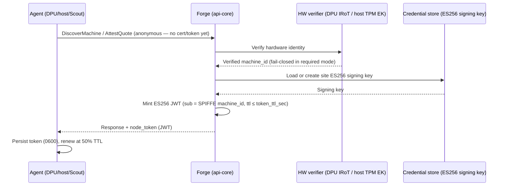
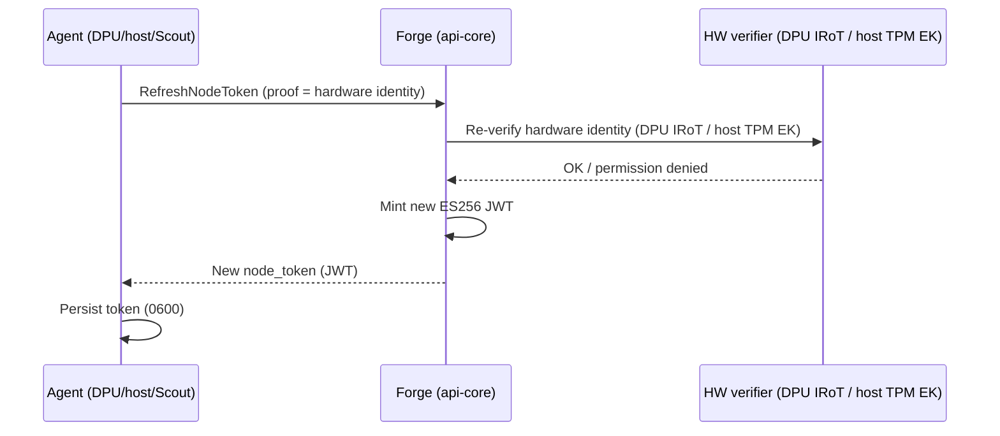

# Eliminate Dependency on Vault — Design

**Author:** Bill Minckler
**Status:** Draft
**Epic:** [#195](https://github.com/NVIDIA/infra-controller/issues/195) — Eliminate dependency on Vault
**Related issues:** #353, #354, #355, #357, #1837, #1852, #2811, #2880, #2917
**Companion:** [`eliminate-vault-dependency.md`](./eliminate-vault-dependency.md) (status / open-items overview)

## Revision history

| Date | Author | Summary of change |
| :---- | :---- | :---- |
| 2026-06-29 | Bill Minckler | Initial design doc, derived from the Vault-elimination design note and inspection of the committed source tree and infrastructure. |
| 2026-06-30 | Bill Minckler | Added the certificate-issuance alternatives to §3.1 (cert-manager rejected; k8s CSR model adopted, k8s transport rejected; in-process CA / SPIRE candidate) with rationale. |
| 2026-06-30 | Bill Minckler | Expanded the §3.1 KMS alternative and open item O2 with non-Vault production KMS provider options (managed cloud KMS, PKCS#11 HSM / KMIP, hardened Integrated; migration via Multi + routing). |
| 2026-06-30 | Bill Minckler | Reframed node-token issuance/refresh to the target design — authorized by the machine's verified hardware-rooted identity (DPU IRoT / host TPM EK) rather than mTLS — with the current mTLS gate marked transitional (open item O4). |
| 2026-06-30 | Bill Minckler | Added the §3.6.4 future-work entry: converge the machine-identity signing-key encryption and the credential-store KMS envelope onto a shared KMS-backed primitive (after O2), removing the O3 KEK recursion. |
| 2026-07-02 | Bill Minckler | Addressed review comment on §3.1: added credential-storage alternative (d) plain Postgres on an encrypted disk/volume, with rationale for keeping envelope encryption and a defense-in-depth disk-encryption recommendation (also §3.4). |
| 2026-07-02 | Bill Minckler | Addressed review comment on §3.1 node-authentication: clarified mTLS+JWT are supported concurrently through rolling upgrade (may coexist), and that retaining mTLS does not by itself remove Vault (still needs a non-Vault cert issuer, O1); noted the reviewer's cert-manager / k8s CSR suggestion is covered by the certificate-issuance alternatives. |
| 2026-07-02 | Bill Minckler | Addressed review comment on §3.2.3.1: cross-referenced the existing machine-identity signing-key encryption as a reuse/refactor candidate for the credential-store envelope + KEK-rotation work (see §3.6.4). |
| 2026-07-02 | Bill Minckler | Addressed review comment on §3.3.3: added sequence diagrams for the node bootstrap and token-refresh flows. |
| 2026-07-06 | Bill Minckler | Corrected §1.3 constraint: DPU device-identity attestation depends on direct controller→DPU-BMC Redfish access (established at discovery), not on DPF — removed the incorrect DPF-targeting statement. |
| 2026-07-06 | Bill Minckler | Expanded O1 (§3.6.4) into a phased plan to remove the unconditional Vault-client construction / hard startup dependency (decouple Vault-client build → optional provider type → non-Vault issuer → retire Vault PKI); §2 now points to it. |
| 2026-07-06 | Bill Minckler | Reformatted §3.1 design-alternative options (a/b/c/…) into nested lists with the "Selected" rationale as a trailing note (no content change). |
| 2026-07-06 | Bill Minckler | Clarified §3.1 node-authentication: Vault-free node auth has two routes — a non-Vault cert issuer (if certs are kept) or JWT-only with the cert provider disabled (a config choice, given O1 optional-provider + O4), the latter contingent on nothing else consuming the client certs. |
| 2026-07-06 | Bill Minckler | Recorded cert-consumer audit: issued machine certs are used solely for control-plane mTLS auth/identity; refined §3.1 route 2 (JWT-only feasible but not a config flip — needs a JWT auth path + machine-id re-sourcing in 3 handlers) and noted the provider also mints the UFM server cert (O1 step 2). |
| 2026-07-06 | Bill Minckler | Fixed §3.3.3 bootstrap diagram: enrollment RPCs (DiscoverMachine/AttestQuote) are anonymous and authorized by verified hardware identity — removed the incorrect (mTLS) label. |
| 2026-07-06 | Bill Minckler | Reorganized §2 by subsystem (Credential store / Certificate issuance / Node authentication / DPU device identity), each with its structure, behavior, and open limitation, replacing the aspect-based prose (no substantive content change). |
| 2026-07-06 | Bill Minckler | Applied the same subsystem grouping to §3.2.1 (config), §3.3.1 (functionality), §3.3.3 (data flow), and §3.3.5 (logging) for consistency and scannability (no substantive content change). |
| 2026-07-06 | Bill Minckler | Annotated the dangling references to the DPU device-attestation config guide (§1.6, §3.4): it ships with the #2917 feature and is not present in this branch. |
| 2026-07-06 | Bill Minckler | Reworded the DPU identity work from "attestation" to "identity verification" where it described cert-chain identity derivation, to avoid implying full measured-boot/quote attestation (§1.3, §1.6, §3.4). Kept genuine attestation references (AttestQuote, the SPDM/NRAS FSM, the [dpu_device_attestation] config key). |
| 2026-07-06 | Bill Minckler | Reframed §2 / §1.1 so DPU device identity (#2917) and the host TPM EK are the hardware-rooted identity anchor *under* Node authentication (#355), and stated explicitly that the device-identity work exists solely to enable the move to JWT (not a standalone feature; GitHub issue hierarchy unchanged). |
| 2026-07-06 | Bill Minckler | Rewrote §1–§3 to describe the epic's **end state**: removed transitional (mTLS-gated refresh), current-code, and unmerged-branch language. The current state of the code now lives in the status doc (`eliminate-vault-dependency.md`). |

# 1. Introduction

## 1.1 Purpose and scope

This document records the architecture and design for the Vault-elimination epic ([#195](https://github.com/NVIDIA/infra-controller/issues/195)): the credential-storage abstraction and backends, encryption-at-rest, gradual/reversible backend migration, and node authentication (JWT bearer tokens) — including the DPU BlueField IRoT device identity and host TPM EK that anchor it (with device-CA management), the hardware root that lets node auth move off mTLS client certificates. Certificate (PKI) issuance is in scope as a tracked gap, not as a delivered replacement.

## 1.2 Assumptions

- A KMS provider is available to wrap data-encryption keys (integrated/static for dev, Transit-compatible for production).
- PostgreSQL is the control plane's datastore and is available.
- For DPU device identity, the DPU BMC exposes the BlueField IRoT over Redfish SPDM `ComponentIntegrity`, and site-explorer has pre-ingested the BMC so a DPU is correlatable to its BMC by DMI serial.
- NVIDIA BlueField device root CA(s) are obtainable out-of-band for production trust anchoring.

## 1.3 Constraints

- Migration off Vault must be gradual and reversible (downgrade supported).
- Rust workspace, tonic/gRPC, SPIFFE identity, Casbin/RBAC reused unchanged by new auth paths.
- `machine_id` is the system-wide identity key (DB PK, SPIFFE subject); the existing fleet must not be re-keyed.
- DPU device-identity verification requires the controller to have direct access to the DPU BMC Redfish endpoint; the device identity is established at discovery. This is identity verification only — cert-chain validation to derive `machine_id` — not measured-boot / quote attestation of the DPU.

## 1.4 External dependencies

| Team or Company | Deliverable |
| :---- | :---- |
| HashiCorp Vault / OpenBao | KV2 (credentials), PKI (certificate issuance), Transit (KMS) during transition |
| PostgreSQL | Encrypted `secrets` table / credential journal |
| NVIDIA BlueField / DPU firmware & PKI | IRoT device certificate over BMC Redfish SPDM; NVIDIA device root CA(s) |
| Cloud/HSM KMS provider (future) | Non-Vault production KEK provider (open item O2) |

## 1.5 Definitions, acronyms, abbreviations

| Term | Description |
| :---- | :---- |
| Credential store | The backend-agnostic secret read/write layer (`crates/secrets`) |
| KEK / DEK | Key-Encryption Key / Data-Encryption Key (envelope encryption) |
| KMS | Key Management Service (Integrated / Transit / Multi providers) |
| SPIFFE | URI machine identity used by certs and JWTs |
| IRoT | BlueField Initial Root of Trust (SPDM device-identity target) |
| SPDM | Security Protocol and Data Model (over BMC Redfish ComponentIntegrity) |
| envelope encryption | Encrypt value with a per-record DEK; wrap the DEK with a KEK |

## 1.6 References

| Input work product | Location |
| :---- | :---- |
| Design note: Eliminate Dependency on Vault (overview / open items) | `docs/design/eliminate-vault-dependency.md` |
| Epic #195 and sub-tasks #353/#354/#355/#357/#1837/#1852/#2811/#2880/#2917 | GitHub NVIDIA/infra-controller |
| Config guide: DPU device-identity verification (#2917) | `docs/configuration/dpu_device_attestation.md` |

# 2. Architectural details

**High-level architecture.** A single backend-agnostic credential abstraction fronts pluggable storage backends; certificate issuance is a separate provider; node authentication adds JWT bearer tokens alongside mTLS; and DPU identity is rooted in a BMC-fetched hardware certificate.

```
 Callers (handlers, controllers, agents)
        │  CredentialReader/Writer/Manager        CertificateProvider
        ▼                                                  │
 ┌───────────────────────────────────────────┐             ▼
 │ ChainedCredentialReader (first-match)     │     ForgeVaultClient (Vault PKI)
 │   env → file(YAML, hot-reload) → backends │     — separate trait, still Vault [open O1]
 │ writer = one backend                      │
 └───────────┬────────────────────┬──────────┘
             ▼                    ▼
   PostgresCredentialManager   ForgeVaultClient (KV2)
        │  envelope-encrypt
        ▼
   KMS provider (Integrated | Transit | Multi)  ── Transit = Vault/OpenBao [open O2]

 Node auth:  Discover/AttestQuote/RefreshNodeToken → ES256 JWT, authorized by verified HW identity (DPU IRoT / host TPM EK)
 DPU identity: discover → DPU BMC Redfish SPDM IRoT CertChain → verify → machine_id
```

The architecture breaks into four subsystems; each is summarized here — structure, runtime behavior, and any open limitation — and detailed in §3.2–§3.3.

**Credential store (#354 / #2811).**
- *Structure* — `CredentialReader` / `CredentialWriter` / `CredentialManager` traits over pluggable backends (`ForgeVaultClient` Vault KV2, `PostgresCredentialManager` append-only encrypted `secrets` journal, env/file readers, `MemoryCredentialStore`), composed first-match by `ChainedCredentialReader`; KMS providers `Integrated` / `Transit` / `Multi` in `crates/kms-provider`.
- *Behavior* — reads resolve first-match (env → file → backends); writes go to a single writer and are envelope-encrypted on the Postgres path.
- *Key custody* — the production KEK is held by a non-Vault KMS provider, so the credential store has no residual Vault dependency (roadmap: O2).

**Certificate issuance (#2880).**
- *Structure* — a *distinct* `CertificateProvider` trait, so PKI can diverge from credential storage; the provider is pluggable and optional.
- *End state* — PKI is served by a **non-Vault** issuer, or removed entirely under JWT-only node auth (see §3.1); either way the control plane starts and runs without Vault (roadmap: O1 / #2880).

**Node authentication (#355) — the path off client certs / mTLS.**
- *Structure / behavior* — machines authenticate with **ES256 JWT bearer tokens**, issued at discovery/attestation and refreshed before expiry, carrying the SPIFFE machine identity as the RBAC principal.
- *Authorization* — token issuance and refresh are authorized by the machine's **verified hardware-rooted identity**, not by an mTLS client certificate, so a stolen token cannot be refreshed indefinitely (roadmap: O4).
- *Hardware-rooted identity anchor* — the device-identity work exists **solely to provide this anchor** (to enable JWT-based node auth), not as a standalone feature:
  - **DPU BlueField IRoT (#2917)** — discovery triggers an out-of-band DPU-BMC Redfish SPDM IRoT fetch + server-side cert-chain verification, yielding a hardware-rooted `machine_id`; trusted device-CA roots are seeded via the admin CLI.
  - **Host TPM EK** — the analogous host path (`tpm-ca`).

# 3. Design details

## 3.1 Design alternatives

- **Credential storage.**
  - (a) Vault-only (status quo).
  - (b) PostgreSQL with a DB extension (e.g. pgcrypto) — operational burden, key handling in-DB.
  - (c) PostgreSQL with application-layer envelope encryption and KMS-wrapped DEKs.
  - (d) Plain PostgreSQL on an encrypted disk/volume (LUKS/dm-crypt, cloud block-storage encryption, or Postgres TDE) — keeps credentials encrypted at rest with no application code changes.

  **Selected (c)** — it satisfies the #354 secure-if-stolen requirement across more threat models than (d): disk encryption protects only physically stolen or decommissioned media and leaves plaintext exposed to a live SQL-level dump, a compromised DB role/connection, and logical backups, with the key held by the OS/infra rather than outside the DB trust boundary and no per-record rotation. Disk encryption is nonetheless **recommended in addition** (defense-in-depth): operators should enable volume/disk encryption for the database and its backups regardless of the credential-storage mechanism.
- **DPU identity acquisition.**
  - (a) In-band — the DPU agent presents its device cert and signs a nonce during discovery (requires DPU-side DICE/signing integration).
  - (b) Out-of-band — the controller fetches the IRoT cert from the DPU BMC over Redfish SPDM.

  **Selected (b)** — no DPU agent change, reuses the existing SPDM controller fetch machinery, verification co-located in api-core with the host TPM EK path.
- **Node authentication.**
  - (a) Replace mTLS outright.
  - (b) Additive dual-support (JWT alongside mTLS).

  **Selected (b)** — same SPIFFE principal / RBAC, and a reversible rollout (both methods accepted concurrently until every machine is JWT-capable). The end state is JWT authorized by verified hardware identity; the residual client-cert / mTLS dependency is then eliminated by one of two routes, decided under O1 / #2880:
  1. **Keep issuing client certificates** from a **non-Vault certificate issuer** (see the certificate-issuance alternatives below).
  2. **No client-cert issuance (JWT-only).** The issued machine certs back only control-plane mTLS auth/identity — nothing else consumes them — so once machine identity is sourced from the verified token, certificate issuance can be disabled entirely, with no non-Vault issuer required.
- **KMS (key-encryption-key custody).** Providers: *Integrated* (256-bit AES key from env/file/config; Vault-free but dev/test custody), *Transit* (Vault/OpenBao server-side wrap — Vault-dependent, an interim option only; requires a static Vault token — the k8s SA login flow is unsupported for Transit), and *Multi* (composes providers, enabling migration). `active` selects the write-time provider; `routing` maps path prefixes → `kek_id`. The end state uses a **non-Vault production KMS** (roadmap: O2). Non-Vault production candidates (each = a new `KmsBackend` impl + `ProviderConfig` variant; the trait only wraps/unwraps a 256-bit symmetric DEK, so additions are contained, and the opaque wrapped blob maps to the existing `EncryptedDek` the same way Transit does):
  - *Managed cloud KMS — AWS KMS / GCP Cloud KMS / Azure Key Vault (Keys).* Server-side wrap (Encrypt/Decrypt, GenerateDataKey, or wrapKey/unwrapKey), HSM-backed, managed rotation + native audit, and **workload-identity auth** (IRSA / GKE Workload Identity / Azure Managed Identity) — which also removes Transit's static-token limitation. Best fit for cloud deployments. (Azure Key Vault here is the managed cloud KMS, not HashiCorp Vault.)
  - *On-prem key managers — PKCS#11 HSM (AWS CloudHSM / Thales Luna / Entrust nShield via the `cryptoki` crate) or KMIP (Thales CipherTrust / Fortanix).* Strongest custody (key never leaves the HSM), FIPS/compliance; higher operational cost. Best fit for on-prem/regulated environments.
  - *Hardened Integrated.* Keep the Integrated provider but source its key file from a CSI secrets-store / External-Secrets mount backed by a cloud secret manager or a sealed secret. Lowest effort (no new code), but the KEK is plaintext in node memory/at-rest — acceptable only if that node trust boundary is sufficient.
  - *Niche — TPM-sealed KEK (if control-plane nodes have TPMs), or Tink as a uniform envelope abstraction over cloud KMS.*
  Migration uses `Multi` (decrypt with Transit, encrypt with the new provider) + `routing`, then re-encrypt on rotation.
- **Certificate issuance (PKI) — the O1 direction.** The end state replaces Vault PKI with a non-Vault issuer (or removes issuance entirely under JWT-only node auth). Candidate replacements:
  - *Kubernetes cert-manager — **rejected**.* cert-manager issues certificates as in-cluster Kubernetes Secrets for Pods/Ingress via declarative `Certificate` CRDs, whereas carbide issues per-machine mTLS client certificates **synchronously to external machines** (DPU/host/Scout) at discovery/renewal, returning the keypair over gRPC. It is a structural mismatch on four counts: (1) **consumer model** — k8s Secret vs. external requester (cert-manager cannot deliver a keypair to a non-cluster machine); (2) **declarative/eventually-consistent reconcile** vs. the synchronous on-demand `get_certificate(...)` call that must return the cert inline; (3) **cardinality** — one `Certificate` CR + Secret per machine means heavy etcd object count/churn at fleet scale for external, often-ephemeral identities; and (4) **it is not a CA** — cert-manager only fronts an `Issuer`, so backing it with the existing Vault issuer keeps Vault, and backing it with a non-Vault issuer relocates the CA private key into a k8s Secret (weaker custody than Vault Transit/HSM). It is also not SPIFFE-identity-native.
  - *Kubernetes `CertificateSigningRequest` (CSR) API — **model adopted, k8s transport rejected**.* The CSR *model* is desirable: the machine generates its own keypair and submits only a CSR, so the private key never transits (an improvement over server-side keygen + key handoff). But the k8s CSR **API as the issuance interface** was rejected because: (1) it is not a CA — you must run a custom-`signerName` signer backed by your own CA key, so key custody and "drop Vault" are unchanged (built-in signers are k8s-internal and reusing the cluster CA would conflate the machine trust domain with the control-plane PKI); (2) it is async/object-in-etcd (CSR → approve → sign → poll) versus the synchronous discovery RPC, with per-issuance etcd churn at fleet scale; and (3) external machines are not k8s API clients, so carbide would create and sign the CSR on their behalf — an internal hop adding ceremony without the CSR API's native requester-identity/RBAC benefit. The CSR model can instead be adopted over carbide's own gRPC (machine-held key + server-side CSR signing with SPIFFE/subject policy) without k8s CSR objects.
  - *Programmatic in-process CA, or SPIRE (SPIFFE-native) — **candidate direction**.* Better fit for synchronous, per-machine, SPIFFE-named issuance and RBAC principal mapping; can accept a machine-generated CSR over gRPC (capturing the CSR-model benefit above). Selection deferred (open item O1 / #2880).

## 3.2 Static design

### 3.2.1 Configuration data

- **Credential store (#354/#2811)** — `[secrets]`: `backends` (ordered read list of `postgres`/`vault`; env+file always tried ahead), `writer` (single target), `import_from` (one-time Vault import), `kms.providers` + `routing` (path-prefix → KEK id). Env: `CARBIDE_STATIC_CREDENTIAL_*`, `CARBIDE_CREDENTIAL_STORE`.
- **Node authentication (#355)** — `[node_auth]`: `enabled` (default false), `issuer`, `audience`, `token_ttl_sec` (≤ 86400); `[auth.trust]`: SPIFFE trust domain + machine base path (required when node-auth enabled). On-disk: node-auth token (`0600`).
- **Certificate issuance (#2880)** — on-disk client cert/key paths.
- **DPU device identity (#2917)** — `[dpu_device_attestation].mode`: `disabled` | `best_effort` | `required`.

### 3.2.2 External interface and specification

- **Forge gRPC API** (`crates/rpc`): `RefreshNodeToken`; optional `node_token` on discovery/attestation responses; `DpuAddDeviceCaCert` / `DpuShowDeviceCaCerts` / `DpuDeleteDeviceCaCert` (mirrors `Tpm*CaCert`). RBAC: `ForgeAdminCLI`, `SiteAgent`. (Node token #355; device CA #2917.)
- **DPU BMC Redfish** (`carbide-redfish`/libredfish): `GET /redfish/v1/ComponentIntegrity?$expand=...` → `Bluefield_DPU_IRoT` member; `GET /redfish/v1/Chassis/Bluefield_DPU_IRoT/Certificates/CertChain` → PEM `CertificateString` (matched case-insensitively). (#2917.)
- **PostgreSQL**: `secrets` table (encrypted_value, nonce, kek_id, encrypted_dek, dek_nonce, append-only seq); `dpu_device_ca_certs` + `dpu_device_cert_status` tables. (#354; #2917.)
- **Vault/OpenBao**: KV2 (credentials), PKI (certs), Transit (KEK wrap).
- **Administrative CLI** (`nico-admin-cli`): `dpu-device-ca {add,show,delete}` and the pre-existing `tpm-ca`. (#2917.)

### 3.2.3 Dependencies

| Team or Company | Deliverable | Ref | Committed? |
| :---- | :---- | :---- | :---- |
| Vault/OpenBao | KV2, PKI, Transit | 1.4, 3.2.2 | existing |
| PostgreSQL | encrypted secrets store | 3.2.2 | existing |
| DPU BMC / BlueField firmware | IRoT cert over Redfish SPDM | 3.2.2 | verified on BF-3 |
| NVIDIA device PKI | device root CA(s) | 1.4 | open |
| KMS (cloud/HSM, future) | non-Vault prod KEK | 3.1 | open (O2) |

#### 3.2.3.1 Integration validation plan

| Functionality to validate | Teams participating | Interfaces covered | Date complete |
| :---- | :---- | :---- | :---- |
| IRoT CertChain shape + verification vs real BMC | NICo | 3.2.2 Redfish | Done (BlueField-3) |
| Envelope encrypt/decrypt round-trip + KEK rotation (credential-store / KMS path) | NICo | 3.2.2 PostgreSQL/KMS | Pending live-DB test |
| Reader/writer fallback + Vault import | NICo | 3.2.2 PG/Vault | Pending live-DB test |
| JWT issue/validate/refresh (dual-support) | NICo | 3.2.2 gRPC | Unit-tested; e2e pending |

> The credential-store envelope + KEK-rotation logic (row 2) can **reuse or refactor** the existing **machine-identity signing-key encryption** (`machine_identity/crypto.rs` + `carbide_secrets::key_encryption`), which already implements a `key_id`-tagged envelope with re-wrap-on-rotation. See the encryption-convergence entry in §3.6.4.

## 3.3 Dynamic design

### 3.3.1 Functionality and behavior

- **Credential store (#354/#2811)** — read/write through the chain; envelope encryption on the Postgres write path.
- **Node authentication (#355)** — node-token issuance / validation / refresh.
- **DPU device identity (#2917)** — IRoT fetch → verify → identity selection → binding; device-CA seeding.

### 3.3.2 Control flow

```
Credential read:   get_credentials(key) → env? → file? → backends[0]? → backends[1]? → first hit
Credential write:  set_credentials(key,val) → writer backend → (Postgres) DEK-encrypt → KMS-wrap DEK → append row
Node bootstrap:    Discover/AttestQuote → verify hardware identity (DPU IRoT / host TPM EK) → issue ES256 JWT (sub=SPIFFE) → client persists 0600 → renew @50% TTL
Node refresh:      RefreshNodeToken → re-verify hardware identity (DPU IRoT / host TPM EK) → new JWT
DPU identity:      Discover(DPU) → [mode≠disabled] serial→explored BMC → Redfish IRoT CertChain
                   → verify_device_cert_chain(roots) → select_dpu_machine_id(mode,verified,legacy_known)
                   → record dpu_device_cert_status
SPDM controller:   FetchMetadata → FetchCertificate → (BlueField) hand off as Passed; (GPU) → NRAS
```

> Read-after-write caveat: when the configured `writer` is not the highest-priority `backend`, a freshly written value can be shadowed on read by a higher-priority copy until that copy is removed. NICo warns about this configuration at startup (`writer_is_top_backend`).

### 3.3.3 Data flow

- **Credential store (#354/#2811)** — secret value → per-record DEK (AEAD, path as associated data) → ciphertext+nonce in `secrets`; DEK → KMS wrap → `encrypted_dek` + `kek_id`.
- **DPU device identity (#2917)** — IRoT cert chain: DPU BMC → api-core (PEM→DER) → chain verification against `dpu_device_ca_certs` → `machine_id` (hash of verified leaf) → `dpu_device_cert_status` binding.

**Sequence diagrams — node bootstrap and token refresh.**

*(a) Initial bootstrap* — a machine is discovered/attested and receives its first node token:



*(b) Token refresh* — the agent renews before expiry:



### 3.3.4 Error handling

- `required` mode with no verified identity → discovery fails closed; `best_effort` soft-failures (no BMC, no IRoT, Redfish error, verify failure) → fall back to legacy id.
- Chain verification rejects on invalid validity window, non-CA issuer, name mismatch, trailing bytes, or `NoTrustedRoot`.
- Credential config errors (bad `backends`) fail boot before side effects; envelope decrypt failure surfaces an error, not plaintext.
- Refresh without a verified hardware-rooted identity → permission denied.

### 3.3.5 Logging and debugging

- **Credentials / tokens** — no credential values or token contents are logged; which credential authenticated a request is logged at debug.
- **DPU device identity** — verification outcome (verified `machine_id`, or soft-failure reason) is logged at info/warn.

### 3.3.6 State machine

SPDM device attestation FSM: `FetchMetadata → FetchCertificate → {BlueField: Passed (hand off to api-core verification); GPU: TriggerEvidenceCollection → … → NRAS}`. Credential migration "state" is operator-driven config: `vault → [postgres, vault] (read both, write postgres) → [postgres]`.

## 3.4 Security design

- **Secrets at rest:** envelope encryption; per-record DEK wrapped by a KMS-held KEK; append-only journal; path as associated data. DB theft without the KEK yields only ciphertext. KEK rotation via routing; value rotation via new journal entries / site-versioned keys. Disk/volume encryption of the database and its backups is recommended as an additional layer (defense-in-depth) but does not replace envelope encryption — it protects only physically stolen media, not a live SQL dump, a compromised DB role, or logical backups.
- **Node auth:** bearer tokens accepted only on a TLS listener; refresh is authorized by the machine's verified hardware-rooted identity — not by the bearer token itself — so a stolen token cannot be refreshed indefinitely; token file `0600`.
- **Device identity:** strict chain validation (validity, CA basic-constraints, issuer name-match, full DER consumption, trusted-root termination); fail-closed in `required` mode.
- **Device-CA trust model (open):** verification trusts exactly the seeded roots (no NVIDIA pinning yet). Because the IRoT lets the DPU owner re-provision its CA, operators must seed only the NVIDIA factory root unless they control an owner CA (documented in the DPU device-identity config guide, #2917). This mirrors the existing host TPM-EK / `tpm-ca` flow.
- **Threat-model note:** assets = component credentials, signing keys, device identities; trust boundaries = Vault/KMS, PostgreSQL, DPU BMC (authenticated Redfish/TLS).

## 3.5 Testing

Verification is via the workspace's Rust unit/integration tests: the device-identity verifier has 15 unit tests (chain-to-root, forgery/regression, mode selection); the SPDM device filter has unit tests; node-auth has unit tests; RBAC coverage is asserted. Live-DB and live-BMC integration tests for the credential/Redfish paths are pending (see §3.2.3.1). No non-production credential paths are introduced into released code.

## 3.6 Other design considerations

### 3.6.1 Resource limits

No GPU/compute resource constraints. Storage: encrypted `secrets` rows (append-only; old versions retained until pruned). Network: per-DPU Redfish calls at discovery; per-write KMS wrap call.

### 3.6.2 High availability

Multi-replica safe: the node-auth signing key and KEKs are shared via the credential/KMS layer; the one-time Vault import uses a Postgres advisory lock; the signing-key create-race re-reads the winner's key.

### 3.6.3 Scalability

Per-path, per-record encryption and the first-match chain scale with credential count; the append-only journal grows with rotations and is prunable.

### 3.6.4 Future work (tracked open items)

- **O1 — non-Vault certificate issuance + optional-at-startup Vault (#2880):** decouple PKI from Vault so a Vault-free deployment starts and runs. (The current unconditional Vault-client construction is captured in the status doc, §16.1.) Phased plan:
  1. **Decouple Vault-client construction from cert issuance.** Build the Vault client only when a Vault role is actually configured — `vault` present in `[secrets].backends`/`writer`, an `import_from` set, or the certificate provider selected as Vault PKI — so a fully non-Vault config boots without contacting Vault. Add a `[certificates].provider` selector (default `vault` for back-compat).
  2. **Make the provider optional in the type system.** Change `Api.certificate_provider` to an optional / `Disabled` provider; the handlers that issue certs (`handlers/attestation.rs`, `handlers/credential.rs`, `handlers/machine_discovery.rs`) return a typed "certificate issuance not configured" error instead of assuming a provider exists. This lets a JWT-only deployment (after O4) run with no cert provider at all. Two audit caveats: (a) the same `CertificateProvider` also mints the **UFM fabric server cert** (`write_ufm_certs` in `credential.rs`) — a separate consumer, so gate *machine-cert* issuance without dropping UFM issuance (or supply that cert another way); (b) machine identity is currently read from the client cert in `renew_machine_certificate`, `sign_machine_identity`, and phone-home, which must re-source identity from the node token under JWT-only.
  3. **Add a non-Vault `CertificateProvider`.** Implement the §3.1 candidate direction (in-process CA, or SPIRE, accepting a machine-generated CSR over gRPC) as a selectable `[certificates].provider`; run Vault and the new issuer in parallel during migration.
  4. **Flip the default and retire Vault PKI.** Once the new issuer is proven and existing certs are reissued/rotated onto it, default the provider away from Vault and remove the Vault-PKI wiring.
  Steps 1–2 make Vault *optional at startup* and can land ahead of choosing an issuer; steps 3–4 are the #2880 issuer work. Combined with O2 (KEK off Transit), this removes the last hard Vault dependency and meets the epic's Vault-free goal.
- **O2 — non-Vault production KMS:** so the Postgres KEK does not transitively depend on Vault/OpenBao Transit. Candidate providers are enumerated in §3.1 (managed cloud KMS — AWS/GCP/Azure; PKCS#11 HSM or KMIP for on-prem; or a hardened Integrated provider as the no-new-code interim). Cloud KMS additionally uses workload-identity auth, removing Transit's static-token constraint.
- **O3 — dedicated migration/rotation for the credential types covered only generically** (NMX-M, BGP, MQTT, NIC-lockdown IKM, extension-service, machine-identity encryption key, rack token, SSH/HBN/Redfish; UFM #1837; per-switch NVOS #1852; reader/writer rollout #2811).
- **O4 — wire hardware identity to node-token issuance/refresh** (implements the §3.3 refresh design): use the verified hardware identity (DPU IRoT #2917; host TPM EK) to authorize JWT issuance/refresh (#355), so node auth requires no mTLS client certificate.
- **Encryption convergence (after O2):** unify the two encryption-at-rest subsystems onto a **shared KMS-backed envelope primitive**. There are two: the **machine-identity signing-key encryption** (`machine_identity/crypto.rs` + `carbide_secrets::key_encryption`) — single-tier AES, `key_id`-tagged, KEK = a `MachineIdentityEncryptionKey` *credential*, with re-wrap rotation — and the **credential-store KMS envelope** (`kms-provider` + `api-core/src/secrets`) — two-tier per-record DEK wrapped by a KMS KEK. Converge them at the **crypto/KEK-custody layer only** (one primitive: per-record DEK wrapped by a KMS KEK, `kek_id`-tagged, re-wrap-on-rotation), with both keeping their own storage (`tenant_identity_config` columns vs the `secrets` table). Benefits: a single KEK-custody story, the signing-key KEK gains the O2 non-Vault KMS options, and the O3 recursion (the machine-identity KEK being a credential stored under the credential-store envelope) is removed. Requires migrating existing machine-identity ciphertext (the dual-slot rewrap machinery already supports overlap) and re-sourcing `MachineIdentityEncryptionKey` from a raw credential to a KMS-managed KEK. **Gate on O2** — converging before a non-Vault KMS exists would merely move the signing-key KEK onto Transit/Vault.
- **Optional hardening:** NVIDIA-issuance pinning (name constraints/policy OID) and deriving `machine_id` from a stable in-cert identifier so IRoT re-provisioning does not re-key a DPU.

## Issue map

| Design area | Sections | Issue(s) |
| :---- | :---- | :---- |
| Credential store + backends | 2, 3.1, 3.2.1, 3.3.1–3.3.3 | #354, #2811 |
| Encryption at rest (KMS envelope) | 3.3.3, 3.4, 3.2.3.1 | #354 |
| Node-auth JWT | 2, 3.1, 3.3.1–3.3.2, 3.4 | #355 |
| DPU device identity + device CA | 2, 3.1, 3.2.2, 3.3.1–3.3.6, 3.4 | #2917 |
| Certificate issuance (PKI) — open | 3.1, 3.6.4 (O1) | #2880 |
| Separate credential vs certificate provider | 2, 3.1 | #2880 |
