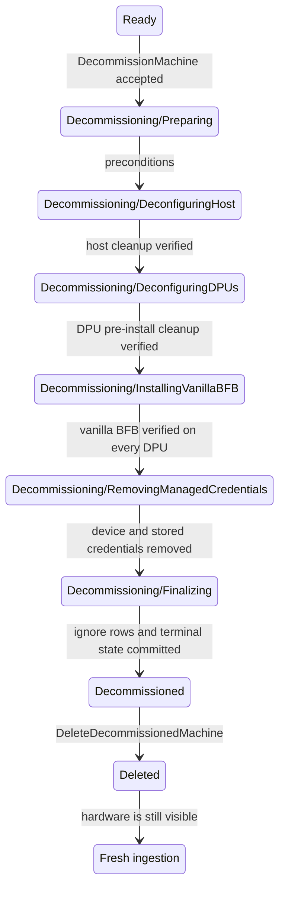

# Machine Decommissioning

## Status

Draft

## Summary

This design doc proposes a workflow for decommissioning a managed host from NICo. Decommissioning can be used for two purposes:

- physically removing the machine from the site; or
- returning the machine to a neutral state and then ingesting it again as a fresh machine.

Decommissioning starts only when the managed host is in `Ready`. NICo removes the configurations and credentials it placed on the host and its DPUs, installs a vanilla BFB on every managed DPU, and then ends in the terminal `Decommissioned` state. 

During the decommissioning process, the BMC MACs are added to an ignore table: at the beginning of decommissioning, we tell site explorer to skip exploring these BMCs, and at the end of decommissioning we additionally tell the DHCP server to stop leasing (and revoke) IPs to these BMCs.

The terminal record is retained until an operator explicitly requests final  
deletion (different from force-delete). Final deletion removes the machine and its associated state, but  
does not touch the `expected_machines` entry. It also removes the BMC ignore entries.  
Consequently, hardware that is still connected to the site is automatically discovered and  
ingested again. Hardware that has been physically removed stays absent. The site manager can remove the machine from `expected_machines` after the process is completed. 

## Terminology and invariants

In this document, **managed host** means the host machine plus every DPU linked
to it. 

The following invariants apply:

1. There is at most one active decommission operation for a managed host.
2. A managed host in any `Decommissioning/*` state cannot be allocated,
  reprovisioned, updated, repaired, or selected by rack maintenance.
3. `Decommissioned` is terminal. The state controller does no more hardware
  work in that state.
4. The host's `expected_machines` row is never deleted by this workflow.
5. Per-device secrets are not deleted until the last device operation that
  needs them has succeeded.
6. NICo does not enter `Decommissioned` until hardware cleanup has been
  verified and all NICo-managed per-device credentials have been removed.


## Proposed state model

Add two states to `ManagedHostState`:

```rust
Decommissioning {
    decommissioning_state: DecommissioningState,
},
Decommissioned,
```

Multi-DPU steps contain a map keyed by DPU machine ID so one completed DPU is not repeated after another DPU fails. Each substate also persists retry count, last redacted error, and the time of the last attempt in the normal controller outcome fields.

```rust
enum DecommissioningState {
    Preparing,
    DeconfiguringHost,
    DeconfiguringDPUs {
        dpu_states: HashMap<MachineId, DpuDecommissionState>,
    },
    InstallingVanillaBFB {
        dpu_states: HashMap<MachineId, VanillaBFBInstallState>,
    },
    RemovingManagedCredentials,
    Finalizing,
}
```

The externally reported state strings are exactly:

- `Decommissioning/Preparing`
- `Decommissioning/DeconfiguringHost`
- `Decommissioning/DeconfiguringDPUs`
- `Decommissioning/InstallingVanillaBFB`
- `Decommissioning/RemovingManagedCredentials`
- `Decommissioning/Finalizing`
- `Decommissioned`


### State diagram




### Transition criteria


| From                         | To                           | Required criteria                                                                                                                                                                                                                                                         |
| ---------------------------- | ---------------------------- | ------------------------------------------------------------------------------------------------------------------------------------------------------------------------------------------------------------------------------------------------------------------------- |
| `Ready`                      | `Decommissioning/Preparing`  | The request is authorized; the managed host is exactly `Ready`; no instance references the host; no decommission operation exists; the host is not participating in rack maintenance or another exclusive operation.                                                      |
| `Preparing`                  | `DeconfiguringHost`          | The BMC MACs and `expected_machines` row exist; suppress site explorer in the ignore table; the correct vanilla artifact and installation method resolve for every DPU; all credentials needed for cleanup are readable; pending update/reprovision requests are cleared. |
| `DeconfiguringHost`          | `DeconfiguringDPUs`          | lockdown is disabled; UEFI password is cleared; BIOS reset; in-band BMC/IPMI policy restored; NIC/SuperNIC lockdown cleared; The host is rebooted when required by the vendor operation.                                                                                  |
| `DeconfiguringDPUs`          | `InstallingVanillaBFB`       | NIC/SuperNIC lockdown is removed, DPU UEFI settings are reset, one-time boot overrides are cleared, and any DPF or extension-service resources that would reconfigure the DPU are removed for every DPU. No DPU agent changes are needed after this point.                |
| `InstallingVanillaBFB`       | `RemovingManagedCredentials` | Every managed DPU has completed vanilla BFB installation; Redfish/DPF reports success. For a zero-DPU or NIC-mode host this is a no-op.                                                                                                                                   |
| `RemovingManagedCredentials` | `Finalizing`                 | per-device secrets and rotation markers are absent; DPU OS credentials disappeared with the vanilla BFB.                                                                                                                                                                  |
| `Finalizing`                 | `Decommissioned`             | Current BMC DHCP allocations are revoked; suppress DHCP in the ignore table.                                                                                                                                                                                              |
| `Decommissioned`             | deleted                      | `DeleteDecommissionedMachine` is authorized; all associated database and external control-plane resources are absent; machine rows and ignore rows are removed atomically; `expected_machines` remains.                                                                   |


## State behavior


### `Decommissioning/Preparing`

The API changes `Ready` to `Preparing`. The step fails if the host BMC MAC, expected-machine entry, required credentials, or vanilla artifact cannot be resolved. This validation happens before NICo changes hardware.

All BMC MAC addresses are added to the ignore table, and `suppress_site_explorer` in the ignore table is set to true. 

### `Decommissioning/DeconfiguringHost`

Decommissioning the host is vendor-specific, so these steps are general:

- disable BIOS/BMC lockdown;
- clear the host UEFI administrator password;
- reset BIOS settings to factory default;
- restore in-band BMC/IPMI policy to its decommission value; and
- remove NICo-applied NIC/SuperNIC lockdown from host-visible devices.

Each operation is a converge-and-verify operation: read current state, write
only if needed, perform required resets or power cycles, and read back the
result. Unsupported required operations block decommissioning rather than
silently succeeding.

### `Decommissioning/DeconfiguringDPUs`

For every managed DPU, NICo performs all cleanup that requires the NICo DPU OS  
or agent before replacing that OS:

- unlock NIC/SuperNIC devices using the current lockdown key;
- clear DPU UEFI passwords and NICo boot overrides; and
- delete DPF/other resources that would otherwise reprovision or reconfigure the device.

Because entry is from `Ready`, tenant configuration should already be absent.

### `Decommissioning/InstallingVanillaBFB`

The vanilla image is the existing unmodified pre-ingestion BFB artifact already served by NICo.

Artifact selection is by DPU model and supported provisioning source. The
preferred installation order is:

1. DPF/DMS when the DPU is DPF-managed and that integration supports an
  explicit vanilla deployment;
2. Redfish `UpdateService`/`SimpleUpdate` when supported; or
3. the existing BMC-rshim copy path.

UEFI HTTP boot may be used only when it can install the vanilla artifact without serving NICo customization. Installation completion is verified using the Redfish/DPF task result and the resulting DPU system-image identity.

For multi-DPU hosts, the parent state advances only after every DPU reports the
expected vanilla identity. 

### `Decommissioning/RemovingManagedCredentials`

Credential removal is deliberately late. Until this state, NICo retains the
credentials needed to retry hardware operations.

#### Host

- The host BMC credentials are factory reset, verified, and then its per-BMC secret is removed.


#### DPU

- The vanilla install removes DPU OS SSH keys, HBN credentials, client
certificates, NICo trust roots, and agent enrollment material from the DPU
filesystem.
- The DPU BMC credentials are factory reset, verified, and then its per-BMC secret is removed.


#### NICo control plane

NICo deletes all machine-specific credential material, including:

- `BmcRoot` and `BmcForgeAdmin` secrets for every known BMC MAC;
- `DpuSsh` and `DpuHbn` secrets for every DPU machine ID;
- BMC, host-UEFI, and DPU-UEFI credential-rotation convergence rows; and
- outstanding BMC sessions and machine-scoped enrollment tokens.

Site-wide credentials and lockdown input key material are not deleted.

### `Decommissioning/Finalizing`

This state performs the control-plane cutover:

1. Set `suppress_dhcp` to true in the ignore table for all BMCs.
2. Revoke the existing BMC DHCP leases and release their current address
  allocations.
3. Invalidate the DHCP record cache.
4. Transition to `Decommissioned`


### `Decommissioned`

NICo retains enough inventory and the completion summary for an operator to verify what was successfully decommissioned. The machine is excluded from capacity and health remediation. Rack health may report it as administratively absent, but the rack controller must not attempt to return it to `Ready`.

The only normal mutation accepted in this state is final deletion.

## BMC ignore table

Add a table owned by the site inventory domain:

```sql
CREATE TABLE ignored_bmc_macs (
    bmc_mac_address MACADDR PRIMARY KEY,
    reason TEXT NOT NULL,
    suppress_site_explorer BOOLEAN NOT NULL DEFAULT FALSE,
    suppress_dhcp BOOLEAN NOT NULL DEFAULT FALSE,
    created_at TIMESTAMPTZ NOT NULL DEFAULT NOW(),
    updated_at TIMESTAMPTZ NOT NULL DEFAULT NOW()
);
```

Site Explorer loads this table on each iteration and filters an endpoint as soon as its MAC is known, before Redfish authentication, credential rotation, inventory persistence, power control, or managed-host creation. It's permissible for one queued or currently in-flight site explorer run to finish for the machine, but it will no longer start new explorations after `suppress_site_explorer` is set. 

`DiscoverDhcp` checks the table immediately after parsing the client MAC. For an ignored MAC it  
returns no DHCP record.

## APIs and authorization


### Start decommissioning

```protobuf
rpc DecommissionMachine(DecommissionMachineRequest)
    returns (DecommissionMachineResponse);

message DecommissionMachineRequest {
  MachineId machine_id = 1;
  string message = 2;
}
```

The response returns the canonical host machine ID. 

### Resume/retry

```protobuf
rpc ResumeMachineDecommissioning(ResumeMachineDecommissioningRequest)
    returns (DecommissionMachineResponse);
```

This API clears an exhausted retry delay and asks the controller to run the current substate again; it does not skip a failed criterion or choose a later state by default.

Allow the operator to optionally force skip the currently failing state if it's not important for handoff.

### Final deletion

```protobuf
rpc DeleteDecommissionedMachine(DeleteDecommissionedMachineRequest)
    returns (DeleteDecommissionedMachineResponse);
```

The request requires the canonical host ID. It is accepted only from exactly `Decommissioned`. It deletes the host, associated DPUs, interfaces, explored endpoints, observations, measurements, health  
records, DNS/DHCP state, allocation state, and DPF/extension resources. 

The `expected_machines` row is deliberately preserved.

The final transaction removes the machine rows and corresponding  
`ignored_bmc_macs` rows. If the BMC is still reachable, the expected-machine entry drives normal discovery and ingestion from the beginning. If the machine is absent, no managed-host record is recreated.

## Failure and retry behavior

Failures remain in the current `Decommissioning/*` substate. The normal state handler outcome records the redacted error and retry schedule. Retry is invoked via the API and clears the current error.

Operations must be idempotent:

- "already unlocked," "password absent," "account absent," and "resource not
found" are successful results when verified;
- asynchronous Redfish and DPF task IDs are persisted before polling;
- credential replacement verifies the replacement credential before deleting
the previous secret; and
- secret deletion treats an absent key as success.


## Verification plan

Unit and integration tests should cover at least:

- only `Ready` can enter `Preparing`;
- missing expected-machine, BMC MAC, credentials, or vanilla artifact fails
before hardware mutation;
- zero-, one-, and multi-DPU transitions, including one DPU retrying after a
sibling completes;
- every substate resumes correctly after a controller restart;
- device credentials remain available until all dependent hardware operations
complete;
- a replacement credential is verified before the NICo secret is removed;
- vanilla BFB completion is verified without a DPU-agent heartbeat;
- terminal transition and ignore insertion are atomic;
- ignored BMCs are neither explored nor served by DHCP, including renewals of
an old lease;
- final deletion is rejected before `Decommissioned`;
- final deletion preserves `expected_machines` and removes ignore rows;
- connected hardware is rediscovered after final deletion;
- absent hardware is not recreated after final deletion; and
- stale machine certificates cannot call machine-authenticated APIs during
decommissioning, after terminal completion, or after deletion.

Hardware qualification must exercise each supported host vendor, BlueField  
generation, BFB installation method, multi-DPU topology, and required power  
cycle. 