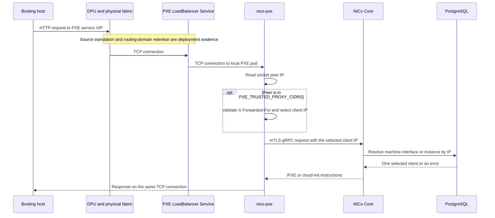

# PXE and Cloud-Init Client Identity

NICo selects machine-specific iPXE scripts and cloud-init data from the client
IP address selected by `nico-pxe`. That is a complete lookup key only while the
address is unique in the lookup domain. This page records the repository-backed
identity contract and the qualification required before separate VPCs may use
the same overlay address.

The identity investigation is tracked by
[NVIDIA/infra-controller#3888](https://github.com/NVIDIA/infra-controller/issues/3888),
and final qualification is tracked by
[NVIDIA/infra-controller#3902](https://github.com/NVIDIA/infra-controller/issues/3902).
Duplicate overlay addresses must remain disabled until the ambiguity rejection
tracked by
[NVIDIA/infra-controller#3887](https://github.com/NVIDIA/infra-controller/issues/3887)
is deployed, the production-equivalent evidence described below is complete,
and
[NVIDIA/infra-controller#3902](https://github.com/NVIDIA/infra-controller/issues/3902)
records final enablement sign-off.

## Repository-backed request path

The following parts of that path are established by code and deployment
manifests:

- [`nico-pxe`](../../crates/pxe/src/main.rs) installs
  `ClientIpSource::ConnectInfo`, and Axum supplies the accepted socket's
  `SocketAddr`. The [request logger](../../crates/pxe/src/middleware/logging.rs)
  records the same peer as `remote_ip`.
- The [client-IP extractor](../../crates/pxe/src/extractors/client_ip.rs) uses
  the accepted socket peer unless that peer belongs to an explicitly configured
  `PXE_TRUSTED_PROXY_CIDRS` range. An untrusted peer cannot select a machine by
  sending `X-Forwarded-For`. A trusted peer may send exactly one forwarding
  header field. Its comma-separated chain is parsed in full and traversed from
  right to left; the first address outside the trusted ranges becomes the
  client identity. Duplicate header fields, malformed forwarding, and chains
  made entirely of trusted addresses are rejected.
- The [boot-instruction RPC](../../crates/pxe/src/routes/mod.rs) sends the
  selected address as `PxeInstructionRequest.client_ip`. The
  [cloud-init RPC](../../crates/pxe/src/extractors/machine.rs) sends it as
  `CloudInitInstructionsRequest.ip`. Neither request carries a VPC, VNI,
  network-segment, circuit, interface, or authenticated boot-client identity.
- The PXE workload uses its service certificate for the call to Core, and
  [Core's internal RBAC](../../crates/api-core/src/auth/internal_rbac_rules.rs)
  grants both instruction RPCs to the PXE service role. `GetPxeInstructions`
  also permits `machine-a-tron`, which supplies `client_ip` as an RPC field
  rather than deriving it from a connection. Service authentication therefore
  does not authenticate the booting host or add a routing-domain discriminator.
- The [Kustomize external PXE Services](../../deploy/nico-system/external-services.yaml)
  use `LoadBalancer` with `externalTrafficPolicy: Local`. The
  [optional Helm external Services](../../helm/charts/nico-pxe/templates/external-service.yaml)
  default to `Local` when enabled, but the chart permits that value to be
  cleared or changed. No production PXE ingress, forwarded-header trust, or
  application-layer proxy is configured by these manifests. The local
  DevSpace `full` profile is the exception: it trusts `127.0.0.0/8` solely so
  its loopback `kubectl port-forward` verification path can name a simulated
  client address.

The external Service setting does not prove which address reaches the socket.
An off-box DPU, gateway, or load-balancer hop may preserve or translate the
source before Kubernetes receives it.

## Inputs that do and do not identify the client

| Input | Effect on identity |
|---|---|
| Accepted TCP socket peer | Used directly unless it matches an explicitly configured trusted-proxy CIDR. Its trust and uniqueness depend on the deployed network path. |
| `PXE_TRUSTED_PROXY_CIDRS` | Optional comma-separated IPv4 or IPv6 CIDRs. The default is empty. A malformed CIDR prevents startup. A matching direct peer may supply `X-Forwarded-For`; configure only controlled proxies that sanitize or append the chain correctly. |
| `X-Forwarded-For` | Ignored from untrusted peers. A trusted peer without the header retains its direct address. When present, exactly one header field is allowed, every list element must parse as an IP address, and the rightmost untrusted address is forwarded to Core. Duplicate fields and malformed or all-trusted chains are rejected. |
| Other forwarding headers | Ignored for client identity. |
| `buildarch`, `product`, and the other iPXE query values | Caller-provided boot characteristics. They can affect rendering after address resolution but do not select the database client. |
| PXE service certificate | Authenticates the PXE service to Core, not the booting host or VPC. |
| `machine-a-tron` service certificate and `client_ip` RPC field | Authorizes another internal caller to request iPXE instructions for a supplied address. It is not evidence about the source of a PXE socket. |
| Deprecated `PxeInstructionRequest.interface_id` | Not populated by `nico-pxe` and not used by Core for client selection. |

For the umbrella Helm chart, set the environment variable through
`nico-pxe.config.extraEnvData.PXE_TRUSTED_PROXY_CIDRS`. Omitting that key is
equivalent to an empty list and preserves direct-peer selection.

The selected address is therefore security-sensitive. Repository code does
not prove that the DPU prevents source spoofing on a direct path, that a gateway
gives each VPC a unique translated address, that a configured proxy constructs
a trustworthy forwarding chain, or that the selected address is one Core can
map back to the correct instance. The request logger's `remote_ip` remains the
accepted socket peer; when proxy trust is enabled, operators must capture both
that peer and the selected forwarded address.

## Core lookup behavior

[Core's client resolver](../../crates/api-core/src/handlers/client_resolution.rs)
prefers a matching machine-interface address for boot-instruction lookup and
falls back to an instance address. An instance result is then mapped to an
interface on its host, preferring an admin-segment interface. Cloud-init and
`whoami` prefer an instance address and fall back to a machine-interface
address. An instance returns tenant user-data only while its host is
Assigned/Ready; otherwise Core resolves the same address as a machine
interface. A machine-interface result can include discovery instructions,
machine metadata, and a configured boot override.

The duplicate-safe contract applies across both address domains:

| Matches for the selected address | Required resolution |
|---|---|
| No machine interface and no instance | Return a generic not-found or non-booting response. |
| Exactly one machine interface and no instance | Use the machine-interface path. |
| No machine interface and exactly one instance | Use the instance path, including the existing boot-interface and Assigned/Ready rules. |
| More than one result within either domain, or results in both domains | Treat the request as ambiguous. Return no client-specific material and do not select or fall back to any candidate. |

The address helpers used by this path request one optional row and have no
explicit ambiguous-result contract. After overlapping VPC address space is
representable, selecting one row would risk returning one tenant's data to
another tenant.

[NVIDIA/infra-controller#3887](https://github.com/NVIDIA/infra-controller/issues/3887)
must change the raw overlay-address lookup to detect every match. An ambiguous
request must then:

- return no iPXE instructions, custom user-data, instance metadata, network
  configuration, or discovery instructions;
- expose no candidate tenant, instance, machine, VPC, or segment identity to
  the HTTP client;
- produce a generic non-booting response while retaining bounded diagnostic
  context for operators; and
- avoid falling through to the other address domain after ambiguity has been
  established.

This rejection is the required safety backstop. It prevents disclosure but
does not make PXE or cloud-init usable for two clients whose only observed
identity is the same address.

## Deployment evidence still required

The repository establishes the PXE pod, Service, and Core behavior, but it does
not contain the complete [FNN](../glossary.md#fnn) gateway and physical
return-path configuration.
The launch-site SRE, DPU/HBN owner, and physical-network owner must capture both
the request and reply for `/api/v0/pxe/boot`, `/api/v0/pxe/whoami`, and the
`/api/v0/cloud-init/user-data`, `meta-data`, and `network-config` requests.
`vendor-data` is static and performs no client lookup.

The qualification must use two isolated FNN VPCs with the same overlay address
and correlate each request across every listed hop and endpoint. Use a unique
per-request marker where the endpoint and protocol support one. Otherwise,
synchronize clocks and record the timestamp, complete source and destination
address-and-port tuple, translation state, node or pod identity, and response
status or result at every hop. For each correlated request, also record:

1. The source address and VPC/VRF at the host-facing DPU interface.
2. The source address, VNI/VRF, and any translation at DPU egress.
3. The source address, routing table, and any translation or connection state
   at each physical gateway hop.
4. The deployed PXE Service type and `externalTrafficPolicy` value.
5. The `remote_ip` recorded by `nico-pxe`, the complete forwarding chain when
   proxy trust is enabled, and the selected value sent to Core.
6. The routing context used by the reply at the site controller node, gateway,
   and DPU.
7. Which host receives the reply.

The qualification must also actively test source spoofing from both VPCs.
Record the enforcement point and a negative result showing that one host cannot
forge the other VPC's accepted source or translated peer identity. Passive
packet captures establish what happened in one request; they do not establish
that the observed identity is non-spoofable.

Use the non-tenant-specific `/api/v0/tls/root_ca` PXE endpoint for the first
network-path capture.
After the ambiguity rejection from
[NVIDIA/infra-controller#3887](https://github.com/NVIDIA/infra-controller/issues/3887)
is deployed, repeat the test against the instruction endpoints and verify that
neither VPC receives tenant or discovery material.

## Enablement decision

[NVIDIA/infra-controller#3887](https://github.com/NVIDIA/infra-controller/issues/3887)
is necessary but is not, by itself, an enablement decision.

- If both VPCs reach `nico-pxe` with the same peer address, or if a shared
  translation loses routing-domain identity, a follow-up implementation is
  required before duplicate addresses can be enabled.
- If the deployed path supplies a stable, non-spoofable, globally unique value
  that Core can already map to the correct assigned instance, and the reply is
  proven to return through the same VPC, the ambiguity rejection is sufficient
  and no new protocol is needed.
- If the selected value is unique but Core cannot map it to the assigned
  instance, a follow-up implementation is still required.

Do not enable forwarded-header trust or select a token, VNI field, proxy
protocol, or source-NAT scheme for a production path before the capture
identifies which component can provide and authenticate the smallest useful
discriminator. The loopback-only DevSpace setting exercises application
behavior; it is not evidence for a site's network path.
