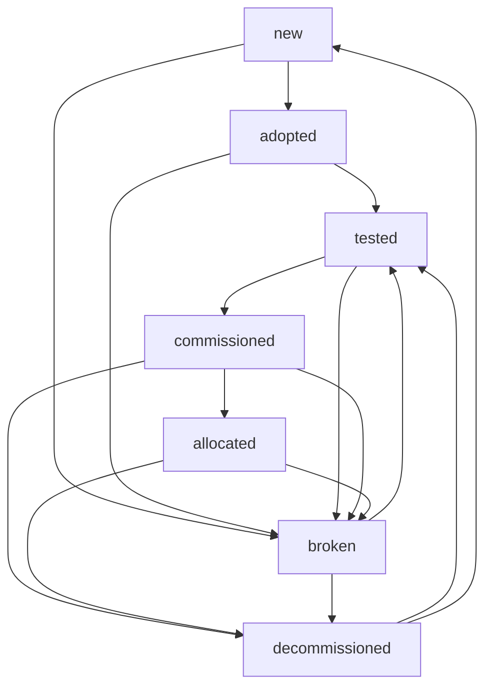

# NSV Metal-as-a-Service

End-to-End OS provisioning system for hardware in NVIDIA managed racks

What it is meant to do:
 * Receive and respond to DHCP requests for booting machines
 * Power on/off machines & set boot order to apply state changes
 * Allocate IP addresses to machine valid for the entire lifetime of the machine
 * Manage overall state of machines
 * Perform hardware validation (i.e. is it complete)
 * Perform hardware testing (i.e. does it work)
 * Perform hardware ‘commissioning’ (make firmware consistent)
 * Maintain metadata about the machine like its purpose and ownership information
 * Provide data to aid in customization of the machine (i.e. cloud-init user data, local disk profiles, network configuration)

What it doesn’t do:
 * Doesn’t care about the final OS that’s provisioned
 * Not responsible for network configuration or management
 * Not source of truth for actual asset information (serial numbers, PO# numbers, etc)

