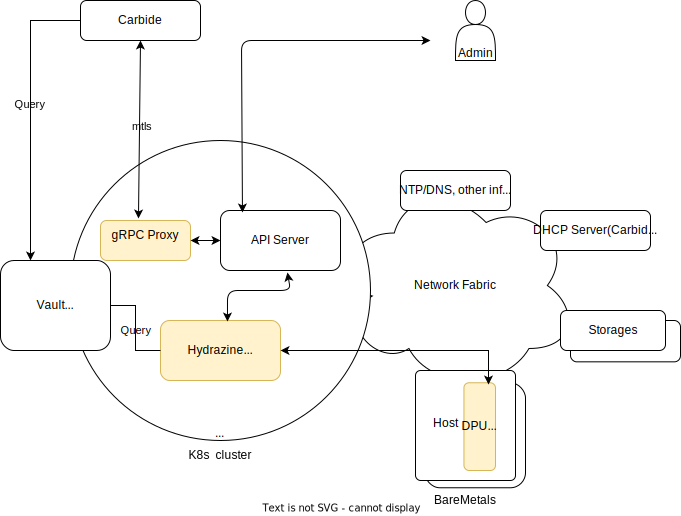
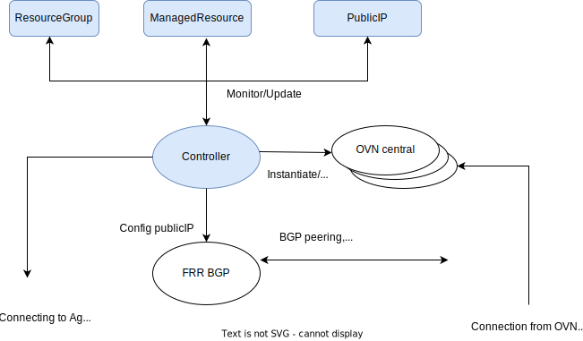
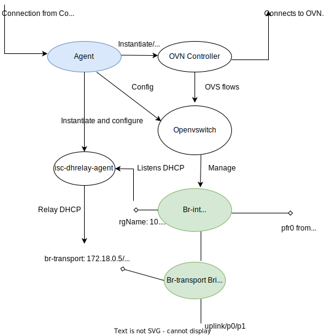
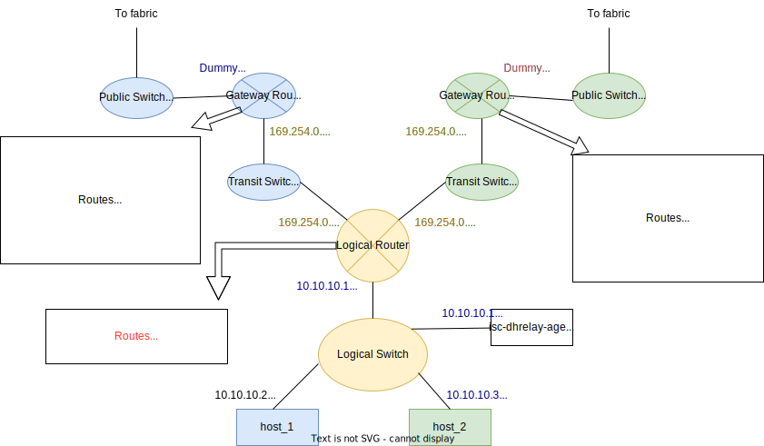

# Hydrazine Design

## Goals
The hydrazine controller provides an abstraction layer that allows customers to manged user-defined networks 
of BareMetals on-demand. Thus, the hydrazine controller design has the following goals in mind,

* By using the abstraction layer, customers are unaware of the underlying network fabric connecting the 
  BareMetals. Thus, the controller may be deployed on any Data Centers (DCs) with any network fabric topology.
* Customers can create and then manage their own user-defined networks. Thus, 
  * overlapping IPs from different user-defined networks are allowed.
  * BareMetals on a user-defined network may be accessed from within this network, or within the DC, or 
    from the public domain.
* Customers can manage their user-defined networks without any human operator intervention.
* The design choices of abstraction layer, user-defined network, and on-demand follow public cloud providers' 
  (aws/azure/gcp) network models.
* User-defined networks and underlying network fabric are completely decoupled. The network fabric only provides the 
  transport of the BareMetal hosts traffic, but not their network configuration.

## Prerequisites
* **K8s cluster**: The hydrazine controller is a native k8s application, it requires a hosting K8s cluster on 
each DC where it is deployed.
* **BareMetal Host Service**: The hydrazine controller does not provision the BareMetal hosts, therefore some services, 
  such as Carbide, must be deployed to allow the hosts to obtain among other things its proper network configuration.
* **DPU**: The hydrazine controller is agnostic to the underlying network fabric. It uses OVN/OVS on DPU to implement 
  user-defined network for the BareMetal hosts.
* **Network Fabric Requirements**: 
  * The K8s cluster, DPUs are connected via network fabric,
  * Each DPU uplink is provided with two (one assigned to uplink; one reserved for NATting) routable network fabric IP 
    addresses.
  
## Components Overview

The following diagram illustrates the hydrazine software components, their placements, and their 
interactions with the surroundings.

\
*Hydrazine componments*

### Hydrazine Components
**Controller**: The controller is deployed as a K8s native application. It monitors the K8s API server for 
any changes to the hydrazine CustomizedResourceDefinition(CRD)s. The CRDs may create, delete, or update user-defined 
networks. The Controller translates CRD requirements into internal OVN logical network configurations. For each 
user-defined network, it also instantiates a OVN central instance (not shown) that implements the OVN logical 
network topology, which eventually leads to OVS flow changes on each impacted DPUs.

**Agent**: The agent is installed on every DPU. Its primary job is to listen to the controller's instructions to 
bootstrap the OVN controller so that the OVN controller may connect to the OVN central instance with the correct 
parameters. It also reports back to the hydrazine controller the operational state of the agent on the DPU. The 
communication channel between the controller and the agents ideally should be mTLS, but can also be TCP in short term. 

**gRPC Proxy**: The gRPC Proxy is a K8s native application that converts gRPC requests into K8s CRD 
updates. It is primary use case is to allow clients, such as Carbide, that does not speak K8s CRD natively to 
interact with hydrazine controller. The communication channel between the proxy and the client ideally should be mTLS, 
but can also be TCP.

### Other components
**OVN/OVS**: [OVN](https://www.ovn.org/en)/[OVS](http://www.openvswitch.org) are the backends that implement 
the user-define networks.

**Vault**: [Vault](https://www.vaultproject.io) is a secure keystore software application that can be deployed in 
the K8s cluster. The vault may be used to issue certificates and keys for software components (Controller, Agents, 
Proxy) that may require secure mTLS channel. 


## CRDs

This section describes the CRDs that clients such as Carbide may use to request network services from the hydrazine 
controller.

### resource.ResourceGroup
The ResourceGroup defines a ResourceGroup for a tenant. A tenant may have multiple ResourceGroups. Each 
ResourceGroup specify a separate user-defined network. In its initial form, the user-defined network of each 
ResourceGroup is completely isolated from each other, even if they are created for the same tenant.
```golang
// IPNet describes an IPv4 or IPv6 network.
type IPNet struct {
	IP           IPAddress `json:"ip,omitempty"`
	PrefixLength uint32    `json:"prefixLength,omitempty"`
	// Gateway is the default gateway for IPv4 subnet.
	Gateway IPAddress `json:"gateway,omitempty"`
}

// ResourceGroupSpec defines the desired state of ResourceGroup.
type ResourceGroupSpec struct {
	// TenantIdentifier identifies tenant associated with this ResourceGroup.
	TenantIdentifier string `json:"tenantIdentifier,omitempty"`
	// Network defines overlay L2 network for this ResourceGroup. It is immutable.
	Network *IPNet `json:"network,omitempty"`
	// DHCPServer is the IPAddress of the DHCP server (i.e. Carbide) for ManagedResources in this ResourceGroup.
	DHCPServer IPAddress `json:"dhcpServer,omitempty"`
	// implements the l2 overlay network. Default to "Fabric".
	NetworkImplementationType OverlayNetworkImplementationType `json:"networkImplementationType,omitempty"`
}

// ResourceGroupCondition defines responses of ResourceGroup create/delete/update.
type ResourceGroupCondition struct {
	...
}

type SoftwareNetworkConfiguration struct {
	// OvnService is the OVN central service name.
	OvnService string `json:"ovnServiceName,omitempty"`
	// LogicalNetwork is logical network name.
	LogicalNetwork string `json:"LogicalNetwork,omitempty"`
}

// ResourceGroupStatus defines the observed state of ResourceGroup
type ResourceGroupStatus struct {
	// SNATIPs is the snat IPs for overlay traffic entering network fabric.
	SNATIPs []IPAddress `json:"snatIPs,omitempty"`
	// ManagedResourceCount is the number of ManagedResources in the ResourceGroup.
	ManagedResourceCount uint64 `json:"managedResourceCount,omitempty"`
	// SoftwareNetworkConfiguration is the software defined overlay network configuration.
	SoftwareNetworkConfiguration *SoftwareNetworkConfiguration `json:"softwareNetworkConfiguration,omitempty"`
	// Conditions specifies responses of ResourceGroup create/delete/update.
	Conditions []ResourceGroupCondition `json:"conditions,omitempty"`
}
type ResourceGroup struct {
	metav1.TypeMeta   `json:",inline"`
	metav1.ObjectMeta `json:"metadata,omitempty"`

	Spec   ResourceGroupSpec   `json:"spec,omitempty"`
	Status ResourceGroupStatus `json:"status,omitempty"`
}
```

### resource.ManagedResource
The ManagedResource describes the network properties of BareMetals (or potentially any resources) managed by 
hydrazine, and its association to a ResourceGroup.

If a ManagedResource is successfully added to a ResourceGroup, it will be added to the user-defined network from 
that ResourceGroup, as well as being provided IPs to access the host from within the DC and, if applicable, the 
public domain.

```golang
// IPAssociation describes BM host IP to DPU IP to Public IP association.
type IPAssociation struct {
	// HostIP is an overlay IP assigned to the host.
	HostIP IPAddress `json:"hostIP,omitempty"`
	// FabricIP is a fabric IP assigned to DPU, it is used to access the host if HostIP is specified.
	FabricIP IPAddress `json:"fabricIP,omitempty"`
	// PublicIP is public IP associated with the FabricIP.
	PublicIP IPAddress `json:"publicIP,omitempty"`
}

// ManagedResourceSpec defines the desired state of ManagedResource
type ManagedResourceSpec struct {
	// ResourceGroup this ManagedResource belongs.
	ResourceGroup string `json:"resourceGroup,omitempty"`
	// Type is this ManagedResource type.
	Type ResourceType `json:"type,omitempty"`
	// State is ManagedResource state.
	State ManagedResourceState `json:"State,omitempty"`
	// HostIP is host IP of this ManagedResource.
	HostIP IPAddress `json:"hostIP,omitempty"`
	// HostMAC is host MAC of this ManagedResource.
	HostMAC MACAddress `json:"hostMAC,omitempty"`
	// DPUIPs are IPs on DPU.
	// if HostAccess >= FabricAccess it must contain second IP which will be used
	// to access the host from DC or internet.
	DPUIPs []IPAddress `json:"dpuIPs,omitempty"`
	// HostAccess specifies how should host be accessed.
	HostAccess HostAccess `json:"hostAccess,omitempty"`
	// Identifier uniquely identifies a ManagedResource.
	// It may be used to map a ManagedResource to network fabric resource.
	Identifier string `json:"identifier,omitempty"`
}

// ManagedResourceCondition defines responses of ManagedResource create/delete/update.
type ManagedResourceCondition struct {
	...
}

// LogicalPortReference references to a logical port on overlay network connecting to this ManagedResource.
type LogicalPortReference struct {
	// LogicalPort is the logical port.
	LogicalPort string `json:"logicalPort,omitempty"`
	// Dpu is the DPU this logicalPort is configured on.
	DPU string `json:"dpu,omitempty"`
}

// ManagedResourceStatus defines the observed state of ManagedResource
type ManagedResourceStatus struct {
	// HostAccessIPs are IPs to access the host from within DC and from internet.
	HostAccessIPs *IPAssociation `json:"hostAccessIPs,omitempty"`
	// LogicalPortReference references to a logical port that this ManagedResource connected to.
	LogicalPortReference *LogicalPortReference `json:"networkFabricReference,omitempty"`
	// Conditions specifies responses of ManagedResource create/delete/update.
	Conditions []ManagedResourceCondition `json:"conditions,omitempty"`
}

// ManagedResource is the Schema for the managedresources API
type ManagedResource struct {
	metav1.TypeMeta   `json:",inline"`
	metav1.ObjectMeta `json:"metadata,omitempty"`

	Spec   ManagedResourceSpec   `json:"spec,omitempty"`
	Status ManagedResourceStatus `json:"status,omitempty"`
}
```

### networkfabric.PublicIP
Each networkfabric.PublicIP indicates to the hydrazine a single public IP that may be assigned to a single 
ManagedResource for access from the public domain. 
```golang
// PublicIPSpec defines the desired state of PublicIP
type PublicIPSpec struct {
	// IPAddress is the public IP.
	IPAddress resource.IPAddress `json:"ipAddress,omitempty"`
}

// PublicIPStatus defines the observed state of PublicIP
type PublicIPStatus struct {
	// Allocated is true if this IP is already assigned.
	Allocated bool `json:"allocated,omitempty"`
}
```

## Operations

### Deploy and Upgrade

**Deploy or Upgrade the hydrazine controller**:
Applying manifest with updated container image version.

**Deploy or Upgrade the Agents**:
TBD.

The controllers’ version need to be always newer or equal to the Agents’ version. The Controllers are required to 
be compatible with any older versions of the Agents. The Controllers and Agents may be upgraded at different times.

###Day 0:  Initial Setup
Deploy the proxy and controller on the management K8s cluster and agents on All DPUs.

### Day 1 and on:  Operations
**Create a user-defined network**:
* Carbide via gRPC proxy applies resource.ResourceGroup to the K8s cluster.
* Carbide via gRPC proxy applies resource.ManagedResources (BMs) that belong to the above ResourceGroup.
* Expected Result: a L2 user-defined network is created with IP range specified by the ResourceGroup. Each 
  corresponding BMs is attached to the L2 overlay network. Depending on pre-configured NetworkPolicy, the hosts may 
  be able to access some shared resources in DC or the internet.

**Delete a user-defined network**:
* Carbide via gPRC removes resource.ResourceGroup from the management K8s cluster.
* Expected Results: all hosts of BMs in the ResourceGroup are isolated.

**Add/Remove BMs to/from a user-defined network**:
* Carbide via gRPC proxy add/remove the resource.ManagedResource.
* Expected Results: the host represented by the resource.ManagedResource is isolated if operation is remove; 
  otherwise the host is attached to the L2 network.

**View BMs ownership, status**:
* Carbide via gPRC may Get resource.ResourceGroup and resource.ManagedResource from the management K8s cluster.

## Design

### Network Fabric Requirements

\
*Network Fabric Topology*

The above diagram depicts the hydrazine deployment on a network fabric, where all entities, K8s cluster, BareMetals, 
storages and infrastructure servers are connected via the network fabric. The specifics of the network fabric is 
opaque the hydrazine controller.  

Each DPU has an uplink connected to the network fabric. The uplink may consist of one or multiple NICs (Link 
Aggregation or fail-over). Each uplink is given two IP addresses that are routable by the network fabric. The first 
IPs (e.g. 172.18.0.5, 172.18.0.7) are assigned to the uplink by the network fabric provision. They are used for 
encapsulating traffic between hosts of same user-defined network, as well as for any DPUs traffic. The second 
IPs(e.g. 172.18.0.7, 172.18.0.107) are reserved and not assigned to any other devices on the network fabric. They are 
used to NAT the hosts' traffic by hydrazine. Traffic coming in or out of the uplinks always have one of the two IP 
addresses as destination or source IP correspondingly.

An additional IP (not shown, for example, 172.18.0.254) per network subnet is also reserved. It is a dummy IP 
assigned to OVN gateway router, as we will see later.

### Hydrazine Controller

\
*Hydrazine Controller*

The Hydrazine controller resides in a K8s cluster. It monitors the K8s API server for CRDs resource.ResourceGroup, 
resource.ManagedResource, and networkfabric.PublicIP.

For each ResourceGroup, the hydrazine controller creates a new instance of the OVN central, and mitigates the risk 
of OVN central error or corrupated OVN database to one single ResourceGroup. This arrangement also addresses OVN 
scalability concerns. Given the maximum number of BareMetals per ResourceGroup is around 100, this should well 
within OVN central's scale limits. We prefer to grow number of OVN central instances within a K8s cluster, let K8s 
to handle scalability.

The hydrazine controller translates the network requirements from ResourceGroup and ManagedResource CRDs into 
logical network configurations (see in later section) and configures the OVN central instances.

For each ManagedResource, the hydrazine controller make gRPC calls to the agent on the corresponding DPU. It 
queries agent's liveness and operational status, informs 
agent which OVN central instance (corresponding the ResourceGroup this ManagedResources is a member of) to connect 
to, and retrieve isc_dhrelay_agent interface and host port names so that the hydrazine controller can add them to the 
logical topology.

The hydrazine eco-system also includes a [FRR BGP](https://frrouting.org) instance that peers with one or more network 
fabric devices. When a ManagedResource/BareMetal host requires to be publicly accessible, the hydrazine controller 
allocates one available PublicIP, add DNAT policy to the logical topology to OVN central, and add this public IP to the 
BGP instances, and the BGP instance in turn exports it to the network fabric.

### Hydrazine Agent
\
*Hydrazine Agent*

The hydrazine agent, along with an OVN controller and OpenVswitch are deployed on all the DPUs. Each agent 
is also a gRPC server allowing the controller, as client, to query the state of and to configure the agent.

When a ManagedResource becomes a member of ResourceGroup, the agent on the DPU (corresponding to the ManagedResource) 
receives instruction from the controller to a OVN central instance implementing the logical topology of the 
ResourceGroup. The agent, in turn, configures creates br-int and br-transport bridges, attach ports to the br-int 
bridge, adds vteps, OVN central connection information to OVS database, and starts OVN controller on the DPU. OVN 
controller now connects to the OVN central, and can then realize the logical topology from the OVN central by 
configuring OVS flows onto br-int.

In addition, when instructed by the hydrazine controller, the agent may also deploy an isc_dhrelay_agent. A single
isc_dhrelay_agent is responsible to relay DHCP requests from all BareMetal hosts attaching to the same user-defined 
network. The agent creates a linux internal port on which the isc_dhcrelay_agent monitors for DHCP requests. The 
name of this internal port is significant, and is one-to-one mapped to the ResourceGroup. The reason is that this 
internal port name is carried in dhcp relay message's 
[CircuitID](https://datatracker.ietf.org/doc/html/rfc3046#section-3.1) field, so that Carbide DHCP server 
can distinguish DHCP requests using the same overlay IP addresses but from different user-defined networks.

### Hydrazine User-defined Network Topology
\
*Hydrazine Logical Topology*\

The above diagram depicts a single user-defined network topology corresponding to the previous *Network Fabric 
Topology* diagram. Here we assume that a customer has created ResourceGroup with 10.10.10.0/24 subnet with 
IP 10.10.10.1 as gateway, and both BareMetals are members of that ResourceGroup. This topology is completely 
generated by the hydrazine controller configuring OVN/OVS, where

* Blue IPs  are subnets from the ResourceGroup CRD.
* Black IPs are network fabric routable IPs, note the encapsulation (first) IP is not shown.
* Brown IPs are link local IP addresses computed by hydrazine.
* The brown logical switch and router are distributed to both DPUs, whereas
* Blue switches and routers only exist on DPU_1, and green switches and routers only exist on DPU_2

#### Traffic Analysis
**DHCP**: 
* host_1 broadcasts a DHCP request to the Logical Switch, the isc_dhrelay_agent receives and relays the request to 
  Carbide DHCP server.
* The isc_dhrelay_agent broadcast the DHCP replay from the server to logical switch, and host_1 now 
  has IP 10.10.10.2 and default route gateway 10.10.10.1.

**Traffic within User-defined Network**:
* Traffic stays within the logical switch.
* Traffic between host_1 and host_2 is encapsulated with uplink IPs 172.18.0.5, 172.18.0.7 (not shown) as source 
  or destination IPs before being sent to the uplink.
* Traffic between host_1 and host_2 is decapsulated before sending the hosts.

**Traffic from host to DC or internet**:
* Egress traffic from host_1 traverses Logical Switch --> Logical Router --> Transit_switch_1 --> Gateway Router_1
* Egress traffic is SNATted with 172.18.0.105, and sent to Public Switch_1 and then network fabric; and 
* On reply, ingress traffic with destIP=172.18.0.105, reaches Gateway Router_1,and is Un-SNATted to destIP=10.10.10.2.
* Ingress traffic traverses Gateway Router_1 --> Transit Switch_1 --> Logical Router --> Logical Switch and 
  eventually reaches host_1.

**Traffic from DC or internet to host**:
* Ingress traffic reaches Gateway Router_1 with dstIP=172.18.105, and is DNATted to 10.10.10.2.
* Ingress traffic traverse Gateway Router_1 --> Transit Switch_1 --> Logical Router--> Logical Switch and reaches 
  host1; and
* On reply, host egress traffic with srcIP=10.10.10.2 traverses Logical Switch --> Logical Router --> Transit 
  Switch_1 --> Gateway Router_1.
* On Gateway router_1, ingress traffic is Un-DNATted to srcIP=172.18.0.105, and sent to Public Switch_1 and then 
  network fabric.

Note:
* Separate Transit Switches, Gateway routers and Public switches are created on each DPU. They are required because we 
  prefer to SNAT/DNAT traffic on the local DPU where host is.
* The dummy IP 172.18.0.254 is configured on Gatweay routers of DPUs. It is an OVN requirement where IP traffic can 
  only be routed onto a port with an IP address. It is not used by any traffic as its source or destination IPs.
* SNAT/DNAT rules for public and DC IPs are exactly the same, except that when public IP is used for 
  NATting, an additional SNAT rule with DC IP (172.18.0.105 in this example) is configured so that
  * The public IP may be advertised to the network fabric as *PublicIP/32 nh 172.18.0.105*
  * The SNAT rule with 172.18.0.105 allows IP 172.18.0.105 to be ARP resolved, so that traffic with destIP=publicIP 
    may be sent and received by Gateway Router_1.

## Open Questions
* How to securely issue and distribute keys and certificates from the Vault to software components?
* Need to sync-up with CJ/Fred/Alex Rosenbaum on software deployment on DPU for Agent.
* OVN currently does not support IPv6 NATting. Thus, if host requires public accessibility, its assigned public IP 
  will either need to be IPv4 or another NAT on network fabric edge.
* Access control policy. Hydrazine does not have CRDs to provide per ResourceGroup NetworkPolicies. What will be the 
  global scope NetworkPolicy ?
